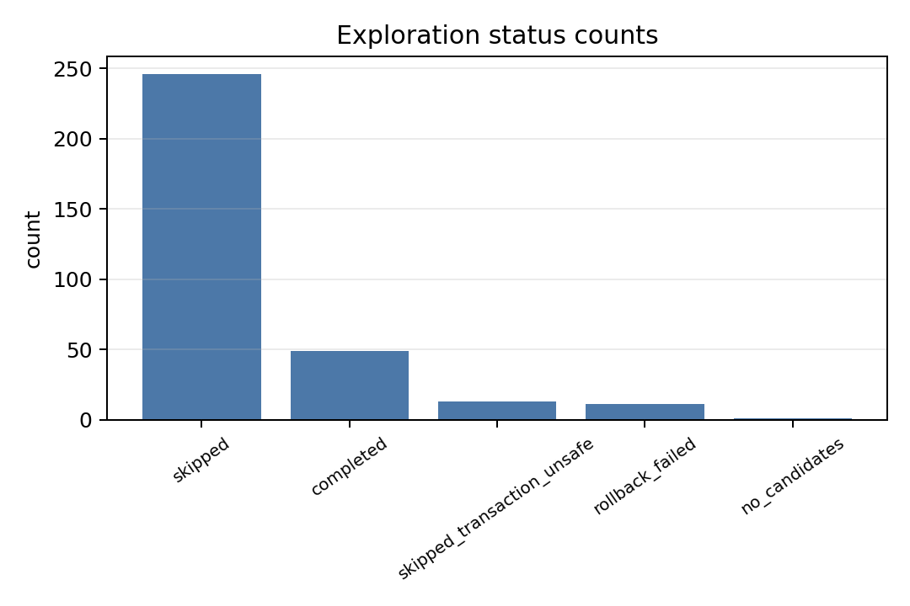
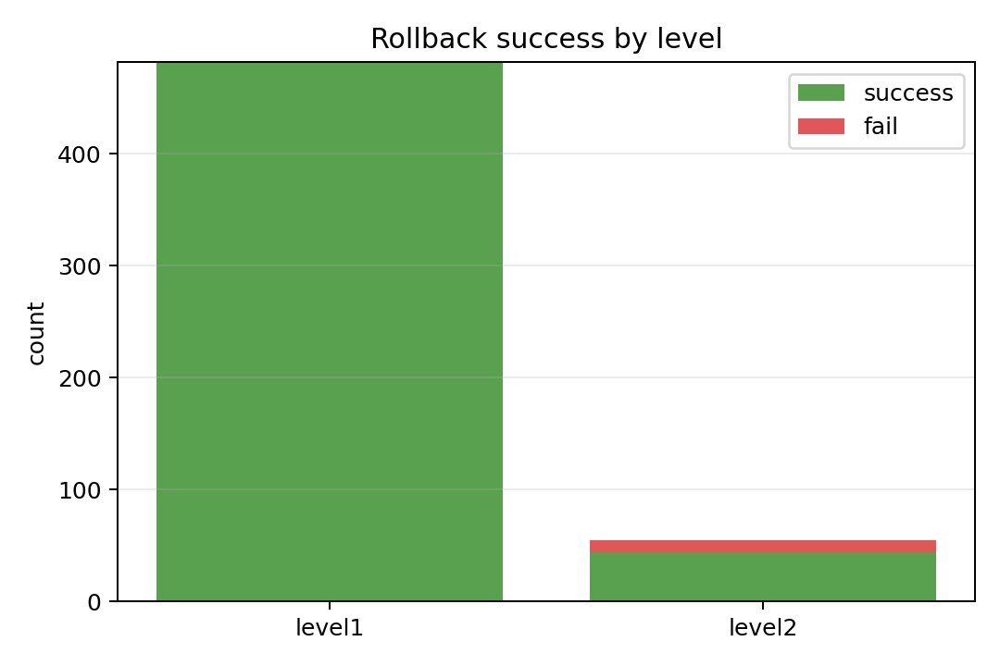
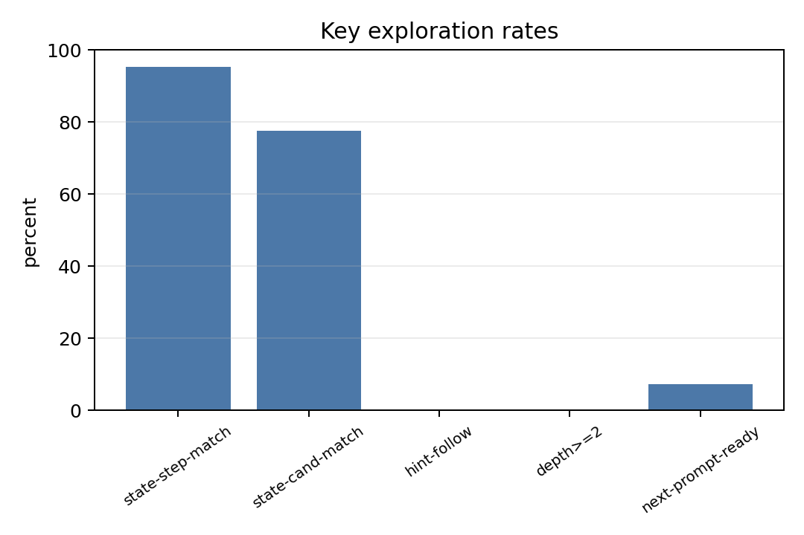
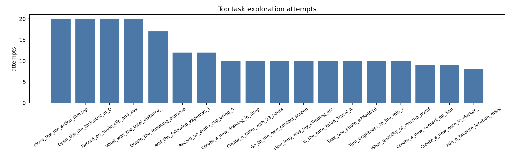
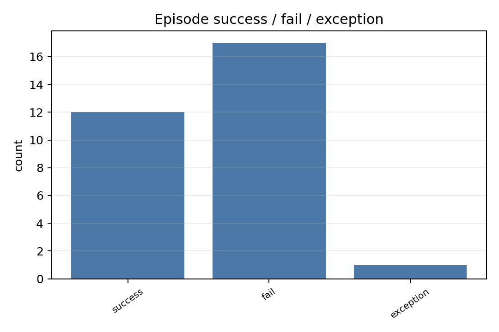
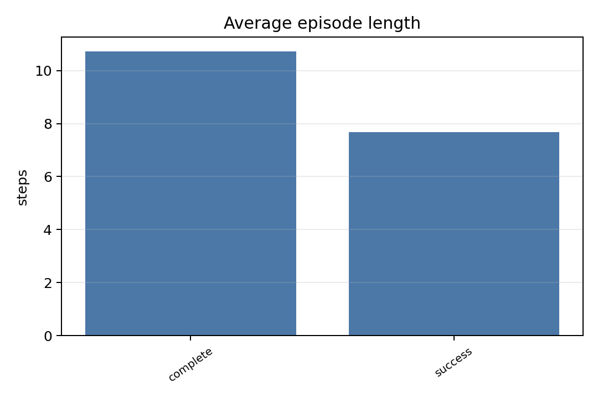
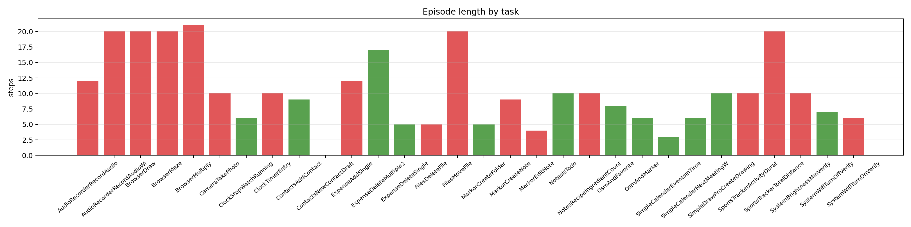
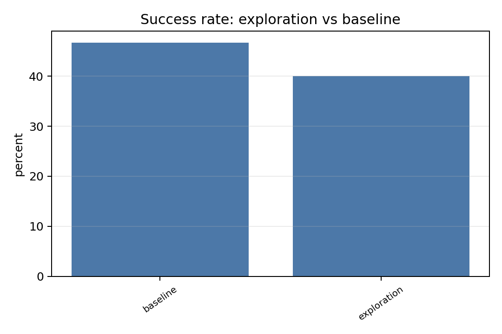
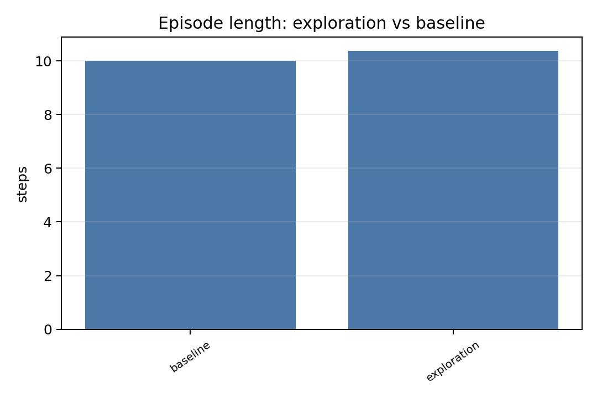
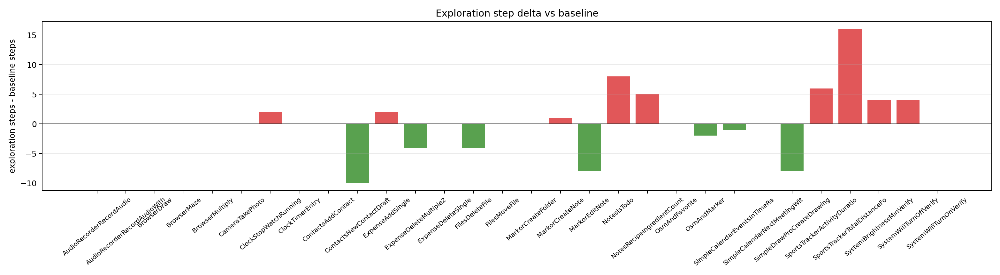

# AndroidWorld Exploration 完整实验报告

- 生成时间: `2026-06-02 17:17:59`
- checkpoint dir: `D:\Projects\android_world\results\strategy_30task_split\sensys_strategy30_v1\machine_2\S2_DFS_BUDGET12\run_20260602T154948\checkpoints`
- trace root: `D:\Projects\android_world\results\strategy_30task_split\sensys_strategy30_v1\machine_2\S2_DFS_BUDGET12\run_20260602T154948\traces`
- per-step metrics: `D:\Projects\android_world\results\strategy_30task_split\sensys_strategy30_v1\machine_2\S2_DFS_BUDGET12\run_20260602T154948\report\step_metrics.csv`

## 总览

| metric | value |
| --- | ---: |
| total episodes | 30 |
| complete episodes | 29 |
| exception failures | 1 |
| success rate, complete only | 41.4% |
| success rate, all trials | 40.0% |
| avg episode length, complete | 10.724137931034482 |
| avg episode length, success | 7.666666666666667 |
| reasoning steps | 320 |
| exploration traces | 320 |
| prompt hint steps | 14 |
| evidence-only hint steps | 14 |
| evaluable action-hint steps | 0 |
| hint follow rate | n/a |
| rollback success rate | 98.0% |

## Diagnostic / Hard Validation

| artifact | value |
| --- | ---: |
| evidence_decisions rows | 1502 |
| prompt_hints rows | 692 |
| injected prompt hints | 80 |
| step decoupling rows | 640 |
| decoupling invalid steps | 0 |
| exploration_latency rows | 640 |
| rollback_events rows | 1074 |
| rollback event failures | 22 |
| missing required files | `[]` |

## Prompt Injection Diagnosis

- prompt_hints rows: `692`
- injected hint count: `80`
- rejected hint count: `612`
- evidence_decisions rows: `1502`

如果 injected hint count 为 `0`，本报告不得把 success rate 变化归因于 prompt augmentation；变化只能来自 exploration/rollback side effects、timing variance、evaluator variance 或随机性。

### Top rejection reasons

- prompt hint rejection reasons: `{'no_matched_evidence': 600, 'matched_evidence_not_promptable': 12}`
- evidence rejection reasons: `{'evidence_only_but_no_injection_rule': 812, 'low_confidence': 610}`
- evidence type counts: `{'NONE': 812, 'ACTION_HINT': 608, 'ANSWER_HINT': 68, 'AVOID_HINT': 12, 'RISK_HINT': 2}`

### Rejected evidence examples

| step | branch | type | confidence | threshold | reason | candidate |
| ---: | ---: | --- | ---: | ---: | --- | --- |
| 2 | 0 | `ACTION_HINT` | 0.2 | 0.85 | `low_confidence` | `visible answer facts` |
| 2 | 1 | `ACTION_HINT` | 0.26 | 0.85 | `low_confidence` | `simple` |
| 2 | 2 | `ACTION_HINT` | 0.26 | 0.85 | `low_confidence` | `simple` |
| 2 | 3 | `ACTION_HINT` | 0.26 | 0.85 | `low_confidence` | `simple` |
| 2 | 4 | `ACTION_HINT` | 0.2226131890310718 | 0.85 | `low_confidence` | `Search` |
| 2 | 5 | `ACTION_HINT` | 0.26 | 0.85 | `low_confidence` | `simple` |
| 2 | 6 | `ACTION_HINT` | 0.26 | 0.85 | `low_confidence` | `simple` |
| 2 | 7 | `ACTION_HINT` | 0.26 | 0.85 | `low_confidence` | `simple` |

## Candidate Quality Filtering

- raw candidates: `3322`
- filtered candidates: `1406`
- candidate operator counts: `{'ListInspect': 1194, 'Other': 244, 'NavigationPeek': 184, 'SearchPeek': 150, 'DetailPeek': 100, 'FilterPeek': 30, 'StatsPeek': 10, 'RiskBoundary': 4}`
- top filtered examples: `[{'label': 'androidx.viewpager.widget.b', 'merged': 'androidx.viewpager.widget.b', 'reason': 'generic_container', 'center': [540, 1316]}, {'label': 'top left arrow', 'merged': 'top left arrow', 'reason': 'invalid_or_negative_center', 'center': [-466, 367]}, {'label': 'September', 'merged': 'september september top value', 'reason': 'invalid_or_negative_center', 'center': [-73, 367]}, {'label': 'top right arrow', 'merged': 'top right arrow', 'reason': 'invalid_bbox', 'center': [0, 367]}, {'label': 'month view background', 'merged': 'month view background', 'reason': 'invalid_or_negative_center', 'center': [-463, 664]}, {'label': 'month view background', 'merged': 'month view background', 'reason': 'invalid_or_negative_center', 'center': [-386, 664]}, {'label': 'month view background', 'merged': 'month view background', 'reason': 'invalid_or_negative_center', 'center': [-308, 664]}, {'label': 'month view background', 'merged': 'month view background', 'reason': 'invalid_or_negative_center', 'center': [-231, 664]}, {'label': 'month view background', 'merged': 'month view background', 'reason': 'invalid_or_negative_center', 'center': [-154, 664]}, {'label': 'month view background', 'merged': 'month view background', 'reason': 'invalid_or_negative_center', 'center': [-77, 664]}, {'label': 'month view background', 'merged': 'month view background', 'reason': 'invalid_bbox', 'center': [0, 664]}, {'label': 'month view background', 'merged': 'month view background', 'reason': 'invalid_or_negative_center', 'center': [-463, 968]}, {'label': 'androidx.viewpager.widget.b', 'merged': 'androidx.viewpager.widget.b', 'reason': 'generic_container', 'center': [540, 1316]}, {'label': 'top left arrow', 'merged': 'top left arrow', 'reason': 'invalid_or_negative_center', 'center': [-466, 367]}, {'label': 'September', 'merged': 'september september top value', 'reason': 'invalid_or_negative_center', 'center': [-73, 367]}, {'label': 'top right arrow', 'merged': 'top right arrow', 'reason': 'invalid_bbox', 'center': [0, 367]}, {'label': 'month view background', 'merged': 'month view background', 'reason': 'invalid_or_negative_center', 'center': [-463, 664]}, {'label': 'month view background', 'merged': 'month view background', 'reason': 'invalid_or_negative_center', 'center': [-386, 664]}, {'label': 'month view background', 'merged': 'month view background', 'reason': 'invalid_or_negative_center', 'center': [-308, 664]}, {'label': 'month view background', 'merged': 'month view background', 'reason': 'invalid_or_negative_center', 'center': [-231, 664]}]`

## Search Strategy

- strategy name: `Operator-Stratified Best-First Exploration`
- root-level search: stratified breadth-first selection across operator groups.
- branch continuation: gated depth-first continuation to depth 2.
- ranking: best-first score.
- score formula: `2.0*MissingSlotGain + 1.5*TaskEntityMatch + 1.0*OperatorPriority + 1.0*TaskProgress + 0.5*Novelty - 2.0*RiskPenalty - 1.0*RollbackCost - 1.0*WrongScreenRolePenalty - 0.5*RevisitPenalty`.
- operators: `ListInspect`, `SearchPeek`, `FilterPeek`, `NavigationPeek`, `DetailPeek`, `StatsPeek`, `FormSchema`, `RiskBoundary`, `Other`.

## Latency Breakdown

| metric | value ms |
| --- | ---: |
| avg step latency | 15637.973196059465 |
| avg VLM latency | 1538.60082924366 |
| avg exploration latency | 7700.575911253691 |
| avg wait after VLM for exploration | 7364.2733335494995 |
| avg exploration state fetch | 2006.706490367651 |
| avg exploration a11y dump | 1919.6356318891048 |
| avg branch state fetch | 903.1590392653281 |
| avg branch a11y latency | 777.5219063550946 |
| p50 exploration total | 2.1185874938964844 |
| p95 exploration total | 33556.38360977173 |
| p50 branch a11y | 0.0 |
| p95 branch a11y | 1186.7446899414062 |
| p50 branch state fetch | 0.0 |
| p95 branch state fetch | 1357.2862148284912 |
| p50 rollback verify | 0.0 |
| p95 rollback verify | 0.0 |

## 统计图表





















## Baseline 对比

- baseline task 数: `116`
- 与本次实验匹配的 task 数: `30`
- baseline 平均成功率: `46.7%`
- exploration 平均成功率: `40.0%`
- baseline 平均步数: `10.0`
- exploration 平均步数: `10.366666666666667`

| task | baseline success | exploration success | baseline steps | exploration steps | step delta |
| --- | ---: | ---: | ---: | ---: | ---: |
| `AudioRecorderRecordAudio` | 0.0% | 0.0% | 12.0 | 12.0 | 0.0 |
| `AudioRecorderRecordAudioWithFileName` | 0.0% | 0.0% | 20.0 | 20.0 | 0.0 |
| `BrowserDraw` | 0.0% | 0.0% | 20.0 | 20.0 | 0.0 |
| `BrowserMaze` | 0.0% | 0.0% | 20.0 | 20.0 | 0.0 |
| `BrowserMultiply` | 0.0% | 0.0% | 21.0 | 21.0 | 0.0 |
| `CameraTakePhoto` | 0.0% | 0.0% | 10.0 | 10.0 | 0.0 |
| `ClockStopWatchRunning` | 100.0% | 100.0% | 4.0 | 6.0 | 2.0 |
| `ClockTimerEntry` | 0.0% | 0.0% | 10.0 | 10.0 | 0.0 |
| `ContactsAddContact` | 100.0% | 100.0% | 9.0 | 9.0 | 0.0 |
| `ContactsNewContactDraft` | 100.0% | 0.0% | 10.0 | 0.0 | -10.0 |
| `ExpenseAddSingle` | 100.0% | 0.0% | 10.0 | 12.0 | 2.0 |
| `ExpenseDeleteMultiple2` | 100.0% | 100.0% | 21.0 | 17.0 | -4.0 |
| `ExpenseDeleteSingle` | 100.0% | 100.0% | 5.0 | 5.0 | 0.0 |
| `FilesDeleteFile` | 0.0% | 0.0% | 9.0 | 5.0 | -4.0 |
| `FilesMoveFile` | 0.0% | 0.0% | 20.0 | 20.0 | 0.0 |
| `MarkorCreateFolder` | 100.0% | 100.0% | 5.0 | 5.0 | 0.0 |
| `MarkorCreateNote` | 100.0% | 0.0% | 8.0 | 9.0 | 1.0 |
| `MarkorEditNote` | 0.0% | 0.0% | 12.0 | 4.0 | -8.0 |
| `NotesIsTodo` | 100.0% | 100.0% | 2.0 | 10.0 | 8.0 |
| `NotesRecipeIngredientCount` | 0.0% | 0.0% | 5.0 | 10.0 | 5.0 |
| `OsmAndFavorite` | 100.0% | 100.0% | 8.0 | 8.0 | 0.0 |
| `OsmAndMarker` | 0.0% | 100.0% | 8.0 | 6.0 | -2.0 |
| `SimpleCalendarEventsInTimeRange` | 0.0% | 100.0% | 4.0 | 3.0 | -1.0 |
| `SimpleCalendarNextMeetingWithPerson` | 0.0% | 100.0% | 6.0 | 6.0 | 0.0 |
| `SimpleDrawProCreateDrawing` | 100.0% | 100.0% | 18.0 | 10.0 | -8.0 |
| `SportsTrackerActivityDuration` | 0.0% | 0.0% | 4.0 | 10.0 | 6.0 |
| `SportsTrackerTotalDistanceForCategoryOverInterval` | 0.0% | 0.0% | 4.0 | 20.0 | 16.0 |
| `SystemBrightnessMinVerify` | 100.0% | 0.0% | 6.0 | 10.0 | 4.0 |
| `SystemWifiTurnOffVerify` | 100.0% | 100.0% | 3.0 | 7.0 | 4.0 |
| `SystemWifiTurnOnVerify` | 100.0% | 0.0% | 6.0 | 6.0 | 0.0 |

## Exploration 统计

- exploration status: `{'skipped': 246, 'completed': 49, 'skipped_transaction_unsafe': 13, 'rollback_failed': 11, 'no_candidates': 1}`
- 可用于下一步 prompt 的 exploration: 23/320 (7.2%)
- depth>=2 observation: 0/711 (0.0%)
- 平均每步候选元素数: `2.99375`
- 平均每步 selected targets: `1.95`
- 平均每步 observations: `2.221875`

## State Match 与 Hint 命中率

- 有 pending exploration 可匹配的 reasoning step: 21
- state match step hit rate: 20/21 (95.2%)
- state match candidate hit rate: 169/218 (77.5%)
- hint injected steps: 14
- evidence-only hint steps: 14
- evaluable action-hint steps: 0
- hint followed: n/a

这里的 hint followed 只统计可评估的 action-hint：VLM 在注入 state-aligned hint 后，下一步实际 click 落在 exploration 建议的 next candidate bbox 内/距离 candidate center 小于 120 px，或实际 TYPE 文本与 typed speculative candidate 完全一致。evidence-only hint 只提供页面事实，不进入该命中率分母。

## Per-step Reasoning / Exploration Trace

完整逐步记录已保存到 `D:\Projects\android_world\results\strategy_30task_split\sensys_strategy30_v1\machine_2\S2_DFS_BUDGET12\run_20260602T154948\report\step_metrics.csv`。下面展示前 30 行，用于检查每次 reasoning 前是否有 pending exploration、匹配到了多少结果、post-planning 阶段又探索了多少分支。

| task | step | pre pending | pre matched | hint | hint hit | post status | post candidates | selected | obs | action |
| --- | ---: | ---: | ---: | --- | --- | --- | ---: | ---: | ---: | --- |
| `Add_a_favorite_location_marker_for_47.1663432...` | 1 | 0 | 0 | False | False | `skipped` | 0 | 0 | 0 | `open_app` |
| `Add_a_favorite_location_marker_for_47.1663432...` | 2 | 0 | 0 | False | False | `skipped` | 0 | 0 | 0 | `click@(201,197)` |
| `Add_a_favorite_location_marker_for_47.1663432...` | 3 | 0 | 0 | False | False | `skipped` | 0 | 0 | 0 | `input_text` |
| `Add_a_favorite_location_marker_for_47.1663432...` | 4 | 0 | 0 | False | False | `skipped` | 0 | 0 | 0 | `click@(484,525)` |
| `Add_a_favorite_location_marker_for_47.1663432...` | 5 | 0 | 0 | False | False | `skipped` | 0 | 0 | 0 | `click@(135,2116)` |
| `Add_a_favorite_location_marker_for_47.1663432...` | 6 | 0 | 0 | False | False | `skipped` | 0 | 0 | 0 | `input_text` |
| `Add_a_favorite_location_marker_for_47.1663432...` | 7 | 0 | 0 | False | False | `skipped` | 0 | 0 | 0 | `click@(797,2193)` |
| `Add_a_favorite_location_marker_for_47.1663432...` | 8 | 0 | 0 | False | False | `skipped` | 0 | 0 | 0 | `status` |
| `Add_a_location_marker_for_47.106997_9.5274854...` | 1 | 0 | 0 | False | False | `skipped` | 0 | 0 | 0 | `open_app` |
| `Add_a_location_marker_for_47.106997_9.5274854...` | 2 | 0 | 0 | False | False | `skipped` | 0 | 0 | 0 | `click@(201,197)` |
| `Add_a_location_marker_for_47.106997_9.5274854...` | 3 | 0 | 0 | False | False | `skipped` | 0 | 0 | 0 | `input_text` |
| `Add_a_location_marker_for_47.106997_9.5274854...` | 4 | 0 | 0 | False | False | `skipped` | 0 | 0 | 0 | `click@(484,525)` |
| `Add_a_location_marker_for_47.106997_9.5274854...` | 5 | 0 | 0 | False | False | `skipped` | 0 | 0 | 0 | `click@(408,2123)` |
| `Add_a_location_marker_for_47.106997_9.5274854...` | 6 | 0 | 0 | False | False | `skipped` | 0 | 0 | 0 | `status` |
| `Add_the_following_expenses_into_the_pro_expen...` | 1 | 0 | 0 | False | False | `skipped` | 0 | 0 | 0 | `open_app` |
| `Add_the_following_expenses_into_the_pro_expen...` | 2 | 0 | 0 | False | False | `skipped` | 0 | 0 | 0 | `click@(962,2178)` |
| `Add_the_following_expenses_into_the_pro_expen...` | 3 | 0 | 0 | False | False | `skipped` | 0 | 0 | 0 | `click@(540,427)` |
| `Add_the_following_expenses_into_the_pro_expen...` | 4 | 0 | 0 | False | False | `skipped` | 0 | 0 | 0 | `click@(537,427)` |
| `Add_the_following_expenses_into_the_pro_expen...` | 5 | 0 | 0 | False | False | `skipped` | 0 | 0 | 0 | `click@(537,427)` |
| `Add_the_following_expenses_into_the_pro_expen...` | 6 | 0 | 0 | False | False | `skipped` | 0 | 0 | 0 | `input_text` |
| `Add_the_following_expenses_into_the_pro_expen...` | 7 | 0 | 0 | False | False | `skipped` | 0 | 0 | 0 | `input_text` |
| `Add_the_following_expenses_into_the_pro_expen...` | 8 | 0 | 0 | False | False | `skipped` | 0 | 0 | 0 | `click@(518,808)` |
| `Add_the_following_expenses_into_the_pro_expen...` | 9 | 0 | 0 | False | False | `skipped` | 0 | 0 | 0 | `click@(540,1058)` |
| `Add_the_following_expenses_into_the_pro_expen...` | 10 | 0 | 0 | False | False | `skipped` | 0 | 0 | 0 | `click@(537,1068)` |
| `Add_the_following_expenses_into_the_pro_expen...` | 11 | 0 | 0 | False | False | `skipped` | 0 | 0 | 0 | `input_text` |
| `Add_the_following_expenses_into_the_pro_expen...` | 12 | 0 | 0 | False | False | `skipped` | 0 | 0 | 0 | `click@(452,1303)` |
| `Create_a_new_contact_for_Santiago_Zhang._Thei...` | 1 | 0 | 0 | False | False | `skipped` | 0 | 0 | 0 | `open_app` |
| `Create_a_new_contact_for_Santiago_Zhang._Thei...` | 2 | 0 | 0 | False | False | `skipped` | 0 | 0 | 0 | `click@(941,2008)` |
| `Create_a_new_contact_for_Santiago_Zhang._Thei...` | 3 | 0 | 0 | False | False | `skipped` | 0 | 0 | 0 | `click@(537,933)` |
| `Create_a_new_contact_for_Santiago_Zhang._Thei...` | 4 | 0 | 0 | False | False | `skipped` | 0 | 0 | 0 | `input_text` |

## Rollback 统计

- rollback total: 537
- rollback success: 526/537 (98.0%)
- level2 trigger reasons: `{'replay_required_after_home': 110}`

| level | total | success | success rate |
| --- | ---: | ---: | ---: |
| level1 | 482 | 482 | 100.0% |
| level2 | 55 | 44 | 80.0% |

## Per-task Exploration Top 20

| task dir | reasoning steps | exploration attempts | observations | hint steps | hint followed |
| --- | ---: | ---: | ---: | ---: | ---: |
| `Move_the_file_action_film.mp4_from_DCIM_within_the_sdk_gphone_x_18d9fc96` | 20 | 20 | 144 | 11 | 0 |
| `Open_the_file_task.html_in_Downloads_in_the_file_manager_when_p_29665811` | 20 | 20 | 180 | 0 | 0 |
| `Open_the_file_task.html_in_Downloads_in_the_file_manager_when_p_3c9666e9` | 20 | 20 | 0 | 0 | 0 |
| `Open_the_file_task.html_in_Downloads_in_the_file_manager_when_p_8bd7123f` | 20 | 20 | 0 | 0 | 0 |
| `Record_an_audio_clip_and_save_it_with_name_2023_05_05_roundtabl_cf4e20ef` | 20 | 20 | 0 | 0 | 0 |
| `What_was_the_total_distance_covered_for_snow_boarding_activitie_d227ec5a` | 20 | 20 | 74 | 0 | 0 |
| `Delete_the_following_expenses_from_pro_expense_Gift_for_Friend__4d89e1f3` | 17 | 17 | 0 | 0 | 0 |
| `Add_the_following_expenses_into_the_pro_expense_Expense_Landsca_e41182ee` | 12 | 12 | 0 | 0 | 0 |
| `Record_an_audio_clip_using_Audio_Recorder_app_and_save_it_51068baf` | 12 | 12 | 0 | 0 | 0 |
| `Create_a_new_drawing_in_Simple_Draw_Pro._Name_it_amet_active_co_85aa6fea` | 10 | 10 | 0 | 0 | 0 |
| `Create_a_timer_with_23_hours_4_minutes_and_24_seconds._Do_not_s_37c091b5` | 10 | 10 | 0 | 0 | 0 |
| `Go_to_the_new_contact_screen_and_enter_the_following_details_Fi_c8e1389e` | 10 | 10 | 0 | 0 | 0 |
| `How_long_was_my_climbing_activity_October_15_in_the_OpenTracks__584bfe41` | 10 | 10 | 10 | 0 | 0 |
| `Is_the_note_titled_Travel_Itinerary_in_the_Joplin_app_marked_as_947ea02b` | 10 | 10 | 72 | 0 | 0 |
| `Take_one_photo_e76e6616` | 10 | 10 | 0 | 0 | 0 |
| `Turn_brightness_to_the_min_value_178fab52` | 10 | 10 | 24 | 0 | 0 |
| `What_quantity_of_matcha_powder_do_I_need_for_the_recipe_Beef_St_1653e163` | 10 | 10 | 84 | 1 | 0 |
| `Create_a_new_contact_for_Santiago_Zhang._Their_number_is_103289_9ea91677` | 9 | 9 | 0 | 0 | 0 |
| `Create_a_new_note_in_Markor_named_backup_tough_penguin.md_with__9ea22dbd` | 9 | 9 | 0 | 0 | 0 |
| `Add_a_favorite_location_marker_for_47.1663432_9.5103085_in_the__4d73e2bc` | 8 | 8 | 0 | 0 | 0 |

## 具体 Exploration Traces

### Case 1: exploration step 5

- task instruction: `Turn brightness to the min value.`
- status: `rollback_failed`; trigger: `slot_gate_enabled:NAVIGATION_SEARCH:navigation_search`
- candidates: 11; selected targets: 11; latency: 69904.5 ms
- available for next prompt: `False`

Root screenshot:


| rank | selected element | score | relevance | center |
| ---: | --- | ---: | ---: | --- |
| 1 | `settings` | 0.050 | 0.000 | `[540, 238]` |
| 2 | `settings` | 0.050 | 0.000 | `[540, 407]` |
| 3 | `settings` | 0.050 | 0.000 | `[540, 581]` |
| 4 | `settings` | 0.050 | 0.000 | `[540, 812]` |
| 5 | `settings` | 0.050 | 0.000 | `[540, 1043]` |

Branch 1: path=`settings`, score=0.050, depth=1, rollback=level2/home_replay_backtrack/True

- depth 1: action=`click settings`; score=0.050; changed=True; activity=`com.google.android.settings.intelligence/com.google.android.settings.intelligence.modules.search....`


Observed elements:

```text
status bar launch animation container; container; status bar container; status bar; status bar contents; status bar start side container; status bar start side content; status bar start side except heads up; 15:36; notification icon area; notificationIcons; Clock notification:; Android System notification: Check access settings; Android System notification: Serial console enabled; cutout space view; status bar end side container; status bar end side content; system icons; statusIcons; Do Not ...
```

Branch 2: path=`settings`, score=0.050, depth=1, rollback=level1/backtrack/True

- depth 1: action=`click settings`; score=0.050; changed=False; activity=`com.android.settings/com.android.settings.homepage.SettingsHomepageActivity`


Observed elements:

```text
status bar launch animation container; container; status bar container; status bar; status bar contents; status bar start side container; status bar start side content; status bar start side except heads up; 15:36; notification icon area; notificationIcons; Clock notification:; Android System notification: Check access settings; Android System notification: Serial console enabled; cutout space view; status bar end side container; status bar end side content; system icons; statusIcons; Do Not ...
```

Root a11y excerpt:

```json
[
  {
    "text": null,
    "desc": null,
    "class": null,
    "center": [
      540,
      64
    ],
    "clickable": null
  },
  {
    "text": null,
    "desc": null,
    "class": null,
    "center": [
      540,
      64
    ],
    "clickable": null
  },
  {
    "text": null,
    "desc": null,
    "class": null,
    "center": [
      540,
      64
    ],
    "clickable": null
  },
  {
    "text": null,
    "desc": null,
    "class": null,
    "center": [
      540,
      64
    ],
    "clickable": null
  },
  {
    "text": null,
    "desc": null,
    "class": null,
    "center": [
      538,
      64
    ],
    "clickable": null
  },
  {
    "text": null,
    "desc": null,
    "class": null,
    "center": [
      259,
      64
    ],
    "clickable": null
  },
  {
    "text": null,
    "desc": null,
    "class": null,
    "center": [
      186,
      64
    ],
    "clickable": null
  },
  {
    "text": null,
    "desc": null,
    "class": null,
    "center": [
      186,
      64
    ],
    "clickable": null
  }
]
```

### Case 2: exploration step 6

- task instruction: `Move the file action_film.mp4 from DCIM within the sdk_gphone_x86_64 storage area to the Movies within the same sdk_gphone_x86_64 storage area in the Android filesystem.`
- status: `rollback_failed`; trigger: `slot_gate_enabled:NAVIGATION_SEARCH:navigation_search`
- candidates: 18; selected targets: 12; latency: 33755.8 ms
- available for next prompt: `False`

Root screenshot:


| rank | selected element | score | relevance | center |
| ---: | --- | ---: | ---: | --- |
| 1 | `Search` | 0.010 | 0.000 | `[890, 191]` |
| 2 | `Grid view` | 0.010 | 0.011 | `[953, 588]` |
| 3 | `Audio` | 0.090 | 0.000 | `[178, 446]` |
| 4 | `files` | 0.050 | 0.000 | `[540, 763]` |
| 5 | `Images` | 0.090 | 0.000 | `[441, 446]` |

Branch 1: path=`Search`, score=0.010, depth=1, rollback=level1/backtrack/True

- depth 1: action=`click Search`; score=0.010; changed=True; activity=`com.google.android.documentsui/com.android.documentsui.files.FilesActivity`


Observed elements:

```text
status bar launch animation container; container; status bar container; status bar; status bar contents; status bar start side container; status bar start side content; status bar start side except heads up; 15:37; notification icon area; notificationIcons; Android System notification: Check access settings; Android System notification: Serial console enabled; cutout space view; status bar end side container; status bar end side content; system icons; statusIcons; Do Not Disturb; Phone two ba...
```

Branch 2: path=`Grid view`, score=0.010, depth=1, rollback=level2/home_replay_failed/False

- depth 1: action=`click Grid view`; score=0.010; changed=True; activity=`com.google.android.documentsui/com.android.documentsui.files.FilesActivity`


Observed elements:

```text
status bar launch animation container; container; status bar container; status bar; status bar contents; status bar start side container; status bar start side content; status bar start side except heads up; 15:37; notification icon area; notificationIcons; Android System notification: Check access settings; Android System notification: Serial console enabled; cutout space view; status bar end side container; status bar end side content; system icons; statusIcons; Do Not Disturb; Phone two ba...
```

Root a11y excerpt:

```json
[
  {
    "text": null,
    "desc": null,
    "class": null,
    "center": [
      540,
      64
    ],
    "clickable": null
  },
  {
    "text": null,
    "desc": null,
    "class": null,
    "center": [
      540,
      64
    ],
    "clickable": null
  },
  {
    "text": null,
    "desc": null,
    "class": null,
    "center": [
      540,
      64
    ],
    "clickable": null
  },
  {
    "text": null,
    "desc": null,
    "class": null,
    "center": [
      540,
      64
    ],
    "clickable": null
  },
  {
    "text": null,
    "desc": null,
    "class": null,
    "center": [
      538,
      64
    ],
    "clickable": null
  },
  {
    "text": null,
    "desc": null,
    "class": null,
    "center": [
      259,
      64
    ],
    "clickable": null
  },
  {
    "text": null,
    "desc": null,
    "class": null,
    "center": [
      157,
      64
    ],
    "clickable": null
  },
  {
    "text": null,
    "desc": null,
    "class": null,
    "center": [
      157,
      64
    ],
    "clickable": null
  }
]
```

### Case 3: exploration step 7

- task instruction: `What quantity of matcha powder do I need for the recipe 'Beef Stew' in the Joplin app? Express your answer in the format <amount> <unit> where both the amount and unit exactly match the format in the recipe.`
- status: `rollback_failed`; trigger: `slot_gate_enabled:RECIPE_INGREDIENT:passive_or_partial_slots`
- candidates: 18; selected targets: 12; latency: 32461.9 ms
- available for next prompt: `False`

Root screenshot:


| rank | selected element | score | relevance | center |
| ---: | --- | ---: | ---: | --- |
| 1 | `joplin` | 0.086 | 0.036 | `[868, 1232]` |
| 2 | `Add new, collapsed` | 0.059 | 0.009 | `[964, 2222]` |
| 3 | `New note` | 0.050 | 0.000 | `[747, 2018]` |
| 4 | `joplin` | 0.086 | 0.036 | `[868, 320]` |
| 5 | `New note` | 0.050 | 0.000 | `[964, 2021]` |

Branch 1: path=`joplin`, score=0.086, depth=1, rollback=level2/home_replay_failed/False

- depth 1: action=`click joplin`; score=0.086; changed=True; activity=`net.cozic.joplin/net.cozic.joplin.MainActivity`


Observed elements:

```text
status bar launch animation container; container; status bar container; status bar; status bar contents; status bar start side container; status bar start side content; status bar start side except heads up; 15:36; notification icon area; notificationIcons; Android System notification: Check access settings; Android System notification: Serial console enabled; cutout space view; status bar end side container; status bar end side content; system icons; statusIcons; Do Not Disturb; Phone signal...
```

Branch 2: path=`passive coverage sample 1`, score=0.000, depth=0, rollback=level0/passive_no_action/True

- depth 0: action=`inspect passive coverage sample 1`; score=0.000; changed=False; activity=`net.cozic.joplin/net.cozic.joplin.MainActivity`


Observed elements:

```text
status bar launch animation container; container; status bar container; status bar; status bar contents; status bar start side container
```

Root a11y excerpt:

```json
[
  {
    "text": null,
    "desc": null,
    "class": null,
    "center": [
      540,
      64
    ],
    "clickable": null
  },
  {
    "text": null,
    "desc": null,
    "class": null,
    "center": [
      540,
      64
    ],
    "clickable": null
  },
  {
    "text": null,
    "desc": null,
    "class": null,
    "center": [
      540,
      64
    ],
    "clickable": null
  },
  {
    "text": null,
    "desc": null,
    "class": null,
    "center": [
      540,
      64
    ],
    "clickable": null
  },
  {
    "text": null,
    "desc": null,
    "class": null,
    "center": [
      538,
      64
    ],
    "clickable": null
  },
  {
    "text": null,
    "desc": null,
    "class": null,
    "center": [
      259,
      64
    ],
    "clickable": null
  },
  {
    "text": null,
    "desc": null,
    "class": null,
    "center": [
      157,
      64
    ],
    "clickable": null
  },
  {
    "text": null,
    "desc": null,
    "class": null,
    "center": [
      157,
      64
    ],
    "clickable": null
  }
]
```

### Case 4: exploration step 5

- task instruction: `Is the note titled 'Travel Itinerary' in the Joplin app marked as a todo item? Respond with either 'True' if it is a todo or 'False' if not.`
- status: `rollback_failed`; trigger: `slot_gate_enabled:BOOLEAN_STATUS:search_missing_slots`
- candidates: 13; selected targets: 12; latency: 27386.0 ms
- available for next prompt: `False`

Root screenshot:


| rank | selected element | score | relevance | center |
| ---: | --- | ---: | ---: | --- |
| 1 | `joplin` | 0.096 | 0.046 | `[535, 345]` |
| 2 | `joplin` | 0.096 | 0.046 | `[535, 504]` |
| 3 | `joplin` | 0.096 | 0.046 | `[535, 660]` |
| 4 | `joplin` | 0.096 | 0.046 | `[535, 819]` |
| 5 | `joplin` | 0.096 | 0.046 | `[535, 975]` |

Branch 1: path=`joplin`, score=0.096, depth=1, rollback=level2/home_replay_failed/False

- depth 1: action=`click joplin`; score=0.096; changed=True; activity=`net.cozic.joplin/net.cozic.joplin.MainActivity`


Observed elements:

```text
status bar launch animation container; container; status bar container; status bar; status bar contents; status bar start side container; status bar start side content; status bar start side except heads up; 15:36; notification icon area; notificationIcons; Android System notification: Check access settings; Android System notification: Serial console enabled; cutout space view; status bar end side container; status bar end side content; system icons; statusIcons; Do Not Disturb; Phone two ba...
```

Branch 2: path=`passive coverage sample 1`, score=0.000, depth=0, rollback=level0/passive_no_action/True

- depth 0: action=`inspect passive coverage sample 1`; score=0.000; changed=False; activity=`net.cozic.joplin/net.cozic.joplin.MainActivity`


Observed elements:

```text
status bar launch animation container; container; status bar container; status bar; status bar contents; status bar start side container
```

Root a11y excerpt:

```json
[
  {
    "text": null,
    "desc": null,
    "class": null,
    "center": [
      540,
      64
    ],
    "clickable": null
  },
  {
    "text": null,
    "desc": null,
    "class": null,
    "center": [
      540,
      64
    ],
    "clickable": null
  },
  {
    "text": null,
    "desc": null,
    "class": null,
    "center": [
      540,
      64
    ],
    "clickable": null
  },
  {
    "text": null,
    "desc": null,
    "class": null,
    "center": [
      540,
      64
    ],
    "clickable": null
  },
  {
    "text": null,
    "desc": null,
    "class": null,
    "center": [
      538,
      64
    ],
    "clickable": null
  },
  {
    "text": null,
    "desc": null,
    "class": null,
    "center": [
      259,
      64
    ],
    "clickable": null
  },
  {
    "text": null,
    "desc": null,
    "class": null,
    "center": [
      157,
      64
    ],
    "clickable": null
  },
  {
    "text": null,
    "desc": null,
    "class": null,
    "center": [
      157,
      64
    ],
    "clickable": null
  }
]
```

### Case 5: exploration step 16

- task instruction: `What was the total distance covered for snow boarding activities in the OpenTracks app from October 07 2023 to October 10? Express your answer as a single number in meters rounded to the nearest integer.`
- status: `rollback_failed`; trigger: `slot_gate_enabled:ACTIVITY_STATS:passive_or_partial_slots`
- candidates: 12; selected targets: 12; latency: 38990.8 ms
- available for next prompt: `False`

Root screenshot:


| rank | selected element | score | relevance | center |
| ---: | --- | ---: | ---: | --- |
| 1 | `More options for BBC` | 0.420 | 0.370 | `[1006, 711]` |
| 2 | `Camera search` | 0.748 | 0.048 | `[964, 569]` |
| 3 | `Share 'Mornings and nights no longer exist' at 47C: A day in the hottest plac...` | 0.253 | 0.203 | `[1006, 1602]` |
| 4 | `More options for portsmouth.co.uk` | 0.420 | 0.370 | `[1006, 1721]` |
| 5 | `Search…` | 0.737 | 0.037 | `[540, 569]` |

Branch 1: path=`More options for BBC`, score=0.420, depth=1, rollback=level1/backtrack/True

- depth 1: action=`click More options for BBC`; score=0.420; changed=False; activity=`com.google.android.googlequicksearchbox/com.google.android.apps.search.googleapp.activity.GoogleA...`


Observed elements:

```text
status bar launch animation container; container; status bar container; status bar; status bar contents; status bar start side container; status bar start side content; status bar start side except heads up; 15:40; notification icon area; notificationIcons; Android System notification: Check access settings; Android System notification: Serial console enabled; cutout space view; status bar end side container; status bar end side content; system icons; statusIcons; Do Not Disturb; Phone two ba...
```

Branch 2: path=`Camera search`, score=0.748, depth=1, rollback=level1/backtrack/True

- depth 1: action=`click Camera search`; score=0.748; changed=False; activity=`com.google.android.googlequicksearchbox/com.google.android.apps.search.googleapp.activity.GoogleA...`


Observed elements:

```text
status bar launch animation container; container; status bar container; status bar; status bar contents; status bar start side container; status bar start side content; status bar start side except heads up; 15:40; notification icon area; notificationIcons; Android System notification: Check access settings; Android System notification: Serial console enabled; cutout space view; status bar end side container; status bar end side content; system icons; statusIcons; Do Not Disturb; Phone two ba...
```

Root a11y excerpt:

```json
[
  {
    "text": null,
    "desc": null,
    "class": null,
    "center": [
      540,
      64
    ],
    "clickable": null
  },
  {
    "text": null,
    "desc": null,
    "class": null,
    "center": [
      540,
      64
    ],
    "clickable": null
  },
  {
    "text": null,
    "desc": null,
    "class": null,
    "center": [
      540,
      64
    ],
    "clickable": null
  },
  {
    "text": null,
    "desc": null,
    "class": null,
    "center": [
      540,
      64
    ],
    "clickable": null
  },
  {
    "text": null,
    "desc": null,
    "class": null,
    "center": [
      538,
      64
    ],
    "clickable": null
  },
  {
    "text": null,
    "desc": null,
    "class": null,
    "center": [
      259,
      64
    ],
    "clickable": null
  },
  {
    "text": null,
    "desc": null,
    "class": null,
    "center": [
      157,
      64
    ],
    "clickable": null
  },
  {
    "text": null,
    "desc": null,
    "class": null,
    "center": [
      157,
      64
    ],
    "clickable": null
  }
]
```

### Case 6: exploration step 11

- task instruction: `What was the total distance covered for snow boarding activities in the OpenTracks app from October 07 2023 to October 10? Express your answer as a single number in meters rounded to the nearest integer.`
- status: `rollback_failed`; trigger: `slot_gate_enabled:ACTIVITY_STATS:passive_or_partial_slots`
- candidates: 16; selected targets: 12; latency: 33556.4 ms
- available for next prompt: `False`

Root screenshot:


| rank | selected element | score | relevance | center |
| ---: | --- | ---: | ---: | --- |
| 1 | `Sunday, October 15, 2023` | 1.400 | 0.660 | `[540, 2064]` |
| 2 | `Cancel` | 0.090 | 0.000 | `[720, 2221]` |
| 3 | `OK` | 0.090 | 0.000 | `[894, 2221]` |
| 4 | `snow boarding` | 1.280 | 0.540 | `[540, 885]` |
| 5 | `snowboarding` | 0.761 | 0.021 | `[540, 1008]` |

Branch 1: path=`Sunday, October 15, 2023`, score=1.400, depth=1, rollback=level1/backtrack/True

- depth 1: action=`click Sunday, October 15, 2023`; score=1.400; changed=False; activity=`de.dennisguse.opentracks/de.dennisguse.opentracks.ui.aggregatedStatistics.AggregatedStatisticsAct...`


Observed elements:

```text
status bar launch animation container; container; status bar container; status bar; status bar contents; status bar start side container; status bar start side content; status bar start side except heads up; 15:37; notification icon area; notificationIcons; Android System notification: Check access settings; Android System notification: Serial console enabled; cutout space view; status bar end side container; status bar end side content; system icons; statusIcons; Do Not Disturb; Phone signal...
```

Branch 2: path=`Cancel`, score=0.090, depth=1, rollback=level2/home_replay_failed/False

- depth 1: action=`click Cancel`; score=0.090; changed=True; activity=`de.dennisguse.opentracks/de.dennisguse.opentracks.ui.aggregatedStatistics.AggregatedStatisticsAct...`


Observed elements:

```text
status bar launch animation container; container; status bar container; status bar; status bar contents; status bar start side container; status bar start side content; status bar start side except heads up; 15:38; notification icon area; notificationIcons; Android System notification: Check access settings; Android System notification: Serial console enabled; cutout space view; status bar end side container; status bar end side content; system icons; statusIcons; Do Not Disturb; Phone signal...
```

Root a11y excerpt:

```json
[
  {
    "text": null,
    "desc": null,
    "class": null,
    "center": [
      540,
      64
    ],
    "clickable": null
  },
  {
    "text": null,
    "desc": null,
    "class": null,
    "center": [
      540,
      64
    ],
    "clickable": null
  },
  {
    "text": null,
    "desc": null,
    "class": null,
    "center": [
      540,
      64
    ],
    "clickable": null
  },
  {
    "text": null,
    "desc": null,
    "class": null,
    "center": [
      540,
      64
    ],
    "clickable": null
  },
  {
    "text": null,
    "desc": null,
    "class": null,
    "center": [
      538,
      64
    ],
    "clickable": null
  },
  {
    "text": null,
    "desc": null,
    "class": null,
    "center": [
      259,
      64
    ],
    "clickable": null
  },
  {
    "text": null,
    "desc": null,
    "class": null,
    "center": [
      157,
      64
    ],
    "clickable": null
  },
  {
    "text": null,
    "desc": null,
    "class": null,
    "center": [
      157,
      64
    ],
    "clickable": null
  }
]
```

### Case 7: exploration step 20

- task instruction: `What was the total distance covered for snow boarding activities in the OpenTracks app from October 07 2023 to October 10? Express your answer as a single number in meters rounded to the nearest integer.`
- status: `rollback_failed`; trigger: `slot_gate_enabled:ACTIVITY_STATS:passive_or_partial_slots`
- candidates: 9; selected targets: 9; latency: 37211.3 ms
- available for next prompt: `False`

Root screenshot:


| rank | selected element | score | relevance | center |
| ---: | --- | ---: | ---: | --- |
| 1 | `opentracks` | 0.010 | 0.011 | `[540, 400]` |
| 2 | `Search` | 0.010 | 0.027 | `[784, 211]` |
| 3 | `opentracks` | 0.010 | 0.022 | `[104, 2232]` |
| 4 | `Record` | 0.069 | 0.019 | `[954, 2232]` |
| 5 | `opentracks` | 0.010 | 0.011 | `[540, 609]` |

Branch 0: path=`visible answer facts`, score=8.000, depth=1, rollback=level0/no_action_list_inspect/True

- depth 1: action=`inspect visible answer facts`; score=8.000; changed=True; activity=`de.dennisguse.opentracks/de.dennisguse.opentracks.TrackListActivity`


Observed elements:

```text
Avoid "Markers": it is not useful for duration/distance/activity statistics.
```

Branch 1: path=`opentracks`, score=0.010, depth=1, rollback=level2/home_replay_failed/False

- depth 1: action=`click opentracks`; score=0.010; changed=True; activity=`de.dennisguse.opentracks/de.dennisguse.opentracks.TrackRecordedActivity`


Observed elements:

```text
status bar launch animation container; container; status bar container; status bar; status bar contents; status bar start side container; status bar start side content; status bar start side except heads up; 15:42; notification icon area; notificationIcons; Clock notification:; Android System notification: Check access settings; Android System notification: Serial console enabled; cutout space view; status bar end side container; status bar end side content; system icons; statusIcons; Do Not ...
```

Root a11y excerpt:

```json
[
  {
    "text": null,
    "desc": null,
    "class": null,
    "center": [
      540,
      64
    ],
    "clickable": null
  },
  {
    "text": null,
    "desc": null,
    "class": null,
    "center": [
      540,
      64
    ],
    "clickable": null
  },
  {
    "text": null,
    "desc": null,
    "class": null,
    "center": [
      540,
      64
    ],
    "clickable": null
  },
  {
    "text": null,
    "desc": null,
    "class": null,
    "center": [
      540,
      64
    ],
    "clickable": null
  },
  {
    "text": null,
    "desc": null,
    "class": null,
    "center": [
      538,
      64
    ],
    "clickable": null
  },
  {
    "text": null,
    "desc": null,
    "class": null,
    "center": [
      259,
      64
    ],
    "clickable": null
  },
  {
    "text": null,
    "desc": null,
    "class": null,
    "center": [
      186,
      64
    ],
    "clickable": null
  },
  {
    "text": null,
    "desc": null,
    "class": null,
    "center": [
      186,
      64
    ],
    "clickable": null
  }
]
```

### Case 8: exploration step 6

- task instruction: `What was the total distance covered for snow boarding activities in the OpenTracks app from October 07 2023 to October 10? Express your answer as a single number in meters rounded to the nearest integer.`
- status: `rollback_failed`; trigger: `slot_gate_enabled:ACTIVITY_STATS:passive_or_partial_slots`
- candidates: 18; selected targets: 12; latency: 33566.5 ms
- available for next prompt: `False`

Root screenshot:


| rank | selected element | score | relevance | center |
| ---: | --- | ---: | ---: | --- |
| 1 | `opentracks` | 0.061 | 0.011 | `[540, 545]` |
| 2 | `Search` | 0.547 | 0.027 | `[784, 211]` |
| 3 | `Record` | 0.069 | 0.019 | `[954, 2232]` |
| 4 | `opentracks` | 0.061 | 0.011 | `[540, 711]` |
| 5 | `opentracks` | 0.061 | 0.011 | `[540, 877]` |

Branch 0: path=`visible answer facts`, score=8.000, depth=1, rollback=level0/no_action_list_inspect/True

- depth 1: action=`inspect visible answer facts`; score=8.000; changed=True; activity=`de.dennisguse.opentracks/de.dennisguse.opentracks.TrackListActivity`


Observed elements:

```text
Avoid "Markers": it is not useful for duration/distance/activity statistics.
```

Branch 1: path=`opentracks`, score=0.061, depth=1, rollback=level2/home_replay_failed/False

- depth 1: action=`click opentracks`; score=0.061; changed=True; activity=`de.dennisguse.opentracks/de.dennisguse.opentracks.TrackRecordedActivity`


Observed elements:

```text
status bar launch animation container; container; status bar container; status bar; status bar contents; status bar start side container; status bar start side content; status bar start side except heads up; 15:35; notification icon area; notificationIcons; Android System notification: Check access settings; Android System notification: Serial console enabled; cutout space view; status bar end side container; status bar end side content; system icons; statusIcons; Do Not Disturb; Phone signal...
```

Root a11y excerpt:

```json
[
  {
    "text": null,
    "desc": null,
    "class": null,
    "center": [
      540,
      64
    ],
    "clickable": null
  },
  {
    "text": null,
    "desc": null,
    "class": null,
    "center": [
      540,
      64
    ],
    "clickable": null
  },
  {
    "text": null,
    "desc": null,
    "class": null,
    "center": [
      540,
      64
    ],
    "clickable": null
  },
  {
    "text": null,
    "desc": null,
    "class": null,
    "center": [
      540,
      64
    ],
    "clickable": null
  },
  {
    "text": null,
    "desc": null,
    "class": null,
    "center": [
      538,
      64
    ],
    "clickable": null
  },
  {
    "text": null,
    "desc": null,
    "class": null,
    "center": [
      259,
      64
    ],
    "clickable": null
  },
  {
    "text": null,
    "desc": null,
    "class": null,
    "center": [
      157,
      64
    ],
    "clickable": null
  },
  {
    "text": null,
    "desc": null,
    "class": null,
    "center": [
      157,
      64
    ],
    "clickable": null
  }
]
```

### Case 9: exploration step 15

- task instruction: `What was the total distance covered for snow boarding activities in the OpenTracks app from October 07 2023 to October 10? Express your answer as a single number in meters rounded to the nearest integer.`
- status: `rollback_failed`; trigger: `slot_gate_enabled:ACTIVITY_STATS:passive_or_partial_slots`
- candidates: 9; selected targets: 9; latency: 28201.9 ms
- available for next prompt: `False`

Root screenshot:


| rank | selected element | score | relevance | center |
| ---: | --- | ---: | ---: | --- |
| 1 | `opentracks` | 0.061 | 0.011 | `[540, 609]` |
| 2 | `Search` | 0.007 | 0.027 | `[784, 211]` |
| 3 | `opentracks` | 0.010 | 0.022 | `[104, 2232]` |
| 4 | `Record` | 0.069 | 0.019 | `[954, 2232]` |
| 5 | `opentracks` | 0.010 | 0.011 | `[540, 400]` |

Branch 0: path=`visible answer facts`, score=8.000, depth=1, rollback=level0/no_action_list_inspect/True

- depth 1: action=`inspect visible answer facts`; score=8.000; changed=True; activity=`de.dennisguse.opentracks/de.dennisguse.opentracks.TrackListActivity`


Observed elements:

```text
Avoid "Markers": it is not useful for duration/distance/activity statistics.
```

Branch 1: path=`opentracks`, score=0.061, depth=1, rollback=level2/home_replay_failed/False

- depth 1: action=`click opentracks`; score=0.061; changed=True; activity=`de.dennisguse.opentracks/de.dennisguse.opentracks.TrackRecordedActivity`


Observed elements:

```text
status bar launch animation container; container; status bar container; status bar; status bar contents; status bar start side container; status bar start side content; status bar start side except heads up; 15:39; notification icon area; notificationIcons; Android System notification: Check access settings; Android System notification: Serial console enabled; cutout space view; status bar end side container; status bar end side content; system icons; statusIcons; Do Not Disturb; Phone three ...
```

Root a11y excerpt:

```json
[
  {
    "text": null,
    "desc": null,
    "class": null,
    "center": [
      540,
      64
    ],
    "clickable": null
  },
  {
    "text": null,
    "desc": null,
    "class": null,
    "center": [
      540,
      64
    ],
    "clickable": null
  },
  {
    "text": null,
    "desc": null,
    "class": null,
    "center": [
      540,
      64
    ],
    "clickable": null
  },
  {
    "text": null,
    "desc": null,
    "class": null,
    "center": [
      540,
      64
    ],
    "clickable": null
  },
  {
    "text": null,
    "desc": null,
    "class": null,
    "center": [
      538,
      64
    ],
    "clickable": null
  },
  {
    "text": null,
    "desc": null,
    "class": null,
    "center": [
      259,
      64
    ],
    "clickable": null
  },
  {
    "text": null,
    "desc": null,
    "class": null,
    "center": [
      157,
      64
    ],
    "clickable": null
  },
  {
    "text": null,
    "desc": null,
    "class": null,
    "center": [
      157,
      64
    ],
    "clickable": null
  }
]
```

### Case 10: exploration step 8

- task instruction: `How long was my climbing activity October 15 in the OpenTracks app? Express your answer in minutes as a single integer.`
- status: `rollback_failed`; trigger: `slot_gate_enabled:ACTIVITY_STATS:passive_or_partial_slots`
- candidates: 18; selected targets: 12; latency: 27567.8 ms
- available for next prompt: `False`

Root screenshot:


| rank | selected element | score | relevance | center |
| ---: | --- | ---: | ---: | --- |
| 1 | `opentracks` | 0.050 | 0.000 | `[540, 758]` |
| 2 | `Search` | 0.010 | 0.000 | `[785, 211]` |
| 3 | `Record` | 0.076 | 0.026 | `[954, 2232]` |
| 4 | `opentracks` | 0.050 | 0.000 | `[540, 924]` |
| 5 | `opentracks` | 0.050 | 0.000 | `[540, 1090]` |

Branch 0: path=`visible answer facts`, score=8.000, depth=1, rollback=level0/no_action_list_inspect/True

- depth 1: action=`inspect visible answer facts`; score=8.000; changed=True; activity=`de.dennisguse.opentracks/de.dennisguse.opentracks.TrackListActivity`


Observed elements:

```text
Avoid "Markers": it is not useful for duration/distance/activity statistics.
```

Branch 1: path=`opentracks`, score=0.050, depth=1, rollback=level2/home_replay_failed/False

- depth 1: action=`click opentracks`; score=0.050; changed=True; activity=`de.dennisguse.opentracks/de.dennisguse.opentracks.TrackRecordedActivity`


Observed elements:

```text
status bar launch animation container; container; status bar container; status bar; status bar contents; status bar start side container; status bar start side content; status bar start side except heads up; 15:37; notification icon area; notificationIcons; Android System notification: Check access settings; Android System notification: Serial console enabled; cutout space view; status bar end side container; status bar end side content; system icons; statusIcons; Do Not Disturb; Phone signal...
```

Root a11y excerpt:

```json
[
  {
    "text": null,
    "desc": null,
    "class": null,
    "center": [
      540,
      64
    ],
    "clickable": null
  },
  {
    "text": null,
    "desc": null,
    "class": null,
    "center": [
      540,
      64
    ],
    "clickable": null
  },
  {
    "text": null,
    "desc": null,
    "class": null,
    "center": [
      540,
      64
    ],
    "clickable": null
  },
  {
    "text": null,
    "desc": null,
    "class": null,
    "center": [
      540,
      64
    ],
    "clickable": null
  },
  {
    "text": null,
    "desc": null,
    "class": null,
    "center": [
      538,
      64
    ],
    "clickable": null
  },
  {
    "text": null,
    "desc": null,
    "class": null,
    "center": [
      259,
      64
    ],
    "clickable": null
  },
  {
    "text": null,
    "desc": null,
    "class": null,
    "center": [
      157,
      64
    ],
    "clickable": null
  },
  {
    "text": null,
    "desc": null,
    "class": null,
    "center": [
      157,
      64
    ],
    "clickable": null
  }
]
```

### Case 11: exploration step 3

- task instruction: `What was the total distance covered for snow boarding activities in the OpenTracks app from October 07 2023 to October 10? Express your answer as a single number in meters rounded to the nearest integer.`
- status: `rollback_failed`; trigger: `slot_gate_enabled:ACTIVITY_STATS:passive_or_partial_slots`
- candidates: 17; selected targets: 12; latency: 27398.3 ms
- available for next prompt: `False`

Root screenshot:


| rank | selected element | score | relevance | center |
| ---: | --- | ---: | ---: | --- |
| 1 | `opentracks` | 0.061 | 0.011 | `[540, 359]` |
| 2 | `Search` | 0.547 | 0.027 | `[784, 211]` |
| 3 | `Record` | 0.069 | 0.019 | `[954, 2232]` |
| 4 | `opentracks` | 0.061 | 0.011 | `[540, 506]` |
| 5 | `opentracks` | 0.061 | 0.011 | `[540, 672]` |

Branch 0: path=`visible answer facts`, score=8.000, depth=1, rollback=level0/no_action_list_inspect/True

- depth 1: action=`inspect visible answer facts`; score=8.000; changed=True; activity=`de.dennisguse.opentracks/de.dennisguse.opentracks.TrackListActivity`


Observed elements:

```text
Avoid "Markers": it is not useful for duration/distance/activity statistics.
```

Branch 1: path=`opentracks`, score=0.061, depth=1, rollback=level2/home_replay_failed/False

- depth 1: action=`click opentracks`; score=0.061; changed=True; activity=`de.dennisguse.opentracks/de.dennisguse.opentracks.TrackRecordedActivity`


Observed elements:

```text
status bar launch animation container; container; status bar container; status bar; status bar contents; status bar start side container; status bar start side content; status bar start side except heads up; 15:34; notification icon area; notificationIcons; Android System notification: Check access settings; Android System notification: Serial console enabled; cutout space view; status bar end side container; status bar end side content; system icons; statusIcons; Do Not Disturb; Phone signal...
```

Root a11y excerpt:

```json
[
  {
    "text": null,
    "desc": null,
    "class": null,
    "center": [
      540,
      64
    ],
    "clickable": null
  },
  {
    "text": null,
    "desc": null,
    "class": null,
    "center": [
      540,
      64
    ],
    "clickable": null
  },
  {
    "text": null,
    "desc": null,
    "class": null,
    "center": [
      540,
      64
    ],
    "clickable": null
  },
  {
    "text": null,
    "desc": null,
    "class": null,
    "center": [
      540,
      64
    ],
    "clickable": null
  },
  {
    "text": null,
    "desc": null,
    "class": null,
    "center": [
      538,
      64
    ],
    "clickable": null
  },
  {
    "text": null,
    "desc": null,
    "class": null,
    "center": [
      259,
      64
    ],
    "clickable": null
  },
  {
    "text": null,
    "desc": null,
    "class": null,
    "center": [
      157,
      64
    ],
    "clickable": null
  },
  {
    "text": null,
    "desc": null,
    "class": null,
    "center": [
      157,
      64
    ],
    "clickable": null
  }
]
```

### Case 12: exploration step 3

- task instruction: `Do I have any events between 11:30am and 8pm the Monday after next in Simple Calendar Pro? Answer with the titles only. If there are multiples titles, format your answer in a comma separated list.`
- status: `completed`; trigger: `slot_gate_enabled:EVENT_QUERY:passive_or_partial_slots`
- candidates: 16; selected targets: 12; latency: 122557.1 ms
- available for next prompt: `True`

Root screenshot:


| rank | selected element | score | relevance | center |
| ---: | --- | ---: | ---: | --- |
| 1 | `simple` | 0.010 | 0.013 | `[73, 367]` |
| 2 | `simple` | 0.552 | 0.032 | `[94, 212]` |
| 3 | `simple` | 0.050 | 0.000 | `[540, 547]` |
| 4 | `simple` | 0.010 | 0.000 | `[1006, 367]` |
| 5 | `Search` | 0.589 | 0.029 | `[386, 212]` |

Branch 0: path=`visible answer facts`, score=8.000, depth=1, rollback=level0/no_action_list_inspect/True

- depth 1: action=`inspect visible answer facts`; score=8.000; changed=True; activity=`com.simplemobiletools.calendar.pro/com.simplemobiletools.calendar.pro.activities.MainActivity`


Observed elements:

```text
Avoid "New Event": it opens event creation, not existing event results.
```

Branch 1: path=`simple`, score=0.010, depth=1, rollback=level1/backtrack/True

- depth 1: action=`click simple`; score=0.010; changed=False; activity=`com.simplemobiletools.calendar.pro/com.simplemobiletools.calendar.pro.activities.MainActivity`


Observed elements:

```text
status bar launch animation container; container; status bar container; status bar; status bar contents; status bar start side container; status bar start side content; status bar start side except heads up; 15:35; notification icon area; notificationIcons; Android System notification: Check access settings; Android System notification: Serial console enabled; cutout space view; status bar end side container; status bar end side content; system icons; statusIcons; Do Not Disturb; Phone signal...
```

Root a11y excerpt:

```json
[
  {
    "text": null,
    "desc": null,
    "class": null,
    "center": [
      540,
      64
    ],
    "clickable": null
  },
  {
    "text": null,
    "desc": null,
    "class": null,
    "center": [
      540,
      64
    ],
    "clickable": null
  },
  {
    "text": null,
    "desc": null,
    "class": null,
    "center": [
      540,
      64
    ],
    "clickable": null
  },
  {
    "text": null,
    "desc": null,
    "class": null,
    "center": [
      540,
      64
    ],
    "clickable": null
  },
  {
    "text": null,
    "desc": null,
    "class": null,
    "center": [
      538,
      64
    ],
    "clickable": null
  },
  {
    "text": null,
    "desc": null,
    "class": null,
    "center": [
      259,
      64
    ],
    "clickable": null
  },
  {
    "text": null,
    "desc": null,
    "class": null,
    "center": [
      157,
      64
    ],
    "clickable": null
  },
  {
    "text": null,
    "desc": null,
    "class": null,
    "center": [
      157,
      64
    ],
    "clickable": null
  }
]
```

### Case 13: exploration step 2

- task instruction: `When is my next meeting with Emily in Simple Calendar Pro? Express your answer in the format <month name> <day> <year> <hour in 24-hour format>:<minutes>.`
- status: `completed`; trigger: `slot_gate_enabled:EVENT_QUERY:passive_or_partial_slots`
- candidates: 12; selected targets: 12; latency: 76044.8 ms
- available for next prompt: `True`

Root screenshot:


| rank | selected element | score | relevance | center |
| ---: | --- | ---: | ---: | --- |
| 1 | `simple` | 0.470 | 0.420 | `[77, 664]` |
| 2 | `simple` | 0.081 | 0.031 | `[94, 212]` |
| 3 | `simple` | 0.470 | 0.420 | `[231, 664]` |
| 4 | `Search` | 0.139 | 0.049 | `[386, 212]` |
| 5 | `simple` | 0.470 | 0.420 | `[386, 664]` |

Branch 0: path=`visible answer facts`, score=8.000, depth=1, rollback=level0/no_action_list_inspect/True

- depth 1: action=`inspect visible answer facts`; score=8.000; changed=True; activity=`com.simplemobiletools.calendar.pro/com.simplemobiletools.calendar.pro.activities.MainActivity`


Observed elements:

```text
Avoid "New Event": it opens event creation, not existing event results.
```

Branch 1: path=`simple`, score=0.470, depth=1, rollback=level1/backtrack/True

- depth 1: action=`click simple`; score=0.470; changed=True; activity=`com.simplemobiletools.calendar.pro/com.simplemobiletools.calendar.pro.activities.MainActivity`


Observed elements:

```text
status bar launch animation container; container; status bar container; status bar; status bar contents; status bar start side container; status bar start side content; status bar start side except heads up; 15:34; notification icon area; notificationIcons; Android System notification: Check access settings; Android System notification: Serial console enabled; cutout space view; status bar end side container; status bar end side content; system icons; statusIcons; Do Not Disturb; Phone signal...
```

Root a11y excerpt:

```json
[
  {
    "text": null,
    "desc": null,
    "class": null,
    "center": [
      540,
      64
    ],
    "clickable": null
  },
  {
    "text": null,
    "desc": null,
    "class": null,
    "center": [
      540,
      64
    ],
    "clickable": null
  },
  {
    "text": null,
    "desc": null,
    "class": null,
    "center": [
      540,
      64
    ],
    "clickable": null
  },
  {
    "text": null,
    "desc": null,
    "class": null,
    "center": [
      540,
      64
    ],
    "clickable": null
  },
  {
    "text": null,
    "desc": null,
    "class": null,
    "center": [
      538,
      64
    ],
    "clickable": null
  },
  {
    "text": null,
    "desc": null,
    "class": null,
    "center": [
      259,
      64
    ],
    "clickable": null
  },
  {
    "text": null,
    "desc": null,
    "class": null,
    "center": [
      157,
      64
    ],
    "clickable": null
  },
  {
    "text": null,
    "desc": null,
    "class": null,
    "center": [
      157,
      64
    ],
    "clickable": null
  }
]
```

### Case 14: exploration step 2

- task instruction: `Do I have any events between 11:30am and 8pm the Monday after next in Simple Calendar Pro? Answer with the titles only. If there are multiples titles, format your answer in a comma separated list.`
- status: `completed`; trigger: `slot_gate_enabled:EVENT_QUERY:passive_or_partial_slots`
- candidates: 12; selected targets: 12; latency: 61430.4 ms
- available for next prompt: `True`

Root screenshot:


| rank | selected element | score | relevance | center |
| ---: | --- | ---: | ---: | --- |
| 1 | `simple` | 0.063 | 0.013 | `[73, 367]` |
| 2 | `simple` | 0.732 | 0.032 | `[94, 212]` |
| 3 | `simple` | 0.054 | 0.004 | `[77, 664]` |
| 4 | `Search` | 0.769 | 0.029 | `[386, 212]` |
| 5 | `simple` | 0.054 | 0.004 | `[231, 664]` |

Branch 0: path=`visible answer facts`, score=8.000, depth=1, rollback=level0/no_action_list_inspect/True

- depth 1: action=`inspect visible answer facts`; score=8.000; changed=True; activity=`com.simplemobiletools.calendar.pro/com.simplemobiletools.calendar.pro.activities.MainActivity`


Observed elements:

```text
Avoid "New Event": it opens event creation, not existing event results.
```

Branch 1: path=`simple`, score=0.063, depth=1, rollback=level2/home_replay/True

- depth 1: action=`click simple`; score=0.063; changed=True; activity=`com.simplemobiletools.calendar.pro/com.simplemobiletools.calendar.pro.activities.MainActivity`


Observed elements:

```text
status bar launch animation container; container; status bar container; status bar; status bar contents; status bar start side container; status bar start side content; status bar start side except heads up; 15:34; notification icon area; notificationIcons; Android System notification: Check access settings; Android System notification: Serial console enabled; cutout space view; status bar end side container; status bar end side content; system icons; statusIcons; Do Not Disturb; Phone signal...
```

Root a11y excerpt:

```json
[
  {
    "text": null,
    "desc": null,
    "class": null,
    "center": [
      540,
      64
    ],
    "clickable": null
  },
  {
    "text": null,
    "desc": null,
    "class": null,
    "center": [
      540,
      64
    ],
    "clickable": null
  },
  {
    "text": null,
    "desc": null,
    "class": null,
    "center": [
      540,
      64
    ],
    "clickable": null
  },
  {
    "text": null,
    "desc": null,
    "class": null,
    "center": [
      540,
      64
    ],
    "clickable": null
  },
  {
    "text": null,
    "desc": null,
    "class": null,
    "center": [
      538,
      64
    ],
    "clickable": null
  },
  {
    "text": null,
    "desc": null,
    "class": null,
    "center": [
      259,
      64
    ],
    "clickable": null
  },
  {
    "text": null,
    "desc": null,
    "class": null,
    "center": [
      157,
      64
    ],
    "clickable": null
  },
  {
    "text": null,
    "desc": null,
    "class": null,
    "center": [
      157,
      64
    ],
    "clickable": null
  }
]
```

### Case 15: exploration step 2

- task instruction: `Turn wifi on.`
- status: `completed`; trigger: `slot_gate_enabled:NAVIGATION_SEARCH:navigation_search`
- candidates: 9; selected targets: 9; latency: 111185.1 ms
- available for next prompt: `True`

Root screenshot:


| rank | selected element | score | relevance | center |
| ---: | --- | ---: | ---: | --- |
| 1 | `settings` | 0.700 | 0.000 | `[540, 659]` |
| 2 | `settings` | 0.050 | 0.000 | `[540, 885]` |
| 3 | `Profile picture, double tap to open Google Account` | 0.050 | 0.000 | `[954, 338]` |
| 4 | `settings` | 0.050 | 0.000 | `[540, 1116]` |
| 5 | `settings` | 0.050 | 0.000 | `[540, 1347]` |

Branch 1: path=`settings`, score=0.700, depth=1, rollback=level2/home_replay/True

- depth 1: action=`click settings`; score=0.700; changed=True; activity=`com.google.android.settings.intelligence/com.google.android.settings.intelligence.modules.search....`


Observed elements:

```text
status bar launch animation container; container; status bar container; status bar; status bar contents; status bar start side container; status bar start side content; status bar start side except heads up; 15:34; notification icon area; notificationIcons; Clock notification:; Android System notification: Check access settings; Android System notification: Serial console enabled; cutout space view; status bar end side container; status bar end side content; system icons; statusIcons; Do Not ...
```

Branch 2: path=`settings`, score=0.050, depth=1, rollback=level1/backtrack/True

- depth 1: action=`click settings`; score=0.050; changed=True; activity=`com.android.settings/com.android.settings.SubSettings`


Observed elements:

```text
status bar launch animation container; container; status bar container; status bar; status bar contents; status bar start side container; status bar start side content; status bar start side except heads up; 15:34; notification icon area; notificationIcons; Clock notification:; Android System notification: Check access settings; Android System notification: Serial console enabled; cutout space view; status bar end side container; status bar end side content; system icons; statusIcons; Do Not ...
```

Root a11y excerpt:

```json
[
  {
    "text": null,
    "desc": null,
    "class": null,
    "center": [
      540,
      64
    ],
    "clickable": null
  },
  {
    "text": null,
    "desc": null,
    "class": null,
    "center": [
      540,
      64
    ],
    "clickable": null
  },
  {
    "text": null,
    "desc": null,
    "class": null,
    "center": [
      540,
      64
    ],
    "clickable": null
  },
  {
    "text": null,
    "desc": null,
    "class": null,
    "center": [
      540,
      64
    ],
    "clickable": null
  },
  {
    "text": null,
    "desc": null,
    "class": null,
    "center": [
      538,
      64
    ],
    "clickable": null
  },
  {
    "text": null,
    "desc": null,
    "class": null,
    "center": [
      259,
      64
    ],
    "clickable": null
  },
  {
    "text": null,
    "desc": null,
    "class": null,
    "center": [
      186,
      64
    ],
    "clickable": null
  },
  {
    "text": null,
    "desc": null,
    "class": null,
    "center": [
      186,
      64
    ],
    "clickable": null
  }
]
```

### Case 16: exploration step 5

- task instruction: `Turn wifi off.`
- status: `completed`; trigger: `slot_gate_enabled:NAVIGATION_SEARCH:navigation_search`
- candidates: 10; selected targets: 10; latency: 99398.6 ms
- available for next prompt: `True`

Root screenshot:


| rank | selected element | score | relevance | center |
| ---: | --- | ---: | ---: | --- |
| 1 | `settings` | 0.010 | 0.000 | `[540, 1293]` |
| 2 | `Navigate up` | 0.010 | 0.000 | `[73, 201]` |
| 3 | `settings` | 0.010 | 0.000 | `[540, 1474]` |
| 4 | `settings` | 0.010 | 0.000 | `[540, 1680]` |
| 5 | `settings` | 0.010 | 0.000 | `[540, 1886]` |

Branch 1: path=`settings`, score=0.010, depth=1, rollback=level1/backtrack/True

- depth 1: action=`click settings`; score=0.010; changed=False; activity=`com.android.settings/com.android.settings.SubSettings`


Observed elements:

```text
status bar launch animation container; container; status bar container; status bar; status bar contents; status bar start side container; status bar start side content; status bar start side except heads up; 15:36; notification icon area; notificationIcons; Clock notification:; Android System notification: Check access settings; Android System notification: Serial console enabled; cutout space view; status bar end side container; status bar end side content; system icons; statusIcons; Do Not ...
```

Branch 2: path=`Navigate up`, score=0.010, depth=1, rollback=level2/home_replay/True

- depth 1: action=`click Navigate up`; score=0.010; changed=True; activity=`com.android.settings/com.android.settings.Settings`


Observed elements:

```text
status bar launch animation container; container; status bar container; status bar; status bar contents; status bar start side container; status bar start side content; status bar start side except heads up; 15:36; notification icon area; notificationIcons; Clock notification:; Android System notification: Check access settings; Android System notification: Serial console enabled; cutout space view; status bar end side container; status bar end side content; system icons; statusIcons; Do Not ...
```

Root a11y excerpt:

```json
[
  {
    "text": null,
    "desc": null,
    "class": null,
    "center": [
      540,
      64
    ],
    "clickable": null
  },
  {
    "text": null,
    "desc": null,
    "class": null,
    "center": [
      540,
      64
    ],
    "clickable": null
  },
  {
    "text": null,
    "desc": null,
    "class": null,
    "center": [
      540,
      64
    ],
    "clickable": null
  },
  {
    "text": null,
    "desc": null,
    "class": null,
    "center": [
      540,
      64
    ],
    "clickable": null
  },
  {
    "text": null,
    "desc": null,
    "class": null,
    "center": [
      538,
      64
    ],
    "clickable": null
  },
  {
    "text": null,
    "desc": null,
    "class": null,
    "center": [
      259,
      64
    ],
    "clickable": null
  },
  {
    "text": null,
    "desc": null,
    "class": null,
    "center": [
      186,
      64
    ],
    "clickable": null
  },
  {
    "text": null,
    "desc": null,
    "class": null,
    "center": [
      186,
      64
    ],
    "clickable": null
  }
]
```

### Case 17: exploration step 4

- task instruction: `Turn brightness to the min value.`
- status: `completed`; trigger: `slot_gate_enabled:NAVIGATION_SEARCH:navigation_search`
- candidates: 9; selected targets: 9; latency: 88141.4 ms
- available for next prompt: `True`

Root screenshot:


| rank | selected element | score | relevance | center |
| ---: | --- | ---: | ---: | --- |
| 1 | `settings` | 0.050 | 0.000 | `[540, 659]` |
| 2 | `settings` | 0.050 | 0.000 | `[540, 885]` |
| 3 | `Profile picture, double tap to open Google Account` | 0.056 | 0.006 | `[954, 338]` |
| 4 | `settings` | 0.050 | 0.000 | `[540, 1116]` |
| 5 | `settings` | 0.050 | 0.000 | `[540, 1347]` |

Branch 1: path=`settings`, score=0.050, depth=1, rollback=level2/home_replay/True

- depth 1: action=`click settings`; score=0.050; changed=True; activity=`com.google.android.settings.intelligence/com.google.android.settings.intelligence.modules.search....`


Observed elements:

```text
status bar launch animation container; container; status bar container; status bar; status bar contents; status bar start side container; status bar start side content; status bar start side except heads up; 15:34; notification icon area; notificationIcons; Clock notification:; Android System notification: Check access settings; Android System notification: Serial console enabled; cutout space view; status bar end side container; status bar end side content; system icons; statusIcons; Do Not ...
```

Branch 2: path=`settings`, score=0.050, depth=1, rollback=level1/backtrack/True

- depth 1: action=`click settings`; score=0.050; changed=True; activity=`com.android.settings/com.android.settings.SubSettings`


Observed elements:

```text
status bar launch animation container; container; status bar container; status bar; status bar contents; status bar start side container; status bar start side content; status bar start side except heads up; 15:35; notification icon area; notificationIcons; Clock notification:; Android System notification: Check access settings; Android System notification: Serial console enabled; cutout space view; status bar end side container; status bar end side content; system icons; statusIcons; Do Not ...
```

Root a11y excerpt:

```json
[
  {
    "text": null,
    "desc": null,
    "class": null,
    "center": [
      540,
      64
    ],
    "clickable": null
  },
  {
    "text": null,
    "desc": null,
    "class": null,
    "center": [
      540,
      64
    ],
    "clickable": null
  },
  {
    "text": null,
    "desc": null,
    "class": null,
    "center": [
      540,
      64
    ],
    "clickable": null
  },
  {
    "text": null,
    "desc": null,
    "class": null,
    "center": [
      540,
      64
    ],
    "clickable": null
  },
  {
    "text": null,
    "desc": null,
    "class": null,
    "center": [
      538,
      64
    ],
    "clickable": null
  },
  {
    "text": null,
    "desc": null,
    "class": null,
    "center": [
      259,
      64
    ],
    "clickable": null
  },
  {
    "text": null,
    "desc": null,
    "class": null,
    "center": [
      186,
      64
    ],
    "clickable": null
  },
  {
    "text": null,
    "desc": null,
    "class": null,
    "center": [
      186,
      64
    ],
    "clickable": null
  }
]
```

### Case 18: exploration step 2

- task instruction: `Turn wifi off.`
- status: `completed`; trigger: `slot_gate_enabled:NAVIGATION_SEARCH:navigation_search`
- candidates: 9; selected targets: 9; latency: 74525.6 ms
- available for next prompt: `True`

Root screenshot:


| rank | selected element | score | relevance | center |
| ---: | --- | ---: | ---: | --- |
| 1 | `settings` | 0.700 | 0.000 | `[540, 659]` |
| 2 | `settings` | 0.050 | 0.000 | `[540, 885]` |
| 3 | `Profile picture, double tap to open Google Account` | 0.050 | 0.000 | `[954, 338]` |
| 4 | `settings` | 0.050 | 0.000 | `[540, 1116]` |
| 5 | `settings` | 0.050 | 0.000 | `[540, 1347]` |

Branch 1: path=`settings`, score=0.700, depth=1, rollback=level2/home_replay/True

- depth 1: action=`click settings`; score=0.700; changed=True; activity=`com.google.android.settings.intelligence/com.google.android.settings.intelligence.modules.search....`


Observed elements:

```text
status bar launch animation container; container; status bar container; status bar; status bar contents; status bar start side container; status bar start side content; status bar start side except heads up; 15:34; notification icon area; notificationIcons; Clock notification:; Android System notification: Check access settings; Android System notification: Serial console enabled; cutout space view; status bar end side container; status bar end side content; system icons; statusIcons; Do Not ...
```

Branch 2: path=`settings`, score=0.050, depth=1, rollback=level1/backtrack/True

- depth 1: action=`click settings`; score=0.050; changed=True; activity=`com.android.settings/com.android.settings.SubSettings`


Observed elements:

```text
status bar launch animation container; container; status bar container; status bar; status bar contents; status bar start side container; status bar start side content; status bar start side except heads up; 15:34; notification icon area; notificationIcons; Clock notification:; Android System notification: Check access settings; Android System notification: Serial console enabled; cutout space view; status bar end side container; status bar end side content; system icons; statusIcons; Do Not ...
```

Root a11y excerpt:

```json
[
  {
    "text": null,
    "desc": null,
    "class": null,
    "center": [
      540,
      64
    ],
    "clickable": null
  },
  {
    "text": null,
    "desc": null,
    "class": null,
    "center": [
      540,
      64
    ],
    "clickable": null
  },
  {
    "text": null,
    "desc": null,
    "class": null,
    "center": [
      540,
      64
    ],
    "clickable": null
  },
  {
    "text": null,
    "desc": null,
    "class": null,
    "center": [
      540,
      64
    ],
    "clickable": null
  },
  {
    "text": null,
    "desc": null,
    "class": null,
    "center": [
      538,
      64
    ],
    "clickable": null
  },
  {
    "text": null,
    "desc": null,
    "class": null,
    "center": [
      259,
      64
    ],
    "clickable": null
  },
  {
    "text": null,
    "desc": null,
    "class": null,
    "center": [
      186,
      64
    ],
    "clickable": null
  },
  {
    "text": null,
    "desc": null,
    "class": null,
    "center": [
      186,
      64
    ],
    "clickable": null
  }
]
```

### Case 19: exploration step 11

- task instruction: `Move the file action_film.mp4 from DCIM within the sdk_gphone_x86_64 storage area to the Movies within the same sdk_gphone_x86_64 storage area in the Android filesystem.`
- status: `completed`; trigger: `slot_gate_enabled:NAVIGATION_SEARCH:navigation_search`
- candidates: 13; selected targets: 12; latency: 71391.0 ms
- available for next prompt: `True`

Root screenshot:


| rank | selected element | score | relevance | center |
| ---: | --- | ---: | ---: | --- |
| 1 | `Grid view` | 0.010 | 0.011 | `[953, 588]` |
| 2 | `Search` | 0.010 | 0.000 | `[890, 191]` |
| 3 | `Images` | 0.010 | 0.000 | `[441, 446]` |
| 4 | `files` | 0.110 | 0.420 | `[367, 1297]` |
| 5 | `Audio` | 0.010 | 0.000 | `[178, 446]` |

Branch 1: path=`Grid view`, score=0.010, depth=1, rollback=level2/home_replay/True

- depth 1: action=`click Grid view`; score=0.010; changed=True; activity=`com.google.android.documentsui/com.android.documentsui.files.FilesActivity`


Observed elements:

```text
status bar launch animation container; container; status bar container; status bar; status bar contents; status bar start side container; status bar start side content; status bar start side except heads up; 15:39; notification icon area; notificationIcons; Android System notification: Check access settings; Android System notification: Serial console enabled; cutout space view; status bar end side container; status bar end side content; system icons; statusIcons; Do Not Disturb; Phone three ...
```

Branch 2: path=`Search`, score=0.010, depth=1, rollback=level2/home_replay/True

- depth 1: action=`click Search`; score=0.010; changed=True; activity=`com.google.android.documentsui/com.android.documentsui.files.FilesActivity`


Observed elements:

```text
status bar launch animation container; container; status bar container; status bar; status bar contents; status bar start side container; status bar start side content; status bar start side except heads up; 15:39; notification icon area; notificationIcons; Android System notification: Check access settings; Android System notification: Serial console enabled; cutout space view; status bar end side container; status bar end side content; system icons; statusIcons; Do Not Disturb; Phone two ba...
```

Root a11y excerpt:

```json
[
  {
    "text": null,
    "desc": null,
    "class": null,
    "center": [
      540,
      64
    ],
    "clickable": null
  },
  {
    "text": null,
    "desc": null,
    "class": null,
    "center": [
      540,
      64
    ],
    "clickable": null
  },
  {
    "text": null,
    "desc": null,
    "class": null,
    "center": [
      540,
      64
    ],
    "clickable": null
  },
  {
    "text": null,
    "desc": null,
    "class": null,
    "center": [
      540,
      64
    ],
    "clickable": null
  },
  {
    "text": null,
    "desc": null,
    "class": null,
    "center": [
      538,
      64
    ],
    "clickable": null
  },
  {
    "text": null,
    "desc": null,
    "class": null,
    "center": [
      259,
      64
    ],
    "clickable": null
  },
  {
    "text": null,
    "desc": null,
    "class": null,
    "center": [
      157,
      64
    ],
    "clickable": null
  },
  {
    "text": null,
    "desc": null,
    "class": null,
    "center": [
      157,
      64
    ],
    "clickable": null
  }
]
```

### Case 20: exploration step 3

- task instruction: `Move the file action_film.mp4 from DCIM within the sdk_gphone_x86_64 storage area to the Movies within the same sdk_gphone_x86_64 storage area in the Android filesystem.`
- status: `completed`; trigger: `slot_gate_enabled:NAVIGATION_SEARCH:navigation_search`
- candidates: 17; selected targets: 12; latency: 71209.5 ms
- available for next prompt: `True`

Root screenshot:


| rank | selected element | score | relevance | center |
| ---: | --- | ---: | ---: | --- |
| 1 | `Search` | 0.010 | 0.000 | `[890, 191]` |
| 2 | `List view` | 0.061 | 0.011 | `[953, 588]` |
| 3 | `Eject` | 0.590 | 0.540 | `[651, 1455]` |
| 4 | `files` | 0.470 | 0.420 | `[367, 348]` |
| 5 | `files` | 0.470 | 0.420 | `[367, 495]` |

Branch 1: path=`Search`, score=0.010, depth=1, rollback=level2/home_replay/True

- depth 1: action=`click Search`; score=0.010; changed=True; activity=`com.google.android.documentsui/com.android.documentsui.files.FilesActivity`


Observed elements:

```text
status bar launch animation container; container; status bar container; status bar; status bar contents; status bar start side container; status bar start side content; status bar start side except heads up; 15:34; notification icon area; notificationIcons; Android System notification: Check access settings; Android System notification: Serial console enabled; cutout space view; status bar end side container; status bar end side content; system icons; statusIcons; Do Not Disturb; Phone signal...
```

Branch 2: path=`List view`, score=0.061, depth=1, rollback=level2/home_replay/True

- depth 1: action=`click List view`; score=0.061; changed=True; activity=`com.google.android.documentsui/com.android.documentsui.files.FilesActivity`


Observed elements:

```text
status bar launch animation container; container; status bar container; status bar; status bar contents; status bar start side container; status bar start side content; status bar start side except heads up; 15:35; notification icon area; notificationIcons; Android System notification: Check access settings; Android System notification: Serial console enabled; cutout space view; status bar end side container; status bar end side content; system icons; statusIcons; Do Not Disturb; Phone signal...
```

Root a11y excerpt:

```json
[
  {
    "text": null,
    "desc": null,
    "class": null,
    "center": [
      540,
      64
    ],
    "clickable": null
  },
  {
    "text": null,
    "desc": null,
    "class": null,
    "center": [
      540,
      64
    ],
    "clickable": null
  },
  {
    "text": null,
    "desc": null,
    "class": null,
    "center": [
      540,
      64
    ],
    "clickable": null
  },
  {
    "text": null,
    "desc": null,
    "class": null,
    "center": [
      540,
      64
    ],
    "clickable": null
  },
  {
    "text": null,
    "desc": null,
    "class": null,
    "center": [
      538,
      64
    ],
    "clickable": null
  },
  {
    "text": null,
    "desc": null,
    "class": null,
    "center": [
      259,
      64
    ],
    "clickable": null
  },
  {
    "text": null,
    "desc": null,
    "class": null,
    "center": [
      157,
      64
    ],
    "clickable": null
  },
  {
    "text": null,
    "desc": null,
    "class": null,
    "center": [
      157,
      64
    ],
    "clickable": null
  }
]
```

### Case 21: exploration step 5

- task instruction: `Move the file action_film.mp4 from DCIM within the sdk_gphone_x86_64 storage area to the Movies within the same sdk_gphone_x86_64 storage area in the Android filesystem.`
- status: `completed`; trigger: `slot_gate_enabled:NAVIGATION_SEARCH:navigation_search`
- candidates: 13; selected targets: 12; latency: 45681.4 ms
- available for next prompt: `True`

Root screenshot:


| rank | selected element | score | relevance | center |
| ---: | --- | ---: | ---: | --- |
| 1 | `Search` | 0.010 | 0.000 | `[890, 191]` |
| 2 | `This week` | 0.090 | 0.000 | `[540, 446]` |
| 3 | `Large files` | 0.445 | 0.355 | `[216, 446]` |
| 4 | `List view` | 0.010 | 0.011 | `[953, 588]` |
| 5 | `files` | 0.290 | 0.420 | `[367, 348]` |

Branch 1: path=`Search`, score=0.010, depth=1, rollback=level1/backtrack/True

- depth 1: action=`click Search`; score=0.010; changed=True; activity=`com.google.android.documentsui/com.android.documentsui.files.FilesActivity`


Observed elements:

```text
status bar launch animation container; container; status bar container; status bar; status bar contents; status bar start side container; status bar start side content; status bar start side except heads up; 15:36; notification icon area; notificationIcons; Android System notification: Check access settings; Android System notification: Serial console enabled; cutout space view; status bar end side container; status bar end side content; system icons; statusIcons; Do Not Disturb; Phone signal...
```

Branch 2: path=`This week`, score=0.090, depth=1, rollback=level1/backtrack/True

- depth 1: action=`click This week`; score=0.090; changed=True; activity=`com.google.android.documentsui/com.android.documentsui.files.FilesActivity`


Observed elements:

```text
status bar launch animation container; container; status bar container; status bar; status bar contents; status bar start side container; status bar start side content; status bar start side except heads up; 15:36; notification icon area; notificationIcons; Android System notification: Check access settings; Android System notification: Serial console enabled; cutout space view; status bar end side container; status bar end side content; system icons; statusIcons; Do Not Disturb; Phone signal...
```

Root a11y excerpt:

```json
[
  {
    "text": null,
    "desc": null,
    "class": null,
    "center": [
      540,
      64
    ],
    "clickable": null
  },
  {
    "text": null,
    "desc": null,
    "class": null,
    "center": [
      540,
      64
    ],
    "clickable": null
  },
  {
    "text": null,
    "desc": null,
    "class": null,
    "center": [
      540,
      64
    ],
    "clickable": null
  },
  {
    "text": null,
    "desc": null,
    "class": null,
    "center": [
      540,
      64
    ],
    "clickable": null
  },
  {
    "text": null,
    "desc": null,
    "class": null,
    "center": [
      538,
      64
    ],
    "clickable": null
  },
  {
    "text": null,
    "desc": null,
    "class": null,
    "center": [
      259,
      64
    ],
    "clickable": null
  },
  {
    "text": null,
    "desc": null,
    "class": null,
    "center": [
      157,
      64
    ],
    "clickable": null
  },
  {
    "text": null,
    "desc": null,
    "class": null,
    "center": [
      157,
      64
    ],
    "clickable": null
  }
]
```

### Case 22: exploration step 9

- task instruction: `Move the file action_film.mp4 from DCIM within the sdk_gphone_x86_64 storage area to the Movies within the same sdk_gphone_x86_64 storage area in the Android filesystem.`
- status: `completed`; trigger: `slot_gate_enabled:NAVIGATION_SEARCH:navigation_search`
- candidates: 15; selected targets: 12; latency: 31920.0 ms
- available for next prompt: `True`

Root screenshot:


| rank | selected element | score | relevance | center |
| ---: | --- | ---: | ---: | --- |
| 1 | `Search` | 0.010 | 0.000 | `[890, 191]` |
| 2 | `Grid view` | 0.010 | 0.011 | `[953, 588]` |
| 3 | `Audio` | 0.090 | 0.000 | `[178, 446]` |
| 4 | `Videos` | 0.090 | 0.000 | `[437, 446]` |
| 5 | `Documents` | 0.090 | 0.000 | `[742, 446]` |

Branch 1: path=`Search`, score=0.010, depth=1, rollback=level1/backtrack/True

- depth 1: action=`click Search`; score=0.010; changed=True; activity=`com.google.android.documentsui/com.android.documentsui.files.FilesActivity`


Observed elements:

```text
status bar launch animation container; container; status bar container; status bar; status bar contents; status bar start side container; status bar start side content; status bar start side except heads up; 15:38; notification icon area; notificationIcons; Android System notification: Check access settings; Android System notification: Serial console enabled; cutout space view; status bar end side container; status bar end side content; system icons; statusIcons; Do Not Disturb; Phone signal...
```

Branch 2: path=`Grid view`, score=0.010, depth=1, rollback=level1/backtrack/True

- depth 1: action=`click Grid view`; score=0.010; changed=True; activity=`com.google.android.documentsui/com.android.documentsui.files.FilesActivity`


Observed elements:

```text
status bar launch animation container; container; status bar container; status bar; status bar contents; status bar start side container; status bar start side content; status bar start side except heads up; 15:38; notification icon area; notificationIcons; Android System notification: Check access settings; Android System notification: Serial console enabled; cutout space view; status bar end side container; status bar end side content; system icons; statusIcons; Do Not Disturb; Phone signal...
```

Root a11y excerpt:

```json
[
  {
    "text": null,
    "desc": null,
    "class": null,
    "center": [
      540,
      64
    ],
    "clickable": null
  },
  {
    "text": null,
    "desc": null,
    "class": null,
    "center": [
      540,
      64
    ],
    "clickable": null
  },
  {
    "text": null,
    "desc": null,
    "class": null,
    "center": [
      540,
      64
    ],
    "clickable": null
  },
  {
    "text": null,
    "desc": null,
    "class": null,
    "center": [
      540,
      64
    ],
    "clickable": null
  },
  {
    "text": null,
    "desc": null,
    "class": null,
    "center": [
      538,
      64
    ],
    "clickable": null
  },
  {
    "text": null,
    "desc": null,
    "class": null,
    "center": [
      259,
      64
    ],
    "clickable": null
  },
  {
    "text": null,
    "desc": null,
    "class": null,
    "center": [
      157,
      64
    ],
    "clickable": null
  },
  {
    "text": null,
    "desc": null,
    "class": null,
    "center": [
      157,
      64
    ],
    "clickable": null
  }
]
```

### Case 23: exploration step 2

- task instruction: `Is the note titled 'Travel Itinerary' in the Joplin app marked as a todo item? Respond with either 'True' if it is a todo or 'False' if not.`
- status: `completed`; trigger: `slot_gate_enabled:BOOLEAN_STATUS:search_missing_slots`
- candidates: 24; selected targets: 12; latency: 31638.7 ms
- available for next prompt: `False`

Root screenshot:


| rank | selected element | score | relevance | center |
| ---: | --- | ---: | ---: | --- |
| 1 | `joplin` | 0.078 | 0.028 | `[883, 196]` |
| 2 | `New note` | 0.470 | 0.420 | `[964, 2021]` |
| 3 | `joplin` | 0.078 | 0.028 | `[540, 343]` |
| 4 | `New note` | 0.420 | 0.370 | `[747, 2018]` |
| 5 | `joplin` | 0.078 | 0.028 | `[540, 479]` |

Branch 1: path=`joplin`, score=0.078, depth=1, rollback=level1/backtrack/True

- depth 1: action=`click joplin`; score=0.078; changed=True; activity=`net.cozic.joplin/net.cozic.joplin.MainActivity`


Observed elements:

```text
status bar launch animation container; container; status bar container; status bar; status bar contents; status bar start side container; status bar start side content; status bar start side except heads up; 15:34; notification icon area; notificationIcons; Android System notification: Check access settings; Android System notification: Serial console enabled; cutout space view; status bar end side container; status bar end side content; system icons; statusIcons; Do Not Disturb; Phone signal...
```

Branch 2: path=`New note`, score=0.470, depth=1, rollback=level1/backtrack/True

- depth 1: action=`click New note`; score=0.470; changed=True; activity=`net.cozic.joplin/net.cozic.joplin.MainActivity`


Observed elements:

```text
status bar launch animation container; container; status bar container; status bar; status bar contents; status bar start side container; status bar start side content; status bar start side except heads up; 15:34; notification icon area; notificationIcons; Android System notification: Check access settings; Android System notification: Serial console enabled; cutout space view; status bar end side container; status bar end side content; system icons; statusIcons; Do Not Disturb; Phone signal...
```

Root a11y excerpt:

```json
[
  {
    "text": null,
    "desc": null,
    "class": null,
    "center": [
      540,
      64
    ],
    "clickable": null
  },
  {
    "text": null,
    "desc": null,
    "class": null,
    "center": [
      540,
      64
    ],
    "clickable": null
  },
  {
    "text": null,
    "desc": null,
    "class": null,
    "center": [
      540,
      64
    ],
    "clickable": null
  },
  {
    "text": null,
    "desc": null,
    "class": null,
    "center": [
      540,
      64
    ],
    "clickable": null
  },
  {
    "text": null,
    "desc": null,
    "class": null,
    "center": [
      538,
      64
    ],
    "clickable": null
  },
  {
    "text": null,
    "desc": null,
    "class": null,
    "center": [
      259,
      64
    ],
    "clickable": null
  },
  {
    "text": null,
    "desc": null,
    "class": null,
    "center": [
      157,
      64
    ],
    "clickable": null
  },
  {
    "text": null,
    "desc": null,
    "class": null,
    "center": [
      157,
      64
    ],
    "clickable": null
  }
]
```

### Case 24: exploration step 15

- task instruction: `Move the file action_film.mp4 from DCIM within the sdk_gphone_x86_64 storage area to the Movies within the same sdk_gphone_x86_64 storage area in the Android filesystem.`
- status: `completed`; trigger: `slot_gate_enabled:NAVIGATION_SEARCH:navigation_search`
- candidates: 12; selected targets: 12; latency: 31296.1 ms
- available for next prompt: `True`

Root screenshot:


| rank | selected element | score | relevance | center |
| ---: | --- | ---: | ---: | --- |
| 1 | `This week` | 0.010 | 0.000 | `[540, 446]` |
| 2 | `Search` | 0.010 | 0.000 | `[890, 191]` |
| 3 | `files` | 0.010 | 0.000 | `[296, 741]` |
| 4 | `Large files` | 0.085 | 0.355 | `[216, 446]` |
| 5 | `List view` | 0.010 | 0.011 | `[953, 588]` |

Branch 1: path=`This week`, score=0.010, depth=1, rollback=level1/backtrack/True

- depth 1: action=`click This week`; score=0.010; changed=True; activity=`com.google.android.documentsui/com.android.documentsui.files.FilesActivity`


Observed elements:

```text
status bar launch animation container; container; status bar container; status bar; status bar contents; status bar start side container; status bar start side content; status bar start side except heads up; 15:41; notification icon area; notificationIcons; Android System notification: Check access settings; Android System notification: Serial console enabled; cutout space view; status bar end side container; status bar end side content; system icons; statusIcons; Do Not Disturb; Phone signal...
```

Branch 2: path=`Search`, score=0.010, depth=1, rollback=level1/backtrack/True

- depth 1: action=`click Search`; score=0.010; changed=True; activity=`com.google.android.documentsui/com.android.documentsui.files.FilesActivity`


Observed elements:

```text
status bar launch animation container; container; status bar container; status bar; status bar contents; status bar start side container; status bar start side content; status bar start side except heads up; 15:41; notification icon area; notificationIcons; Android System notification: Check access settings; Android System notification: Serial console enabled; cutout space view; status bar end side container; status bar end side content; system icons; statusIcons; Do Not Disturb; Phone signal...
```

Root a11y excerpt:

```json
[
  {
    "text": null,
    "desc": null,
    "class": null,
    "center": [
      540,
      64
    ],
    "clickable": null
  },
  {
    "text": null,
    "desc": null,
    "class": null,
    "center": [
      540,
      64
    ],
    "clickable": null
  },
  {
    "text": null,
    "desc": null,
    "class": null,
    "center": [
      540,
      64
    ],
    "clickable": null
  },
  {
    "text": null,
    "desc": null,
    "class": null,
    "center": [
      540,
      64
    ],
    "clickable": null
  },
  {
    "text": null,
    "desc": null,
    "class": null,
    "center": [
      538,
      64
    ],
    "clickable": null
  },
  {
    "text": null,
    "desc": null,
    "class": null,
    "center": [
      259,
      64
    ],
    "clickable": null
  },
  {
    "text": null,
    "desc": null,
    "class": null,
    "center": [
      157,
      64
    ],
    "clickable": null
  },
  {
    "text": null,
    "desc": null,
    "class": null,
    "center": [
      157,
      64
    ],
    "clickable": null
  }
]
```

### Case 25: exploration step 7

- task instruction: `Is the note titled 'Travel Itinerary' in the Joplin app marked as a todo item? Respond with either 'True' if it is a todo or 'False' if not.`
- status: `completed`; trigger: `slot_gate_enabled:BOOLEAN_STATUS:search_missing_slots`
- candidates: 23; selected targets: 12; latency: 30844.7 ms
- available for next prompt: `False`

Root screenshot:


| rank | selected element | score | relevance | center |
| ---: | --- | ---: | ---: | --- |
| 1 | `joplin` | 0.078 | 0.028 | `[540, 726]` |
| 2 | `Sort notes by` | 0.010 | 0.000 | `[1014, 196]` |
| 3 | `New note` | 0.110 | 0.420 | `[964, 2021]` |
| 4 | `Add new, collapsed` | 0.050 | 0.000 | `[964, 2222]` |
| 5 | `joplin` | 0.078 | 0.028 | `[540, 861]` |

Branch 1: path=`joplin`, score=0.078, depth=1, rollback=level1/backtrack/True

- depth 1: action=`click joplin`; score=0.078; changed=True; activity=`net.cozic.joplin/net.cozic.joplin.MainActivity`


Observed elements:

```text
status bar launch animation container; container; status bar container; status bar; status bar contents; status bar start side container; status bar start side content; status bar start side except heads up; 15:36; notification icon area; notificationIcons; Android System notification: Check access settings; Android System notification: Serial console enabled; cutout space view; status bar end side container; status bar end side content; system icons; statusIcons; Do Not Disturb; Phone signal...
```

Branch 2: path=`Sort notes by`, score=0.010, depth=1, rollback=level1/backtrack/True

- depth 1: action=`click Sort notes by`; score=0.010; changed=True; activity=`net.cozic.joplin/net.cozic.joplin.MainActivity`


Observed elements:

```text
status bar launch animation container; container; status bar container; status bar; status bar contents; status bar start side container; status bar start side content; status bar start side except heads up; 15:36; notification icon area; notificationIcons; Android System notification: Check access settings; Android System notification: Serial console enabled; cutout space view; status bar end side container; status bar end side content; system icons; statusIcons; Do Not Disturb; Phone signal...
```

Root a11y excerpt:

```json
[
  {
    "text": null,
    "desc": null,
    "class": null,
    "center": [
      540,
      64
    ],
    "clickable": null
  },
  {
    "text": null,
    "desc": null,
    "class": null,
    "center": [
      540,
      64
    ],
    "clickable": null
  },
  {
    "text": null,
    "desc": null,
    "class": null,
    "center": [
      540,
      64
    ],
    "clickable": null
  },
  {
    "text": null,
    "desc": null,
    "class": null,
    "center": [
      540,
      64
    ],
    "clickable": null
  },
  {
    "text": null,
    "desc": null,
    "class": null,
    "center": [
      538,
      64
    ],
    "clickable": null
  },
  {
    "text": null,
    "desc": null,
    "class": null,
    "center": [
      259,
      64
    ],
    "clickable": null
  },
  {
    "text": null,
    "desc": null,
    "class": null,
    "center": [
      157,
      64
    ],
    "clickable": null
  },
  {
    "text": null,
    "desc": null,
    "class": null,
    "center": [
      157,
      64
    ],
    "clickable": null
  }
]
```

### Case 26: exploration step 17

- task instruction: `Move the file action_film.mp4 from DCIM within the sdk_gphone_x86_64 storage area to the Movies within the same sdk_gphone_x86_64 storage area in the Android filesystem.`
- status: `completed`; trigger: `slot_gate_enabled:NAVIGATION_SEARCH:navigation_search`
- candidates: 12; selected targets: 12; latency: 30681.8 ms
- available for next prompt: `True`

Root screenshot:


| rank | selected element | score | relevance | center |
| ---: | --- | ---: | ---: | --- |
| 1 | `This week` | 0.010 | 0.000 | `[540, 446]` |
| 2 | `Search` | 0.010 | 0.000 | `[890, 191]` |
| 3 | `files` | 0.010 | 0.000 | `[296, 741]` |
| 4 | `Large files` | 0.010 | 0.355 | `[216, 446]` |
| 5 | `List view` | 0.010 | 0.011 | `[953, 588]` |

Branch 1: path=`This week`, score=0.010, depth=1, rollback=level1/backtrack/True

- depth 1: action=`click This week`; score=0.010; changed=True; activity=`com.google.android.documentsui/com.android.documentsui.files.FilesActivity`


Observed elements:

```text
status bar launch animation container; container; status bar container; status bar; status bar contents; status bar start side container; status bar start side content; status bar start side except heads up; 15:42; notification icon area; notificationIcons; Android System notification: Check access settings; Android System notification: Serial console enabled; cutout space view; status bar end side container; status bar end side content; system icons; statusIcons; Do Not Disturb; Phone three ...
```

Branch 2: path=`Search`, score=0.010, depth=1, rollback=level1/backtrack/True

- depth 1: action=`click Search`; score=0.010; changed=True; activity=`com.google.android.documentsui/com.android.documentsui.files.FilesActivity`


Observed elements:

```text
status bar launch animation container; container; status bar container; status bar; status bar contents; status bar start side container; status bar start side content; status bar start side except heads up; 15:42; notification icon area; notificationIcons; Android System notification: Check access settings; Android System notification: Serial console enabled; cutout space view; status bar end side container; status bar end side content; system icons; statusIcons; Do Not Disturb; Phone three ...
```

Root a11y excerpt:

```json
[
  {
    "text": null,
    "desc": null,
    "class": null,
    "center": [
      540,
      64
    ],
    "clickable": null
  },
  {
    "text": null,
    "desc": null,
    "class": null,
    "center": [
      540,
      64
    ],
    "clickable": null
  },
  {
    "text": null,
    "desc": null,
    "class": null,
    "center": [
      540,
      64
    ],
    "clickable": null
  },
  {
    "text": null,
    "desc": null,
    "class": null,
    "center": [
      540,
      64
    ],
    "clickable": null
  },
  {
    "text": null,
    "desc": null,
    "class": null,
    "center": [
      538,
      64
    ],
    "clickable": null
  },
  {
    "text": null,
    "desc": null,
    "class": null,
    "center": [
      259,
      64
    ],
    "clickable": null
  },
  {
    "text": null,
    "desc": null,
    "class": null,
    "center": [
      157,
      64
    ],
    "clickable": null
  },
  {
    "text": null,
    "desc": null,
    "class": null,
    "center": [
      157,
      64
    ],
    "clickable": null
  }
]
```

### Case 27: exploration step 19

- task instruction: `Move the file action_film.mp4 from DCIM within the sdk_gphone_x86_64 storage area to the Movies within the same sdk_gphone_x86_64 storage area in the Android filesystem.`
- status: `completed`; trigger: `slot_gate_enabled:NAVIGATION_SEARCH:navigation_search`
- candidates: 12; selected targets: 12; latency: 30652.5 ms
- available for next prompt: `True`

Root screenshot:


| rank | selected element | score | relevance | center |
| ---: | --- | ---: | ---: | --- |
| 1 | `This week` | 0.010 | 0.000 | `[540, 446]` |
| 2 | `Search` | 0.010 | 0.000 | `[890, 191]` |
| 3 | `files` | 0.010 | 0.000 | `[296, 741]` |
| 4 | `Large files` | 0.010 | 0.355 | `[216, 446]` |
| 5 | `List view` | 0.010 | 0.011 | `[953, 588]` |

Branch 1: path=`This week`, score=0.010, depth=1, rollback=level1/backtrack/True

- depth 1: action=`click This week`; score=0.010; changed=True; activity=`com.google.android.documentsui/com.android.documentsui.files.FilesActivity`


Observed elements:

```text
status bar launch animation container; container; status bar container; status bar; status bar contents; status bar start side container; status bar start side content; status bar start side except heads up; 15:43; notification icon area; notificationIcons; Android System notification: Check access settings; Android System notification: Serial console enabled; cutout space view; status bar end side container; status bar end side content; system icons; statusIcons; Do Not Disturb; Phone two ba...
```

Branch 2: path=`Search`, score=0.010, depth=1, rollback=level1/backtrack/True

- depth 1: action=`click Search`; score=0.010; changed=True; activity=`com.google.android.documentsui/com.android.documentsui.files.FilesActivity`


Observed elements:

```text
status bar launch animation container; container; status bar container; status bar; status bar contents; status bar start side container; status bar start side content; status bar start side except heads up; 15:43; notification icon area; notificationIcons; Android System notification: Check access settings; Android System notification: Serial console enabled; cutout space view; status bar end side container; status bar end side content; system icons; statusIcons; Do Not Disturb; Phone two ba...
```

Root a11y excerpt:

```json
[
  {
    "text": null,
    "desc": null,
    "class": null,
    "center": [
      540,
      64
    ],
    "clickable": null
  },
  {
    "text": null,
    "desc": null,
    "class": null,
    "center": [
      540,
      64
    ],
    "clickable": null
  },
  {
    "text": null,
    "desc": null,
    "class": null,
    "center": [
      540,
      64
    ],
    "clickable": null
  },
  {
    "text": null,
    "desc": null,
    "class": null,
    "center": [
      540,
      64
    ],
    "clickable": null
  },
  {
    "text": null,
    "desc": null,
    "class": null,
    "center": [
      538,
      64
    ],
    "clickable": null
  },
  {
    "text": null,
    "desc": null,
    "class": null,
    "center": [
      259,
      64
    ],
    "clickable": null
  },
  {
    "text": null,
    "desc": null,
    "class": null,
    "center": [
      157,
      64
    ],
    "clickable": null
  },
  {
    "text": null,
    "desc": null,
    "class": null,
    "center": [
      157,
      64
    ],
    "clickable": null
  }
]
```

### Case 28: exploration step 13

- task instruction: `Move the file action_film.mp4 from DCIM within the sdk_gphone_x86_64 storage area to the Movies within the same sdk_gphone_x86_64 storage area in the Android filesystem.`
- status: `completed`; trigger: `slot_gate_enabled:NAVIGATION_SEARCH:navigation_search`
- candidates: 12; selected targets: 12; latency: 29976.5 ms
- available for next prompt: `True`

Root screenshot:


| rank | selected element | score | relevance | center |
| ---: | --- | ---: | ---: | --- |
| 1 | `This week` | 0.010 | 0.000 | `[540, 446]` |
| 2 | `Search` | 0.010 | 0.000 | `[890, 191]` |
| 3 | `Large files` | 0.265 | 0.355 | `[216, 446]` |
| 4 | `files` | 0.050 | 0.000 | `[296, 741]` |
| 5 | `List view` | 0.010 | 0.011 | `[953, 588]` |

Branch 1: path=`This week`, score=0.010, depth=1, rollback=level1/backtrack/True

- depth 1: action=`click This week`; score=0.010; changed=True; activity=`com.google.android.documentsui/com.android.documentsui.files.FilesActivity`


Observed elements:

```text
status bar launch animation container; container; status bar container; status bar; status bar contents; status bar start side container; status bar start side content; status bar start side except heads up; 15:41; notification icon area; notificationIcons; Android System notification: Check access settings; Android System notification: Serial console enabled; cutout space view; status bar end side container; status bar end side content; system icons; statusIcons; Do Not Disturb; Phone signal...
```

Branch 2: path=`Search`, score=0.010, depth=1, rollback=level1/backtrack/True

- depth 1: action=`click Search`; score=0.010; changed=True; activity=`com.google.android.documentsui/com.android.documentsui.files.FilesActivity`


Observed elements:

```text
status bar launch animation container; container; status bar container; status bar; status bar contents; status bar start side container; status bar start side content; status bar start side except heads up; 15:41; notification icon area; notificationIcons; Android System notification: Check access settings; Android System notification: Serial console enabled; cutout space view; status bar end side container; status bar end side content; system icons; statusIcons; Do Not Disturb; Phone signal...
```

Root a11y excerpt:

```json
[
  {
    "text": null,
    "desc": null,
    "class": null,
    "center": [
      540,
      64
    ],
    "clickable": null
  },
  {
    "text": null,
    "desc": null,
    "class": null,
    "center": [
      540,
      64
    ],
    "clickable": null
  },
  {
    "text": null,
    "desc": null,
    "class": null,
    "center": [
      540,
      64
    ],
    "clickable": null
  },
  {
    "text": null,
    "desc": null,
    "class": null,
    "center": [
      540,
      64
    ],
    "clickable": null
  },
  {
    "text": null,
    "desc": null,
    "class": null,
    "center": [
      538,
      64
    ],
    "clickable": null
  },
  {
    "text": null,
    "desc": null,
    "class": null,
    "center": [
      259,
      64
    ],
    "clickable": null
  },
  {
    "text": null,
    "desc": null,
    "class": null,
    "center": [
      157,
      64
    ],
    "clickable": null
  },
  {
    "text": null,
    "desc": null,
    "class": null,
    "center": [
      157,
      64
    ],
    "clickable": null
  }
]
```

### Case 29: exploration step 5

- task instruction: `What quantity of matcha powder do I need for the recipe 'Beef Stew' in the Joplin app? Express your answer in the format <amount> <unit> where both the amount and unit exactly match the format in the recipe.`
- status: `completed`; trigger: `slot_gate_enabled:RECIPE_INGREDIENT:passive_or_partial_slots`
- candidates: 13; selected targets: 12; latency: 29822.7 ms
- available for next prompt: `True`

Root screenshot:


| rank | selected element | score | relevance | center |
| ---: | --- | ---: | ---: | --- |
| 1 | `Beef Stew` | 0.630 | 0.540 | `[481, 320]` |
| 2 | `Search` | 0.700 | 0.000 | `[883, 129]` |
| 3 | `joplin` | 0.086 | 0.036 | `[540, 129]` |
| 4 | `Sort notes by` | 0.010 | 0.010 | `[1014, 129]` |
| 5 | `joplin` | 0.086 | 0.036 | `[540, 429]` |

Branch 1: path=`Beef Stew`, score=0.630, depth=1, rollback=level1/backtrack/True

- depth 1: action=`click Beef Stew`; score=0.630; changed=False; activity=`net.cozic.joplin/net.cozic.joplin.MainActivity`


Observed elements:

```text
status bar launch animation container; container; status bar container; status bar; status bar contents; status bar start side container; status bar start side content; status bar start side except heads up; 15:35; notification icon area; notificationIcons; Android System notification: Check access settings; Android System notification: Serial console enabled; cutout space view; status bar end side container; status bar end side content; system icons; statusIcons; Do Not Disturb; Phone signal...
```

Branch 2: path=`Search`, score=0.700, depth=1, rollback=level1/backtrack/True

- depth 1: action=`click Search`; score=0.700; changed=False; activity=`net.cozic.joplin/net.cozic.joplin.MainActivity`


Observed elements:

```text
status bar launch animation container; container; status bar container; status bar; status bar contents; status bar start side container; status bar start side content; status bar start side except heads up; 15:35; notification icon area; notificationIcons; Android System notification: Check access settings; Android System notification: Serial console enabled; cutout space view; status bar end side container; status bar end side content; system icons; statusIcons; Do Not Disturb; Phone signal...
```

Root a11y excerpt:

```json
[
  {
    "text": null,
    "desc": null,
    "class": null,
    "center": [
      540,
      64
    ],
    "clickable": null
  },
  {
    "text": null,
    "desc": null,
    "class": null,
    "center": [
      540,
      64
    ],
    "clickable": null
  },
  {
    "text": null,
    "desc": null,
    "class": null,
    "center": [
      540,
      64
    ],
    "clickable": null
  },
  {
    "text": null,
    "desc": null,
    "class": null,
    "center": [
      540,
      64
    ],
    "clickable": null
  },
  {
    "text": null,
    "desc": null,
    "class": null,
    "center": [
      538,
      64
    ],
    "clickable": null
  },
  {
    "text": null,
    "desc": null,
    "class": null,
    "center": [
      259,
      64
    ],
    "clickable": null
  },
  {
    "text": null,
    "desc": null,
    "class": null,
    "center": [
      157,
      64
    ],
    "clickable": null
  },
  {
    "text": null,
    "desc": null,
    "class": null,
    "center": [
      157,
      64
    ],
    "clickable": null
  }
]
```

### Case 30: exploration step 10

- task instruction: `Is the note titled 'Travel Itinerary' in the Joplin app marked as a todo item? Respond with either 'True' if it is a todo or 'False' if not.`
- status: `completed`; trigger: `slot_gate_enabled:BOOLEAN_STATUS:search_missing_slots`
- candidates: 13; selected targets: 12; latency: 29543.1 ms
- available for next prompt: `False`

Root screenshot:


| rank | selected element | score | relevance | center |
| ---: | --- | ---: | ---: | --- |
| 1 | `Travel Itinerary` | 0.630 | 0.540 | `[481, 320]` |
| 2 | `Sort notes by` | 0.010 | 0.000 | `[1014, 129]` |
| 3 | `to-do: Travel Itinerary for Japan` | 0.590 | 0.540 | `[59, 540]` |
| 4 | `Search` | 0.700 | 0.000 | `[883, 129]` |
| 5 | `to-do: AI-Powered Personalized Travel Itinerary Generator` | 0.590 | 0.540 | `[59, 765]` |

Branch 1: path=`Travel Itinerary`, score=0.630, depth=1, rollback=level1/backtrack/True

- depth 1: action=`click Travel Itinerary`; score=0.630; changed=False; activity=`net.cozic.joplin/net.cozic.joplin.MainActivity`


Observed elements:

```text
status bar launch animation container; container; status bar container; status bar; status bar contents; status bar start side container; status bar start side content; status bar start side except heads up; 15:37; notification icon area; notificationIcons; Android System notification: Check access settings; Android System notification: Serial console enabled; cutout space view; status bar end side container; status bar end side content; system icons; statusIcons; Do Not Disturb; Phone signal...
```

Branch 2: path=`Sort notes by`, score=0.010, depth=1, rollback=level1/backtrack/True

- depth 1: action=`click Sort notes by`; score=0.010; changed=False; activity=`net.cozic.joplin/net.cozic.joplin.MainActivity`


Observed elements:

```text
status bar launch animation container; container; status bar container; status bar; status bar contents; status bar start side container; status bar start side content; status bar start side except heads up; 15:37; notification icon area; notificationIcons; Android System notification: Check access settings; Android System notification: Serial console enabled; cutout space view; status bar end side container; status bar end side content; system icons; statusIcons; Do Not Disturb; Phone signal...
```

Root a11y excerpt:

```json
[
  {
    "text": null,
    "desc": null,
    "class": null,
    "center": [
      540,
      64
    ],
    "clickable": null
  },
  {
    "text": null,
    "desc": null,
    "class": null,
    "center": [
      540,
      64
    ],
    "clickable": null
  },
  {
    "text": null,
    "desc": null,
    "class": null,
    "center": [
      540,
      64
    ],
    "clickable": null
  },
  {
    "text": null,
    "desc": null,
    "class": null,
    "center": [
      540,
      64
    ],
    "clickable": null
  },
  {
    "text": null,
    "desc": null,
    "class": null,
    "center": [
      538,
      64
    ],
    "clickable": null
  },
  {
    "text": null,
    "desc": null,
    "class": null,
    "center": [
      259,
      64
    ],
    "clickable": null
  },
  {
    "text": null,
    "desc": null,
    "class": null,
    "center": [
      157,
      64
    ],
    "clickable": null
  },
  {
    "text": null,
    "desc": null,
    "class": null,
    "center": [
      157,
      64
    ],
    "clickable": null
  }
]
```


## Reasoning / Hint / Action 中间结果

### Reasoning Case 1

- task instruction: `Do I have any events between 11:30am and 8pm the Monday after next in Simple Calendar Pro? Answer with the titles only. If there are multiples titles, format your answer in a comma separated list.`
- step: 2; prompt mode: `baseline`; executed action: `click@(228,1799)`
- exploration status after planning: `completed`; rollback success: `True`

Injected exploration hint before reasoning:

```text
<none>
```

VLM raw output:

```text
<THINK> I need to find events on the Monday after next. The current view shows October, and today is the 15th. The Monday after next would be October 23rd. I will click on the 23rd to see the events for that day. </THINK> explain:I need to select October 23rd, which is the Monday after next, to check for events. action:CLICK point:211,750 summary:The task is to find events on the Monday after next (October 23rd) between 11:30am and 8pm. I am now selecting the date to view its events.
```

Parsed action:

```json
{
  "explain": "I need to select October 23rd, which is the Monday after next, to check for events.",
  "action": "CLICK",
  "point": [
    211,
    750
  ],
  "summary": "The task is to find events on the Monday after next (October 23rd) between 11:30am and 8pm. I am now selecting the date to view its events.",
  "cot": "I need to find events on the Monday after next. The current view shows October, and today is the 15th. The Monday after next would be October 23rd. I will click on the 23rd to see the events for that day."
}
```

Post-planning exploration summary prepared for future prompt:

| rank | explored path | depth | prompt line |
| ---: | --- | ---: | --- |
| 1 | `visible answer facts` | 1 | 1. I simulated `visible answer facts` and returned by level0/no_action_list_inspect. The preview ended on `com.simplemobiletools.calendar.pro.activities.MainActivity` and showed: Avoid "New Event": it opens event creation, not existing event results.. |
| 2 | `Search` | 1 | 2. I simulated `Search` and returned by level1/backtrack. The preview ended on `com.simplemobiletools.calendar.pro.activities.MainActivity` and showed: status bar launch animation container; status bar container; status bar contents; status bar start side c... |
| 3 | `simple` | 1 | 3. I simulated `simple` and returned by level1/backtrack. The preview ended on `com.simplemobiletools.calendar.pro.activities.MainActivity` and showed: status bar launch animation container; status bar container; status bar contents; status bar start side c... |

### Reasoning Case 2

- task instruction: `Do I have any events between 11:30am and 8pm the Monday after next in Simple Calendar Pro? Answer with the titles only. If there are multiples titles, format your answer in a comma separated list.`
- step: 3; prompt mode: `baseline_plus_exploration`; executed action: `status`
- exploration status after planning: `completed`; rollback success: `True`

Injected exploration hint before reasoning:

```text
[Exploration Evidence from Previous Step] State match: - current screen matches explored state by activity + anchor overlap = 0.96 Avoid: 1. [AVOID_HINT] Avoid `simple` because the preview showed status bar launch animation container; status bar container; status bar contents. 2. [AVOID_HINT] Avoid `simple` because the preview showed status bar launch animation container; status bar container; status bar contents. 3. [AVOID_HINT] Avoid `simple` because the preview showed status bar launch animation container; status bar container; status bar contents.
```

VLM raw output:

```text
<THINK> I am currently viewing the schedule for Monday, October 23rd. The task is to identify any events scheduled between 11:30 AM and 8:00 PM. I can see three events listed: 'Call with the Team' (04:56 - 05:26), 'Workshop on Campaign' (10:12 - 10:57), and 'Happy Hour' (11:30 - 11:55). The 'Happy Hour' event falls within the specified time range. Since I have found the required information, the task is complete. </THINK> explain:I have identified the event 'Happy Hour' which occurs between 11:30 AM and 8:00 PM on the specified date, so I will complete the task and provide the answer. action:COMPLETE return:Happy Hour
```

Parsed action:

```json
{
  "explain": "I have identified the event 'Happy Hour' which occurs between 11:30 AM and 8:00 PM on the specified date, so I will complete the task and provide the answer.",
  "action": "COMPLETE",
  "return": "Happy Hour",
  "cot": "I am currently viewing the schedule for Monday, October 23rd. The task is to identify any events scheduled between 11:30 AM and 8:00 PM. I can see three events listed: 'Call with the Team' (04:56 - 05:26), 'Workshop on Campaign' (10:12 - 10:57), and 'Happy Hour' (11:30 - 11:55). The 'Happy Hour' event falls within the specified time range. Since I have found the required information, the task is complete."
}
```

Post-planning exploration summary prepared for future prompt:

| rank | explored path | depth | prompt line |
| ---: | --- | ---: | --- |
| 1 | `visible answer facts` | 1 | 1. I simulated `visible answer facts` and returned by level0/no_action_list_inspect. The preview ended on `com.simplemobiletools.calendar.pro.activities.MainActivity` and showed: Avoid "New Event": it opens event creation, not existing event results.. |
| 2 | `Search` | 1 | 2. I simulated `Search` and returned by level1/backtrack. The preview ended on `com.simplemobiletools.calendar.pro.activities.MainActivity` and showed: status bar launch animation container; status bar container; status bar contents; status bar start side c... |
| 3 | `simple` | 1 | 3. I simulated `simple` and returned by level2/home_replay. The preview ended on `com.simplemobiletools.calendar.pro.activities.MainActivity` and showed: status bar launch animation container; status bar container; status bar contents; status bar start side... |

Matched exploration results used in this prompt:

| rank | next candidate | score | matched by |
| ---: | --- | ---: | --- |
| 1 | `simple` | 0.054 | `activity_anchor_overlap:0.74` |
| 2 | `simple` | 0.054 | `activity_anchor_overlap:0.74` |
| 3 | `simple` | 0.054 | `activity_anchor_overlap:0.93` |

### Reasoning Case 3

- task instruction: `How long was my climbing activity October 15 in the OpenTracks app? Express your answer in minutes as a single integer.`
- step: 2; prompt mode: `baseline`; executed action: `click@(782,209)`
- exploration status after planning: `skipped_transaction_unsafe`; rollback success: `None`

Injected exploration hint before reasoning:

```text
<none>
```

VLM raw output:

```text
<THINK> I need to find the duration of a climbing activity from October 15th. The current screen shows activities from 'Today' and 'Yesterday', but not from October 15th. To find the specific activity, I should use the search function. I see a search icon (magnifying glass) in the top right corner of the screen. I will click on it to open the search interface. </THINK> explain:I need to click the search icon to find the climbing activity from October 15th. action:CLICK point:725,87 summary:The task is to find the duration of a climbing activity from October 15th. The app is open, but the target activity is not visible on the current screen. The next step is to use the search function.
```

Parsed action:

```json
{
  "explain": "I need to click the search icon to find the climbing activity from October 15th.",
  "action": "CLICK",
  "point": [
    725,
    87
  ],
  "summary": "The task is to find the duration of a climbing activity from October 15th. The app is open, but the target activity is not visible on the current screen. The next step is to use the search function.",
  "cot": "I need to find the duration of a climbing activity from October 15th. The current screen shows activities from 'Today' and 'Yesterday', but not from October 15th. To find the specific activity, I should use the search function. I see a search icon (magnifying glass) in the top right corner of the screen. I will click on it to open the search interface."
}
```

### Reasoning Case 4

- task instruction: `How long was my climbing activity October 15 in the OpenTracks app? Express your answer in minutes as a single integer.`
- step: 3; prompt mode: `baseline`; executed action: `swipe`
- exploration status after planning: `skipped_transaction_unsafe`; rollback success: `None`

Injected exploration hint before reasoning:

```text
<none>
```

VLM raw output:

```text
<tool_call> {"name": "mobile_use", "arguments": {"action": "SLIDE", "point1": [500, 797], "point2": [500, 300]}} </tool_call>
```

Parsed action:

```json
{
  "cot": "",
  "action": "SLIDE",
  "point1": [
    500,
    797
  ],
  "point2": [
    500,
    300
  ]
}
```

### Reasoning Case 5

- task instruction: `How long was my climbing activity October 15 in the OpenTracks app? Express your answer in minutes as a single integer.`
- step: 4; prompt mode: `baseline`; executed action: `swipe`
- exploration status after planning: `skipped_transaction_unsafe`; rollback success: `None`

Injected exploration hint before reasoning:

```text
<none>
```

VLM raw output:

```text
<tool_call> {"action": "SLIDE", "point1": [500, 868], "point2": [529, 453]} </tool_call>
```

Parsed action:

```json
{
  "cot": "",
  "action": "SLIDE",
  "point1": [
    500,
    868
  ],
  "point2": [
    529,
    453
  ]
}
```

### Reasoning Case 6

- task instruction: `How long was my climbing activity October 15 in the OpenTracks app? Express your answer in minutes as a single integer.`
- step: 5; prompt mode: `baseline`; executed action: `swipe`
- exploration status after planning: `skipped_transaction_unsafe`; rollback success: `None`

Injected exploration hint before reasoning:

```text
<none>
```

VLM raw output:

```text
<THINK> I am looking for a climbing activity from October 15th. The current screen shows activities from October 7th to October 1st. Since the activities are listed in reverse chronological order, I need to scroll up to find older entries. I will perform another upward scroll to continue searching for the target date. </THINK> explain:I need to scroll up to find the climbing activity from October 15th, as it is not visible on the current screen. action:SLIDE point1:540,2082 point2:540,1087 summary:The task is to find the duration of a climbing activity from October 15th. The app is open, but the target activity is not visible on the current screen. The next step is to scroll up to find it.
```

Parsed action:

```json
{
  "explain": "I need to scroll up to find the climbing activity from October 15th, as it is not visible on the current screen.",
  "action": "SLIDE",
  "point1": [
    540,
    1000
  ],
  "point2": [
    540,
    1000
  ],
  "summary": "The task is to find the duration of a climbing activity from October 15th. The app is open, but the target activity is not visible on the current screen. The next step is to scroll up to find it.",
  "cot": "I am looking for a climbing activity from October 15th. The current screen shows activities from October 7th to October 1st. Since the activities are listed in reverse chronological order, I need to scroll up to find older entries. I will perform another upward scroll to continue searching for the target date.",
  "direction": "up"
}
```

### Reasoning Case 7

- task instruction: `How long was my climbing activity October 15 in the OpenTracks app? Express your answer in minutes as a single integer.`
- step: 6; prompt mode: `baseline`; executed action: `swipe`
- exploration status after planning: `skipped_transaction_unsafe`; rollback success: `None`

Injected exploration hint before reasoning:

```text
<none>
```

VLM raw output:

```text
<tool_call> {"action": "SLIDE", "point1": [500, 868], "point2": [529, 453]} </tool_call>
```

Parsed action:

```json
{
  "cot": "",
  "action": "SLIDE",
  "point1": [
    500,
    868
  ],
  "point2": [
    529,
    453
  ]
}
```

### Reasoning Case 8

- task instruction: `How long was my climbing activity October 15 in the OpenTracks app? Express your answer in minutes as a single integer.`
- step: 7; prompt mode: `baseline`; executed action: `swipe`
- exploration status after planning: `skipped_transaction_unsafe`; rollback success: `None`

Injected exploration hint before reasoning:

```text
<none>
```

VLM raw output:

```text
action:SLIDE point1:540,2082 point2:540,1087 summary:The task is to find the duration of a climbing activity from October 15th. The app is open, but the target activity is not visible on the current screen. The next step is to scroll up to find it.
```

Parsed action:

```json
{
  "action": "SLIDE",
  "point1": [
    540,
    1000
  ],
  "point2": [
    540,
    1000
  ],
  "summary": "The task is to find the duration of a climbing activity from October 15th. The app is open, but the target activity is not visible on the current screen. The next step is to scroll up to find it.",
  "cot": "",
  "direction": "up"
}
```

### Reasoning Case 9

- task instruction: `How long was my climbing activity October 15 in the OpenTracks app? Express your answer in minutes as a single integer.`
- step: 8; prompt mode: `baseline`; executed action: `swipe`
- exploration status after planning: `rollback_failed`; rollback success: `False`

Injected exploration hint before reasoning:

```text
<none>
```

VLM raw output:

```text
action:SLIDE point1:540,2082 point2:540,1087 summary:The task is to find the duration of a climbing activity from October 15th. The app is open, but the target activity is not visible on the current screen. The next step is to scroll up to find it.
```

Parsed action:

```json
{
  "action": "SLIDE",
  "point1": [
    540,
    1000
  ],
  "point2": [
    540,
    1000
  ],
  "summary": "The task is to find the duration of a climbing activity from October 15th. The app is open, but the target activity is not visible on the current screen. The next step is to scroll up to find it.",
  "cot": "",
  "direction": "up",
  "exploration_rollback_uncertain_but_planned_action_executed": {
    "action_type": "swipe",
    "index": null,
    "x": null,
    "y": null,
    "text": null,
    "direction": "up",
    "goal_status": null,
    "app_name": null,
    "keycode": null,
    "clear_text": null
  },
  "rollback_precondition_reason": "fixed_safe_non_target_action:swipe"
}
```

### Reasoning Case 10

- task instruction: `How long was my climbing activity October 15 in the OpenTracks app? Express your answer in minutes as a single integer.`
- step: 10; prompt mode: `baseline`; executed action: `click@(777,199)`
- exploration status after planning: `skipped_transaction_unsafe`; rollback success: `None`

Injected exploration hint before reasoning:

```text
<none>
```

VLM raw output:

```text
action:CLICK point:720,83 summary:The task is to find the duration of a climbing activity from October 15th. The app is open, but the target activity is not visible on the current screen. The next step is to use the search function.
```

Parsed action:

```json
{
  "action": "CLICK",
  "point": [
    720,
    83
  ],
  "summary": "The task is to find the duration of a climbing activity from October 15th. The app is open, but the target activity is not visible on the current screen. The next step is to use the search function.",
  "cot": ""
}
```

### Reasoning Case 11

- task instruction: `Is the note titled 'Travel Itinerary' in the Joplin app marked as a todo item? Respond with either 'True' if it is a todo or 'False' if not.`
- step: 5; prompt mode: `baseline`; executed action: `wait`
- exploration status after planning: `rollback_failed`; rollback success: `False`

Injected exploration hint before reasoning:

```text
<none>
```

VLM raw output:

```text
<THINK> I see a list of project categories on the screen. My goal is to find the 'Travel Itinerary' note. Since I've already tried scrolling and searching without success, the most logical next step is to check the 'Travel' category, as it's the most relevant one for a travel itinerary. I will click on 'Travel' to see if the note is located there. </THINK> explain:I need to click on the 'Travel' category to check if the 'Travel Itinerary' note is located within that section. action:CLICK point:226,799 summary:I am searching for the 'Travel Itinerary' note in the Joplin app. After failing to find it by scrolling and searching, I am now checking the 'Travel' category.
```

Parsed action:

```json
{
  "explain": "I need to click on the 'Travel' category to check if the 'Travel Itinerary' note is located within that section.",
  "action": "WAIT",
  "point": [
    226,
    799
  ],
  "summary": "Internal rollback-gate no-op; not added to prompt history.",
  "cot": "I see a list of project categories on the screen. My goal is to find the 'Travel Itinerary' note. Since I've already tried scrolling and searching without success, the most logical next step is to check the 'Travel' category, as it's the most relevant one for a travel itinerary. I will click on 'Travel' to see if the note is located there.",
  "exploration_rollback_gate_blocked_action": {
    "action_type": "click",
    "index": null,
    "x": 244,
    "y": 1917,
    "text": null,
    "direction": null,
    "goal_status": null,
    "app_name": null,
    "keycode": null,
    "clear_text": null
  }
}
```

### Reasoning Case 12

- task instruction: `Move the file action_film.mp4 from DCIM within the sdk_gphone_x86_64 storage area to the Movies within the same sdk_gphone_x86_64 storage area in the Android filesystem.`
- step: 2; prompt mode: `baseline`; executed action: `click@(72,194)`
- exploration status after planning: `completed`; rollback success: `True`

Injected exploration hint before reasoning:

```text
<none>
```

VLM raw output:

```text
<THINK> 我看到当前界面是文件管理器的“Downloads”文件夹，里面是空的。我的任务是找到并移动一个文件，所以需要先导航到正确的存储位置。左上角的汉堡菜单图标（三条横线）通常是打开导航抽屉的入口，里面会列出所有的存储设备和文件夹。因此，我需要点击这个菜单图标来展开导航选项，以便找到“sdk_gphone_x86_64”存储区。 </THINK> explain:我需要点击左上角的菜单按钮，打开导航抽屉，以便找到并进入目标存储位置。 action:CLICK point:67,81 summary:任务目标是在 Android 系统中移动一个文件。目前已成功打开文件管理器，正准备通过导航菜单找到目标存储位置。
```

Parsed action:

```json
{
  "explain": "我需要点击左上角的菜单按钮，打开导航抽屉，以便找到并进入目标存储位置。",
  "action": "CLICK",
  "point": [
    67,
    81
  ],
  "summary": "任务目标是在 Android 系统中移动一个文件。目前已成功打开文件管理器，正准备通过导航菜单找到目标存储位置。",
  "cot": "我看到当前界面是文件管理器的“Downloads”文件夹，里面是空的。我的任务是找到并移动一个文件，所以需要先导航到正确的存储位置。左上角的汉堡菜单图标（三条横线）通常是打开导航抽屉的入口，里面会列出所有的存储设备和文件夹。因此，我需要点击这个菜单图标来展开导航选项，以便找到“sdk_gphone_x86_64”存储区。"
}
```

Post-planning exploration summary prepared for future prompt:

| rank | explored path | depth | prompt line |
| ---: | --- | ---: | --- |
| 1 | `Images` | 1 | 1. I simulated `Images` and returned by level1/backtrack. The preview ended on `com.android.documentsui.files.FilesActivity` and showed: status bar launch animation container; status bar container; status bar contents; status bar start side container; statu... |
| 2 | `Audio` | 1 | 2. I simulated `Audio` and returned by level1/backtrack. The preview ended on `com.android.documentsui.files.FilesActivity` and showed: status bar launch animation container; status bar container; status bar contents; status bar start side container; status... |
| 3 | `Videos` | 1 | 3. I simulated `Videos` and returned by level1/backtrack. The preview ended on `com.android.documentsui.files.FilesActivity` and showed: status bar launch animation container; status bar container; status bar contents; status bar start side container; statu... |

### Reasoning Case 13

- task instruction: `Move the file action_film.mp4 from DCIM within the sdk_gphone_x86_64 storage area to the Movies within the same sdk_gphone_x86_64 storage area in the Android filesystem.`
- step: 3; prompt mode: `baseline_plus_exploration`; executed action: `click@(355,1303)`
- exploration status after planning: `completed`; rollback success: `True`

Injected exploration hint before reasoning:

```text
[Exploration Evidence from Previous Step] State match: - current screen matches explored state by activity + anchor overlap = 0.84 Useful facts: 1. [ANSWER_HINT] Visible result rows: status bar launch animation container, status bar container, status bar contents, status bar start side container, status bar start side except heads up, 15:34, notification icon area; count=7. 2. [ANSWER_HINT] Visible result rows: status bar launch animation container, status bar container, status bar contents, status bar start side container, status bar start side except heads up, 15:34, notification icon area; count=7. 3. [ANSWER_HINT] Visible result rows: status bar launch animation container, status bar container, status bar contents, status bar start side container, status bar start side except heads up, 15:34, notification icon area; count=7.
```

VLM raw output:

```text
action:CLICK point:329,543 summary:任务目标是在 Android 系统中移动一个文件。目前已成功打开文件管理器，正准备进入目标存储位置 'sdk_gphone64_x86_64'。
```

Parsed action:

```json
{
  "action": "CLICK",
  "point": [
    329,
    543
  ],
  "summary": "任务目标是在 Android 系统中移动一个文件。目前已成功打开文件管理器，正准备进入目标存储位置 'sdk_gphone64_x86_64'。",
  "cot": ""
}
```

Post-planning exploration summary prepared for future prompt:

| rank | explored path | depth | prompt line |
| ---: | --- | ---: | --- |
| 1 | `files` | 1 | 1. I simulated `files` and returned by level2/home_replay. The preview ended on `com.android.documentsui.files.FilesActivity` and showed: status bar launch animation container; status bar container; status bar contents; status bar start side container; stat... |
| 2 | `files` | 1 | 2. I simulated `files` and returned by level1/backtrack. The preview ended on `com.android.documentsui.files.FilesActivity` and showed: status bar launch animation container; status bar container; status bar contents; status bar start side container; status... |
| 3 | `files` | 1 | 3. I simulated `files` and returned by level1/backtrack. The preview ended on `com.android.documentsui.files.FilesActivity` and showed: status bar launch animation container; status bar container; status bar contents; status bar start side container; status... |

Matched exploration results used in this prompt:

| rank | next candidate | score | matched by |
| ---: | --- | ---: | --- |
| 1 | `Search` | 0.050 | `activity_anchor_overlap:0.58` |
| 2 | `Grid view` | 0.061 | `activity_anchor_overlap:0.60` |
| 3 | `Images` | 0.090 | `activity_anchor_overlap:0.84` |

### Reasoning Case 14

- task instruction: `Move the file action_film.mp4 from DCIM within the sdk_gphone_x86_64 storage area to the Movies within the same sdk_gphone_x86_64 storage area in the Android filesystem.`
- step: 4; prompt mode: `baseline_plus_exploration`; executed action: `click@(72,190)`
- exploration status after planning: `skipped`; rollback success: `None`

Injected exploration hint before reasoning:

```text
[Exploration Evidence from Previous Step] State match: - current screen matches explored state by activity + anchor overlap = 0.90 Useful facts: 1. [ANSWER_HINT] Visible result rows: status bar launch animation container, status bar container, status bar contents, status bar start side container, status bar start side except heads up, 15:34, notification icon area; count=7. 2. [ANSWER_HINT] Visible result rows: status bar launch animation container, status bar container, status bar contents, status bar start side container, status bar start side except heads up, 15:35, notification icon area; count=7. 3. [ANSWER_HINT] Visible result rows: status bar launch animation container, status bar container, status bar contents, status bar start side container, status bar start side except heads up, 15:35, notification icon area; count=7.
```

VLM raw output:

```text
action:CLICK point:67,79 summary:任务目标是在 Android 系统中移动一个文件。目前已打开文件管理器，但当前界面显示的是 'Images' 文件夹，需要导航到 'DCIM' 文件夹以找到目标文件。
```

Parsed action:

```json
{
  "action": "CLICK",
  "point": [
    67,
    79
  ],
  "summary": "任务目标是在 Android 系统中移动一个文件。目前已打开文件管理器，但当前界面显示的是 'Images' 文件夹，需要导航到 'DCIM' 文件夹以找到目标文件。",
  "cot": ""
}
```

Matched exploration results used in this prompt:

| rank | next candidate | score | matched by |
| ---: | --- | ---: | --- |
| 1 | `Search` | 0.010 | `activity_anchor_overlap:0.87` |
| 2 | `List view` | 0.061 | `activity_anchor_overlap:0.89` |
| 3 | `files` | 0.470 | `activity_anchor_overlap:0.66` |

### Reasoning Case 15

- task instruction: `Move the file action_film.mp4 from DCIM within the sdk_gphone_x86_64 storage area to the Movies within the same sdk_gphone_x86_64 storage area in the Android filesystem.`
- step: 5; prompt mode: `baseline`; executed action: `click@(355,1303)`
- exploration status after planning: `completed`; rollback success: `True`

Injected exploration hint before reasoning:

```text
<none>
```

VLM raw output:

```text
action:CLICK point:329,543 summary:任务目标是在 Android 系统中移动一个文件。目前已成功打开文件管理器，正准备进入目标存储位置 'sdk_gphone64_x86_64' 以查找源文件。
```

Parsed action:

```json
{
  "action": "CLICK",
  "point": [
    329,
    543
  ],
  "summary": "任务目标是在 Android 系统中移动一个文件。目前已成功打开文件管理器，正准备进入目标存储位置 'sdk_gphone64_x86_64' 以查找源文件。",
  "cot": ""
}
```

Post-planning exploration summary prepared for future prompt:

| rank | explored path | depth | prompt line |
| ---: | --- | ---: | --- |
| 1 | `Large files` | 1 | 1. I simulated `Large files` and returned by level2/home_replay. The preview ended on `com.android.documentsui.files.FilesActivity` and showed: status bar launch animation container; status bar container; status bar contents; status bar start side container... |
| 2 | `files` | 1 | 2. I simulated `files` and returned by level1/backtrack. The preview ended on `com.android.documentsui.files.FilesActivity` and showed: status bar launch animation container; status bar container; status bar contents; status bar start side container; status... |
| 3 | `files` | 1 | 3. I simulated `files` and returned by level1/backtrack. The preview ended on `com.android.documentsui.files.FilesActivity` and showed: status bar launch animation container; status bar container; status bar contents; status bar start side container; status... |

### Reasoning Case 16

- task instruction: `Move the file action_film.mp4 from DCIM within the sdk_gphone_x86_64 storage area to the Movies within the same sdk_gphone_x86_64 storage area in the Android filesystem.`
- step: 6; prompt mode: `baseline_plus_exploration`; executed action: `wait`
- exploration status after planning: `rollback_failed`; rollback success: `False`

Injected exploration hint before reasoning:

```text
[Exploration Evidence from Previous Step] State match: - current screen matches explored state by activity + anchor overlap = 0.97 Useful facts: 1. [ANSWER_HINT] Visible result rows: status bar launch animation container, status bar container, status bar contents, status bar start side container, status bar start side except heads up, 15:36, notification icon area; count=7. 2. [ANSWER_HINT] Visible result rows: status bar launch animation container, status bar container, status bar contents, status bar start side container, status bar start side except heads up, 15:36, notification icon area; count=7. 3. [ANSWER_HINT] Visible result rows: status bar launch animation container, status bar container, status bar contents, status bar start side container, status bar start side except heads up, 15:36, notification icon area; count=7.
```

VLM raw output:

```text
action:CLICK point:220,559 summary:任务目标是在 Android 系统中移动一个文件。目前已成功打开文件管理器并导航到 'sdk_gphone64_x86_64' 存储区域。下一步是进入 'DCIM' 文件夹以找到目标文件。
```

Parsed action:

```json
{
  "action": "WAIT",
  "point": [
    220,
    559
  ],
  "summary": "Internal rollback-gate no-op; not added to prompt history.",
  "cot": "",
  "exploration_rollback_gate_blocked_action": {
    "action_type": "click",
    "index": null,
    "x": 237,
    "y": 1341,
    "text": null,
    "direction": null,
    "goal_status": null,
    "app_name": null,
    "keycode": null,
    "clear_text": null
  }
}
```

Matched exploration results used in this prompt:

| rank | next candidate | score | matched by |
| ---: | --- | ---: | --- |
| 1 | `Search` | 0.010 | `activity_anchor_overlap:0.88` |
| 2 | `This week` | 0.090 | `activity_anchor_overlap:0.92` |
| 3 | `Large files` | 0.445 | `activity_anchor_overlap:0.72` |

### Reasoning Case 17

- task instruction: `Move the file action_film.mp4 from DCIM within the sdk_gphone_x86_64 storage area to the Movies within the same sdk_gphone_x86_64 storage area in the Android filesystem.`
- step: 8; prompt mode: `baseline`; executed action: `click@(72,190)`
- exploration status after planning: `completed`; rollback success: `True`

Injected exploration hint before reasoning:

```text
<none>
```

VLM raw output:

```text
action:CLICK point:67,79 summary:任务目标是在 Android 系统中移动一个文件。当前在文件管理器的 'Downloads' 文件夹，需要导航到 'sdk_gphone64_x86_64' 存储区以找到源文件。
```

Parsed action:

```json
{
  "action": "CLICK",
  "point": [
    67,
    79
  ],
  "summary": "任务目标是在 Android 系统中移动一个文件。当前在文件管理器的 'Downloads' 文件夹，需要导航到 'sdk_gphone64_x86_64' 存储区以找到源文件。",
  "cot": ""
}
```

Post-planning exploration summary prepared for future prompt:

| rank | explored path | depth | prompt line |
| ---: | --- | ---: | --- |
| 1 | `Search` | 1 | 1. I simulated `Search` and returned by level1/backtrack. The preview ended on `com.android.documentsui.files.FilesActivity` and showed: status bar launch animation container; status bar container; status bar contents; status bar start side container; statu... |
| 2 | `List view` | 1 | 2. I simulated `List view` and returned by level1/backtrack. The preview ended on `com.android.documentsui.files.FilesActivity` and showed: status bar launch animation container; status bar container; status bar contents; status bar start side container; st... |
| 3 | `Audio` | 1 | 3. I simulated `Audio` and returned by level1/backtrack. The preview ended on `com.android.documentsui.files.FilesActivity` and showed: status bar launch animation container; status bar container; status bar contents; status bar start side container; status... |

### Reasoning Case 18

- task instruction: `Move the file action_film.mp4 from DCIM within the sdk_gphone_x86_64 storage area to the Movies within the same sdk_gphone_x86_64 storage area in the Android filesystem.`
- step: 9; prompt mode: `baseline_plus_exploration`; executed action: `click@(355,1303)`
- exploration status after planning: `completed`; rollback success: `True`

Injected exploration hint before reasoning:

```text
[Exploration Evidence from Previous Step] State match: - current screen matches explored state by activity + anchor overlap = 1.00 Useful facts: 1. [ANSWER_HINT] Visible result rows: status bar launch animation container, status bar container, status bar contents, status bar start side container, status bar start side except heads up, 15:37, notification icon area; count=7. 2. [ANSWER_HINT] Visible result rows: status bar launch animation container, status bar container, status bar contents, status bar start side container, status bar start side except heads up, 15:38, notification icon area; count=7. 3. [ANSWER_HINT] Visible result rows: status bar launch animation container, status bar container, status bar contents, status bar start side container, status bar start side except heads up, 15:38, notification icon area; count=7.
```

VLM raw output:

```text
action:CLICK point:329,543 summary:任务目标是在 Android 系统中移动一个文件。当前在文件管理器的侧边栏，需要进入 'sdk_gphone64_x86_64' 存储区以查找源文件。
```

Parsed action:

```json
{
  "action": "CLICK",
  "point": [
    329,
    543
  ],
  "summary": "任务目标是在 Android 系统中移动一个文件。当前在文件管理器的侧边栏，需要进入 'sdk_gphone64_x86_64' 存储区以查找源文件。",
  "cot": ""
}
```

Post-planning exploration summary prepared for future prompt:

| rank | explored path | depth | prompt line |
| ---: | --- | ---: | --- |
| 1 | `files` | 1 | 1. I simulated `files` and returned by level1/backtrack. The preview ended on `com.android.documentsui.files.FilesActivity` and showed: status bar launch animation container; status bar container; status bar contents; status bar start side container; status... |
| 2 | `files` | 1 | 2. I simulated `files` and returned by level1/backtrack. The preview ended on `com.android.documentsui.files.FilesActivity` and showed: status bar launch animation container; status bar container; status bar contents; status bar start side container; status... |
| 3 | `files` | 1 | 3. I simulated `files` and returned by level1/backtrack. The preview ended on `com.android.documentsui.files.FilesActivity` and showed: status bar launch animation container; status bar container; status bar contents; status bar start side container; status... |

Matched exploration results used in this prompt:

| rank | next candidate | score | matched by |
| ---: | --- | ---: | --- |
| 1 | `Search` | 0.010 | `activity_anchor_overlap:0.60` |
| 2 | `Videos` | 0.010 | `activity_anchor_overlap:1.00` |
| 3 | `Documents` | 0.010 | `activity_anchor_overlap:1.00` |

### Reasoning Case 19

- task instruction: `Move the file action_film.mp4 from DCIM within the sdk_gphone_x86_64 storage area to the Movies within the same sdk_gphone_x86_64 storage area in the Android filesystem.`
- step: 10; prompt mode: `baseline_plus_exploration`; executed action: `click@(72,190)`
- exploration status after planning: `completed`; rollback success: `True`

Injected exploration hint before reasoning:

```text
[Exploration Evidence from Previous Step] State match: - current screen matches explored state by activity + anchor overlap = 0.98 Useful facts: 1. [ANSWER_HINT] Visible result rows: status bar launch animation container, status bar container, status bar contents, status bar start side container, status bar start side except heads up, 15:38, notification icon area; count=7. 2. [ANSWER_HINT] Visible result rows: status bar launch animation container, status bar container, status bar contents, status bar start side container, status bar start side except heads up, 15:38, notification icon area; count=7. 3. [ANSWER_HINT] Visible result rows: status bar launch animation container, status bar container, status bar contents, status bar start side container, status bar start side except heads up, 15:38, notification icon area; count=7.
```

VLM raw output:

```text
action:CLICK point:67,79 summary:任务目标是在 Android 系统中移动一个文件。当前在文件管理器的 'Downloads' 文件夹，需要导航到 'sdk_gphone64_x86_64' 存储区以找到源文件。
```

Parsed action:

```json
{
  "action": "CLICK",
  "point": [
    67,
    79
  ],
  "summary": "任务目标是在 Android 系统中移动一个文件。当前在文件管理器的 'Downloads' 文件夹，需要导航到 'sdk_gphone64_x86_64' 存储区以找到源文件。",
  "cot": ""
}
```

Post-planning exploration summary prepared for future prompt:

| rank | explored path | depth | prompt line |
| ---: | --- | ---: | --- |
| 1 | `Images` | 1 | 1. I simulated `Images` and returned by level1/backtrack. The preview ended on `com.android.documentsui.files.FilesActivity` and showed: status bar launch animation container; status bar container; status bar contents; status bar start side container; statu... |
| 2 | `Search` | 1 | 2. I simulated `Search` and returned by level1/backtrack. The preview ended on `com.android.documentsui.files.FilesActivity` and showed: status bar launch animation container; status bar container; status bar contents; status bar start side container; statu... |
| 3 | `List view` | 1 | 3. I simulated `List view` and returned by level1/backtrack. The preview ended on `com.android.documentsui.files.FilesActivity` and showed: status bar launch animation container; status bar container; status bar contents; status bar start side container; st... |

Matched exploration results used in this prompt:

| rank | next candidate | score | matched by |
| ---: | --- | ---: | --- |
| 1 | `Search` | 0.010 | `activity_anchor_overlap:0.96` |
| 2 | `Grid view` | 0.010 | `activity_anchor_overlap:0.98` |
| 3 | `Audio` | 0.090 | `activity_anchor_overlap:0.96` |

### Reasoning Case 20

- task instruction: `Move the file action_film.mp4 from DCIM within the sdk_gphone_x86_64 storage area to the Movies within the same sdk_gphone_x86_64 storage area in the Android filesystem.`
- step: 11; prompt mode: `baseline_plus_exploration`; executed action: `click@(355,1303)`
- exploration status after planning: `completed`; rollback success: `True`

Injected exploration hint before reasoning:

```text
[Exploration Evidence from Previous Step] State match: - current screen matches explored state by activity + anchor overlap = 0.87 Useful facts: 1. [ANSWER_HINT] Visible result rows: status bar launch animation container, status bar container, status bar contents, status bar start side container, status bar start side except heads up, 15:39, notification icon area; count=7. 2. [ANSWER_HINT] Visible result rows: status bar launch animation container, status bar container, status bar contents, status bar start side container, status bar start side except heads up, 15:39, notification icon area; count=7. 3. [ANSWER_HINT] Visible result rows: status bar launch animation container, status bar container, status bar contents, status bar start side container, status bar start side except heads up, 15:39, notification icon area; count=7.
```

VLM raw output:

```text
action:CLICK point:329,543 summary:任务目标是在 Android 系统中移动一个文件。目前已打开文件管理器，正准备进入目标存储位置 'sdk_gphone64_x86_64' 以查找源文件。
```

Parsed action:

```json
{
  "action": "CLICK",
  "point": [
    329,
    543
  ],
  "summary": "任务目标是在 Android 系统中移动一个文件。目前已打开文件管理器，正准备进入目标存储位置 'sdk_gphone64_x86_64' 以查找源文件。",
  "cot": ""
}
```

Post-planning exploration summary prepared for future prompt:

| rank | explored path | depth | prompt line |
| ---: | --- | ---: | --- |
| 1 | `files` | 1 | 1. I simulated `files` and returned by level1/backtrack. The preview ended on `com.android.documentsui.files.FilesActivity` and showed: status bar launch animation container; status bar container; status bar contents; status bar start side container; status... |
| 2 | `Grid view` | 1 | 2. I simulated `Grid view` and returned by level2/home_replay. The preview ended on `com.android.documentsui.files.FilesActivity` and showed: status bar launch animation container; status bar container; status bar contents; status bar start side container; ... |
| 3 | `Search` | 1 | 3. I simulated `Search` and returned by level2/home_replay. The preview ended on `com.android.documentsui.files.FilesActivity` and showed: status bar launch animation container; status bar container; status bar contents; status bar start side container; sta... |

Matched exploration results used in this prompt:

| rank | next candidate | score | matched by |
| ---: | --- | ---: | --- |
| 1 | `Search` | 0.010 | `activity_anchor_overlap:0.60` |
| 2 | `List view` | 0.010 | `activity_anchor_overlap:0.62` |
| 3 | `Images` | 0.090 | `activity_anchor_overlap:0.83` |

### Reasoning Case 21

- task instruction: `Move the file action_film.mp4 from DCIM within the sdk_gphone_x86_64 storage area to the Movies within the same sdk_gphone_x86_64 storage area in the Android filesystem.`
- step: 12; prompt mode: `baseline_plus_exploration`; executed action: `click@(72,190)`
- exploration status after planning: `skipped`; rollback success: `None`

Injected exploration hint before reasoning:

```text
[Exploration Evidence from Previous Step] State match: - current screen matches explored state by activity + anchor overlap = 1.00 Useful facts: 1. [ANSWER_HINT] Visible result rows: status bar launch animation container, status bar container, status bar contents, status bar start side container, status bar start side except heads up, 15:39, notification icon area; count=7. 2. [ANSWER_HINT] Visible result rows: status bar launch animation container, status bar container, status bar contents, status bar start side container, status bar start side except heads up, 15:39, notification icon area; count=7. 3. [ANSWER_HINT] Visible result rows: status bar launch animation container, status bar container, status bar contents, status bar start side container, status bar start side except heads up, 15:40, notification icon area; count=7.
```

VLM raw output:

```text
action:CLICK point:67,79 summary:任务目标是在 Android 系统中移动一个文件。目前已打开文件管理器，但当前界面显示的是 'Images' 文件夹，需要导航到 'DCIM' 文件夹以找到目标文件。
```

Parsed action:

```json
{
  "action": "CLICK",
  "point": [
    67,
    79
  ],
  "summary": "任务目标是在 Android 系统中移动一个文件。目前已打开文件管理器，但当前界面显示的是 'Images' 文件夹，需要导航到 'DCIM' 文件夹以找到目标文件。",
  "cot": ""
}
```

Matched exploration results used in this prompt:

| rank | next candidate | score | matched by |
| ---: | --- | ---: | --- |
| 1 | `Grid view` | 0.010 | `activity_anchor_overlap:0.79` |
| 2 | `Search` | 0.010 | `activity_anchor_overlap:0.73` |
| 3 | `Images` | 0.010 | `activity_anchor_overlap:0.98` |

### Reasoning Case 22

- task instruction: `Move the file action_film.mp4 from DCIM within the sdk_gphone_x86_64 storage area to the Movies within the same sdk_gphone_x86_64 storage area in the Android filesystem.`
- step: 13; prompt mode: `baseline`; executed action: `click@(355,1303)`
- exploration status after planning: `completed`; rollback success: `True`

Injected exploration hint before reasoning:

```text
<none>
```

VLM raw output:

```text
action:CLICK point:329,543 summary:任务目标是在 Android 系统中移动一个文件。目前已打开文件管理器，正准备进入 'sdk_gphone64_x86_64' 存储区以查找源文件。
```

Parsed action:

```json
{
  "action": "CLICK",
  "point": [
    329,
    543
  ],
  "summary": "任务目标是在 Android 系统中移动一个文件。目前已打开文件管理器，正准备进入 'sdk_gphone64_x86_64' 存储区以查找源文件。",
  "cot": ""
}
```

Post-planning exploration summary prepared for future prompt:

| rank | explored path | depth | prompt line |
| ---: | --- | ---: | --- |
| 1 | `Large files` | 1 | 1. I simulated `Large files` and returned by level1/backtrack. The preview ended on `com.android.documentsui.files.FilesActivity` and showed: status bar launch animation container; status bar container; status bar contents; status bar start side container; ... |
| 2 | `files` | 1 | 2. I simulated `files` and returned by level1/backtrack. The preview ended on `com.android.documentsui.files.FilesActivity` and showed: status bar launch animation container; status bar container; status bar contents; status bar start side container; status... |
| 3 | `This week` | 1 | 3. I simulated `This week` and returned by level1/backtrack. The preview ended on `com.android.documentsui.files.FilesActivity` and showed: status bar launch animation container; status bar container; status bar contents; status bar start side container; st... |

### Reasoning Case 23

- task instruction: `Move the file action_film.mp4 from DCIM within the sdk_gphone_x86_64 storage area to the Movies within the same sdk_gphone_x86_64 storage area in the Android filesystem.`
- step: 14; prompt mode: `baseline_plus_exploration`; executed action: `click@(72,190)`
- exploration status after planning: `skipped`; rollback success: `None`

Injected exploration hint before reasoning:

```text
[Exploration Evidence from Previous Step] State match: - current screen matches explored state by activity + anchor overlap = 1.00 Useful facts: 1. [ANSWER_HINT] Visible result rows: status bar launch animation container, status bar container, status bar contents, status bar start side container, status bar start side except heads up, 15:41, notification icon area; count=7. 2. [ANSWER_HINT] Visible result rows: status bar launch animation container, status bar container, status bar contents, status bar start side container, status bar start side except heads up, 15:41, notification icon area; count=7. 3. [ANSWER_HINT] Visible result rows: status bar launch animation container, status bar container, status bar contents, status bar start side container, status bar start side except heads up, 15:41, notification icon area; count=7.
```

VLM raw output:

```text
action:CLICK point:67,79 summary:任务目标是在 Android 系统中移动一个文件。目前已打开文件管理器，但当前界面显示的是 'Images' 文件夹，需要导航到 'sdk_gphone64_x86_64' 存储区以找到源文件。
```

Parsed action:

```json
{
  "action": "CLICK",
  "point": [
    67,
    79
  ],
  "summary": "任务目标是在 Android 系统中移动一个文件。目前已打开文件管理器，但当前界面显示的是 'Images' 文件夹，需要导航到 'sdk_gphone64_x86_64' 存储区以找到源文件。",
  "cot": ""
}
```

Matched exploration results used in this prompt:

| rank | next candidate | score | matched by |
| ---: | --- | ---: | --- |
| 1 | `This week` | 0.010 | `activity_anchor_overlap:1.00` |
| 2 | `Search` | 0.010 | `activity_anchor_overlap:0.61` |
| 3 | `Large files` | 0.265 | `activity_anchor_overlap:0.87` |

### Reasoning Case 24

- task instruction: `Move the file action_film.mp4 from DCIM within the sdk_gphone_x86_64 storage area to the Movies within the same sdk_gphone_x86_64 storage area in the Android filesystem.`
- step: 15; prompt mode: `baseline`; executed action: `click@(355,1303)`
- exploration status after planning: `completed`; rollback success: `True`

Injected exploration hint before reasoning:

```text
<none>
```

VLM raw output:

```text
action:CLICK point:329,543
```

Parsed action:

```json
{
  "action": "CLICK",
  "point": [
    329,
    543
  ],
  "cot": ""
}
```

Post-planning exploration summary prepared for future prompt:

| rank | explored path | depth | prompt line |
| ---: | --- | ---: | --- |
| 1 | `Large files` | 1 | 1. I simulated `Large files` and returned by level1/backtrack. The preview ended on `com.android.documentsui.files.FilesActivity` and showed: status bar launch animation container; status bar container; status bar contents; status bar start side container; ... |
| 2 | `This week` | 1 | 2. I simulated `This week` and returned by level1/backtrack. The preview ended on `com.android.documentsui.files.FilesActivity` and showed: status bar launch animation container; status bar container; status bar contents; status bar start side container; st... |
| 3 | `Search` | 1 | 3. I simulated `Search` and returned by level1/backtrack. The preview ended on `com.android.documentsui.files.FilesActivity` and showed: status bar launch animation container; status bar container; status bar contents; status bar start side container; statu... |

### Reasoning Case 25

- task instruction: `Move the file action_film.mp4 from DCIM within the sdk_gphone_x86_64 storage area to the Movies within the same sdk_gphone_x86_64 storage area in the Android filesystem.`
- step: 16; prompt mode: `baseline_plus_exploration`; executed action: `click@(72,190)`
- exploration status after planning: `skipped`; rollback success: `None`

Injected exploration hint before reasoning:

```text
[Exploration Evidence from Previous Step] State match: - current screen matches explored state by activity + anchor overlap = 0.98 Useful facts: 1. [ANSWER_HINT] Visible result rows: status bar launch animation container, status bar container, status bar contents, status bar start side container, status bar start side except heads up, 15:41, notification icon area; count=7. 2. [ANSWER_HINT] Visible result rows: status bar launch animation container, status bar container, status bar contents, status bar start side container, status bar start side except heads up, 15:41, notification icon area; count=7. 3. [ANSWER_HINT] Visible result rows: status bar launch animation container, status bar container, status bar contents, status bar start side container, status bar start side except heads up, 15:41, notification icon area; count=7.
```

VLM raw output:

```text
action:CLICK point:67,79 summary:任务目标是在 Android 系统中移动一个文件。目前已打开文件管理器，但当前界面显示的是 'Images' 文件夹，需要导航到 'sdk_gphone64_x86_64' 存储区以找到源文件。
```

Parsed action:

```json
{
  "action": "CLICK",
  "point": [
    67,
    79
  ],
  "summary": "任务目标是在 Android 系统中移动一个文件。目前已打开文件管理器，但当前界面显示的是 'Images' 文件夹，需要导航到 'sdk_gphone64_x86_64' 存储区以找到源文件。",
  "cot": ""
}
```

Matched exploration results used in this prompt:

| rank | next candidate | score | matched by |
| ---: | --- | ---: | --- |
| 1 | `This week` | 0.010 | `activity_anchor_overlap:0.96` |
| 2 | `Search` | 0.010 | `activity_anchor_overlap:0.57` |
| 3 | `files` | 0.010 | `activity_anchor_overlap:0.57` |

### Reasoning Case 26

- task instruction: `Move the file action_film.mp4 from DCIM within the sdk_gphone_x86_64 storage area to the Movies within the same sdk_gphone_x86_64 storage area in the Android filesystem.`
- step: 17; prompt mode: `baseline`; executed action: `click@(355,1303)`
- exploration status after planning: `completed`; rollback success: `True`

Injected exploration hint before reasoning:

```text
<none>
```

VLM raw output:

```text
action:CLICK point:329,543
```

Parsed action:

```json
{
  "action": "CLICK",
  "point": [
    329,
    543
  ],
  "cot": ""
}
```

Post-planning exploration summary prepared for future prompt:

| rank | explored path | depth | prompt line |
| ---: | --- | ---: | --- |
| 1 | `This week` | 1 | 1. I simulated `This week` and returned by level1/backtrack. The preview ended on `com.android.documentsui.files.FilesActivity` and showed: status bar launch animation container; status bar container; status bar contents; status bar start side container; st... |
| 2 | `Search` | 1 | 2. I simulated `Search` and returned by level1/backtrack. The preview ended on `com.android.documentsui.files.FilesActivity` and showed: status bar launch animation container; status bar container; status bar contents; status bar start side container; statu... |
| 3 | `files` | 1 | 3. I simulated `files` and returned by level1/backtrack. The preview ended on `com.android.documentsui.files.FilesActivity` and showed: status bar launch animation container; status bar container; status bar contents; status bar start side container; status... |

### Reasoning Case 27

- task instruction: `Move the file action_film.mp4 from DCIM within the sdk_gphone_x86_64 storage area to the Movies within the same sdk_gphone_x86_64 storage area in the Android filesystem.`
- step: 18; prompt mode: `baseline_plus_exploration`; executed action: `click@(72,190)`
- exploration status after planning: `skipped`; rollback success: `None`

Injected exploration hint before reasoning:

```text
[Exploration Evidence from Previous Step] State match: - current screen matches explored state by activity + anchor overlap = 0.96 Useful facts: 1. [ANSWER_HINT] Visible result rows: status bar launch animation container, status bar container, status bar contents, status bar start side container, status bar start side except heads up, 15:42, notification icon area; count=7. 2. [ANSWER_HINT] Visible result rows: status bar launch animation container, status bar container, status bar contents, status bar start side container, status bar start side except heads up, 15:42, notification icon area; count=7. 3. [ANSWER_HINT] Visible result rows: status bar launch animation container, status bar container, status bar contents, status bar start side container, status bar start side except heads up, 15:42, notification icon area; count=7.
```

VLM raw output:

```text
action:CLICK point:67,79 summary:任务目标是在 Android 系统中移动一个文件。目前已打开文件管理器，但当前界面显示的是 'Images' 文件夹，需要导航到 'sdk_gphone64_x86_64' 存储区以找到源文件。
```

Parsed action:

```json
{
  "action": "CLICK",
  "point": [
    67,
    79
  ],
  "summary": "任务目标是在 Android 系统中移动一个文件。目前已打开文件管理器，但当前界面显示的是 'Images' 文件夹，需要导航到 'sdk_gphone64_x86_64' 存储区以找到源文件。",
  "cot": ""
}
```

Matched exploration results used in this prompt:

| rank | next candidate | score | matched by |
| ---: | --- | ---: | --- |
| 1 | `This week` | 0.010 | `activity_anchor_overlap:0.96` |
| 2 | `Search` | 0.010 | `activity_anchor_overlap:0.57` |
| 3 | `files` | 0.010 | `activity_anchor_overlap:0.57` |

### Reasoning Case 28

- task instruction: `Move the file action_film.mp4 from DCIM within the sdk_gphone_x86_64 storage area to the Movies within the same sdk_gphone_x86_64 storage area in the Android filesystem.`
- step: 19; prompt mode: `baseline`; executed action: `click@(383,1295)`
- exploration status after planning: `completed`; rollback success: `True`

Injected exploration hint before reasoning:

```text
<none>
```

VLM raw output:

```text
action:CLICK point:355,540 summary:任务目标是在 Android 系统中移动一个文件。目前已打开文件管理器，但当前界面显示的是 'Images' 文件夹，需要导航到 'sdk_gphone64_x86_64' 存储区以找到源文件。
```

Parsed action:

```json
{
  "action": "CLICK",
  "point": [
    355,
    540
  ],
  "summary": "任务目标是在 Android 系统中移动一个文件。目前已打开文件管理器，但当前界面显示的是 'Images' 文件夹，需要导航到 'sdk_gphone64_x86_64' 存储区以找到源文件。",
  "cot": ""
}
```

Post-planning exploration summary prepared for future prompt:

| rank | explored path | depth | prompt line |
| ---: | --- | ---: | --- |
| 1 | `This week` | 1 | 1. I simulated `This week` and returned by level1/backtrack. The preview ended on `com.android.documentsui.files.FilesActivity` and showed: status bar launch animation container; status bar container; status bar contents; status bar start side container; st... |
| 2 | `Search` | 1 | 2. I simulated `Search` and returned by level1/backtrack. The preview ended on `com.android.documentsui.files.FilesActivity` and showed: status bar launch animation container; status bar container; status bar contents; status bar start side container; statu... |
| 3 | `files` | 1 | 3. I simulated `files` and returned by level1/backtrack. The preview ended on `com.android.documentsui.files.FilesActivity` and showed: status bar launch animation container; status bar container; status bar contents; status bar start side container; status... |

### Reasoning Case 29

- task instruction: `Move the file action_film.mp4 from DCIM within the sdk_gphone_x86_64 storage area to the Movies within the same sdk_gphone_x86_64 storage area in the Android filesystem.`
- step: 20; prompt mode: `baseline_plus_exploration`; executed action: `click@(72,190)`
- exploration status after planning: `skipped`; rollback success: `None`

Injected exploration hint before reasoning:

```text
[Exploration Evidence from Previous Step] State match: - current screen matches explored state by activity + anchor overlap = 1.00 Useful facts: 1. [ANSWER_HINT] Visible result rows: status bar launch animation container, status bar container, status bar contents, status bar start side container, status bar start side except heads up, 15:43, notification icon area; count=7. 2. [ANSWER_HINT] Visible result rows: status bar launch animation container, status bar container, status bar contents, status bar start side container, status bar start side except heads up, 15:43, notification icon area; count=7. 3. [ANSWER_HINT] Visible result rows: status bar launch animation container, status bar container, status bar contents, status bar start side container, status bar start side except heads up, 15:43, notification icon area; count=7.
```

VLM raw output:

```text
action:CLICK point:67,79 summary:任务目标是在 Android 系统中移动一个文件。目前已打开文件管理器，但当前界面显示的是 'Images' 文件夹，需要导航到 'sdk_gphone64_x86_64' 存储区以找到源文件。
```

Parsed action:

```json
{
  "action": "CLICK",
  "point": [
    67,
    79
  ],
  "summary": "任务目标是在 Android 系统中移动一个文件。目前已打开文件管理器，但当前界面显示的是 'Images' 文件夹，需要导航到 'sdk_gphone64_x86_64' 存储区以找到源文件。",
  "cot": ""
}
```

Matched exploration results used in this prompt:

| rank | next candidate | score | matched by |
| ---: | --- | ---: | --- |
| 1 | `This week` | 0.010 | `activity_anchor_overlap:0.98` |
| 2 | `Search` | 0.010 | `activity_anchor_overlap:0.59` |
| 3 | `files` | 0.010 | `activity_anchor_overlap:0.59` |

### Reasoning Case 30

- task instruction: `Turn brightness to the min value.`
- step: 4; prompt mode: `baseline`; executed action: `swipe`
- exploration status after planning: `completed`; rollback success: `True`

Injected exploration hint before reasoning:

```text
<none>
```

VLM raw output:

```text
<THINK> I am currently on the main Settings screen. My goal is to adjust the brightness to its minimum value. The brightness setting is typically located under 'Display' or a similar category. I don't see this option on the current screen, so I need to scroll down to find it. I will perform a scroll down action to reveal more settings options. </THINK> explain:I need to scroll down the settings menu to find the 'Display' option, which contains the brightness controls. action:SLIDE point1:500,868 point2:525,453 summary:The task is to set the brightness to the minimum value. I have successfully opened the Settings app and am now scrolling down to find the 'Display' settings option.
```

Parsed action:

```json
{
  "explain": "I need to scroll down the settings menu to find the 'Display' option, which contains the brightness controls.",
  "action": "SLIDE",
  "point1": [
    500,
    868
  ],
  "point2": [
    525,
    453
  ],
  "summary": "The task is to set the brightness to the minimum value. I have successfully opened the Settings app and am now scrolling down to find the 'Display' settings option.",
  "cot": "I am currently on the main Settings screen. My goal is to adjust the brightness to its minimum value. The brightness setting is typically located under 'Display' or a similar category. I don't see this option on the current screen, so I need to scroll down to find it. I will perform a scroll down action to reveal more settings options.",
  "direction": "down"
}
```

Post-planning exploration summary prepared for future prompt:

| rank | explored path | depth | prompt line |
| ---: | --- | ---: | --- |
| 1 | `Profile picture, double tap to open Google Account` | 1 | 1. I simulated `Profile picture, double tap to open Google Account` and returned by level1/backtrack. The preview ended on `com.google.android.gms.accountsettings.mg.ui.main.MainActivity` and showed: status bar launch animation container; status bar contain... |
| 2 | `settings` | 1 | 2. I simulated `settings` and returned by level2/home_replay. The preview ended on `com.google.android.settings.intelligence.modules.search.SearchActivity` and showed: status bar launch animation container; status bar container; status bar contents; status ... |
| 3 | `settings` | 1 | 3. I simulated `settings` and returned by level1/backtrack. The preview ended on `com.android.settings.SubSettings` and showed: status bar launch animation container; status bar container; status bar contents; status bar start side container; status bar sta... |


## 具体 Hint Cases

没有发现被注入到 prompt 的 exploration hint。


## Rollback Fail Cases

### Rollback Failure 1

- task instruction: `How long was my climbing activity October 15 in the OpenTracks app? Express your answer in minutes as a single integer.`
- step: 8; level=`level2`; mode=`home_replay_failed`; matched_by=`activity_match=False|phash_diff=24`
- back presses: 4; replayed actions: 6; latency: 23199.8 ms
- likely reasons: `activity_mismatch, visual_hash_mismatch`


Final state after failed rollback:


Replay actions:

```json
[
  "click",
  "swipe",
  "swipe",
  "swipe",
  "swipe",
  "swipe"
]
```

### Rollback Failure 2

- task instruction: `Is the note titled 'Travel Itinerary' in the Joplin app marked as a todo item? Respond with either 'True' if it is a todo or 'False' if not.`
- step: 5; level=`level2`; mode=`home_replay_failed`; matched_by=`activity_match=False|phash_diff=32`
- back presses: 8; replayed actions: 4; latency: 22626.7 ms
- likely reasons: `activity_mismatch, visual_hash_mismatch`


Final state after failed rollback:


Replay actions:

```json
[
  "open_app",
  "swipe",
  "click",
  "click"
]
```

### Rollback Failure 3

- task instruction: `Move the file action_film.mp4 from DCIM within the sdk_gphone_x86_64 storage area to the Movies within the same sdk_gphone_x86_64 storage area in the Android filesystem.`
- step: 6; level=`level2`; mode=`home_replay_failed`; matched_by=`activity_match=False|phash_diff=26`
- back presses: 8; replayed actions: 5; latency: 25340.8 ms
- likely reasons: `activity_mismatch, visual_hash_mismatch`


Final state after failed rollback:


Replay actions:

```json
[
  "open_app",
  "click",
  "click",
  "click",
  "click"
]
```

### Rollback Failure 4

- task instruction: `Turn brightness to the min value.`
- step: 5; level=`level2`; mode=`home_replay_failed`; matched_by=`activity_match=False|phash_diff=26`
- back presses: 8; replayed actions: 4; latency: 27666.3 ms
- likely reasons: `activity_mismatch, visual_hash_mismatch`


Final state after failed rollback:


Replay actions:

```json
[
  "swipe",
  "swipe",
  "click",
  "swipe"
]
```

### Rollback Failure 5

- task instruction: `What quantity of matcha powder do I need for the recipe 'Beef Stew' in the Joplin app? Express your answer in the format <amount> <unit> where both the amount and unit exactly match the format in the recipe.`
- step: 7; level=`level2`; mode=`home_replay_failed`; matched_by=`activity_match=False|phash_diff=30`
- back presses: 8; replayed actions: 6; latency: 26028.0 ms
- likely reasons: `activity_mismatch, visual_hash_mismatch`


Final state after failed rollback:


Replay actions:

```json
[
  "open_app",
  "click",
  "click",
  "input_text",
  "click",
  "click"
]
```

### Rollback Failure 6

- task instruction: `What was the total distance covered for snow boarding activities in the OpenTracks app from October 07 2023 to October 10? Express your answer as a single number in meters rounded to the nearest integer.`
- step: 3; level=`level2`; mode=`home_replay_failed`; matched_by=`activity_match=False|phash_diff=30`
- back presses: 8; replayed actions: 2; latency: 22567.4 ms
- likely reasons: `activity_mismatch, visual_hash_mismatch`


Final state after failed rollback:


Replay actions:

```json
[
  "open_app",
  "swipe"
]
```

### Rollback Failure 7

- task instruction: `What was the total distance covered for snow boarding activities in the OpenTracks app from October 07 2023 to October 10? Express your answer as a single number in meters rounded to the nearest integer.`
- step: 6; level=`level2`; mode=`home_replay_failed`; matched_by=`activity_match=False|phash_diff=30`
- back presses: 8; replayed actions: 5; latency: 28776.7 ms
- likely reasons: `activity_mismatch, visual_hash_mismatch`


Final state after failed rollback:


Replay actions:

```json
[
  "open_app",
  "swipe",
  "swipe",
  "swipe",
  "click"
]
```

### Rollback Failure 8

- task instruction: `What was the total distance covered for snow boarding activities in the OpenTracks app from October 07 2023 to October 10? Express your answer as a single number in meters rounded to the nearest integer.`
- step: 11; level=`level2`; mode=`home_replay_failed`; matched_by=`activity_match=False|phash_diff=32`
- back presses: 8; replayed actions: 6; latency: 27114.1 ms
- likely reasons: `activity_mismatch, visual_hash_mismatch, keyboard_or_ime_visible`


Final state after failed rollback:


Replay actions:

```json
[
  "click",
  "wait",
  "open_app",
  "click",
  "click",
  "click"
]
```

### Rollback Failure 9

- task instruction: `What was the total distance covered for snow boarding activities in the OpenTracks app from October 07 2023 to October 10? Express your answer as a single number in meters rounded to the nearest integer.`
- step: 15; level=`level2`; mode=`home_replay_failed`; matched_by=`activity_match=False|phash_diff=27`
- back presses: 4; replayed actions: 6; latency: 23363.5 ms
- likely reasons: `activity_mismatch, visual_hash_mismatch`


Final state after failed rollback:


Replay actions:

```json
[
  "click",
  "click",
  "wait",
  "input_text",
  "click",
  "input_text"
]
```

### Rollback Failure 10

- task instruction: `What was the total distance covered for snow boarding activities in the OpenTracks app from October 07 2023 to October 10? Express your answer as a single number in meters rounded to the nearest integer.`
- step: 16; level=`level2`; mode=`home_replay_failed`; matched_by=`activity_match=False|phash_diff=30`
- back presses: 4; replayed actions: 6; latency: 24765.7 ms
- likely reasons: `activity_mismatch, visual_hash_mismatch`


Final state after failed rollback:


Replay actions:

```json
[
  "click",
  "wait",
  "input_text",
  "click",
  "input_text",
  "wait"
]
```

### Rollback Failure 11

- task instruction: `What was the total distance covered for snow boarding activities in the OpenTracks app from October 07 2023 to October 10? Express your answer as a single number in meters rounded to the nearest integer.`
- step: 20; level=`level2`; mode=`home_replay_failed`; matched_by=`activity_match=False|phash_diff=24`
- back presses: 8; replayed actions: 6; latency: 32387.1 ms
- likely reasons: `activity_mismatch, visual_hash_mismatch`


Final state after failed rollback:


Replay actions:

```json
[
  "input_text",
  "wait",
  "open_app",
  "click",
  "click",
  "input_text"
]
```


## 结论

- 完整实验中应同时看 `state match rate` 和 `hint follow rate`。前者表示 speculative t+2 信息是否能对齐到 t+1 页面，后者表示 VLM 是否真正采用了该信息。
- `available_for_next_prompt` 很高但 `state match rate` 低，通常说明 exploration 做出来了，但 t+1 页面与 depth1 页面不一致，需要收紧匹配或改变 exploration 目标。
- `state match rate` 高但 `hint follow rate` 低，通常说明 prompt 里信息格式、候选元素选择或任务相关性不足，需要优化 distill 后的 hint 文本。
- rollback failure 必须单独看，尤其是 level2 replay failure；这类失败会污染主进程状态，当前代码已经在 rollback_failed 时 suppress 主 action。

