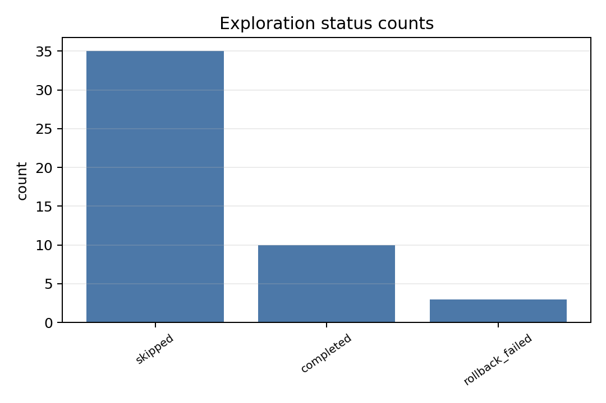
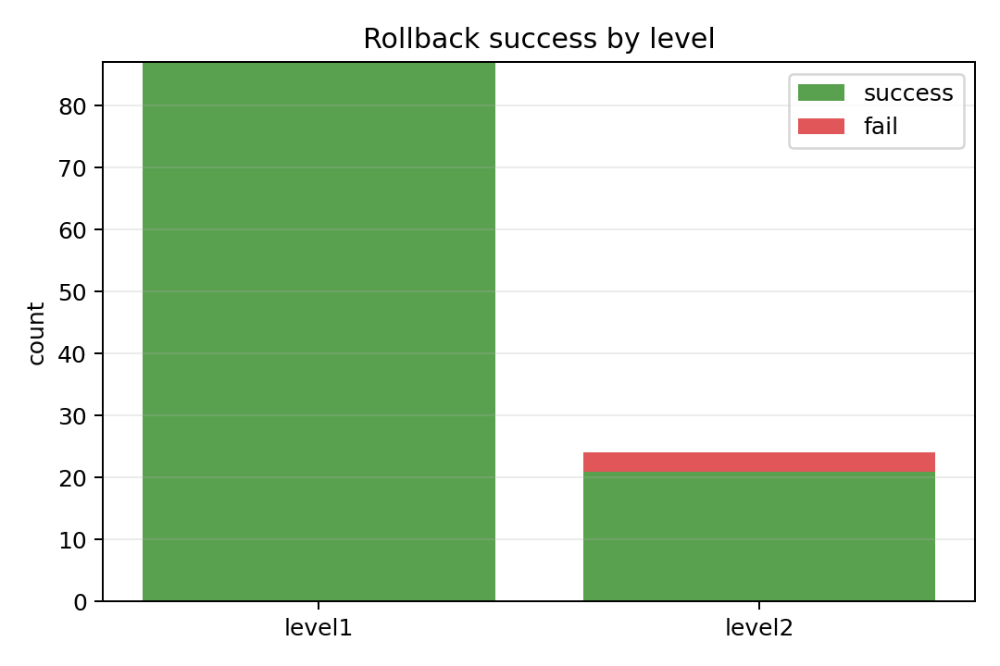
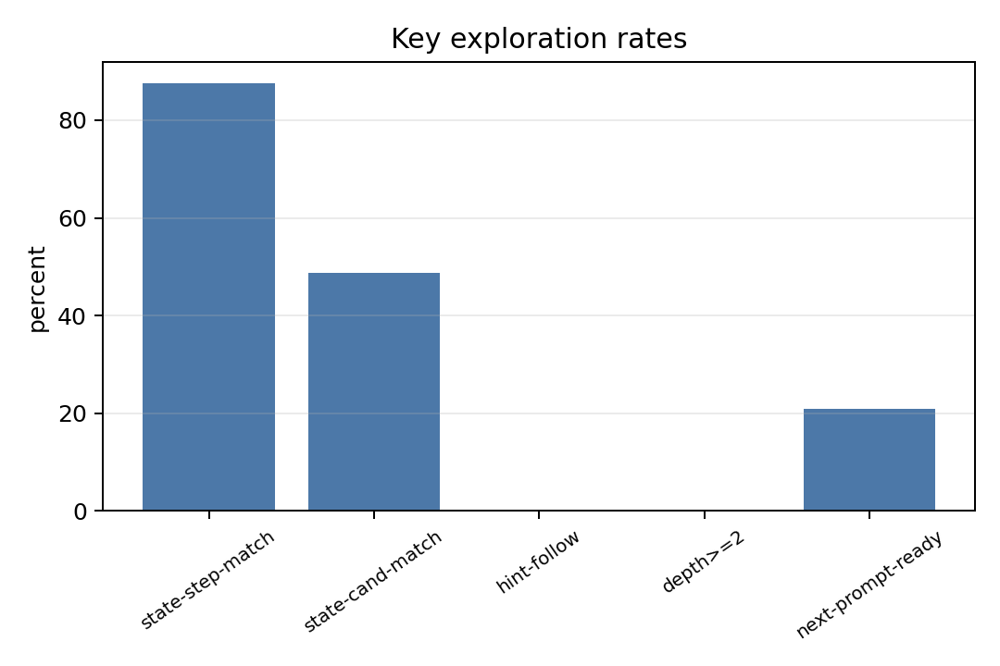
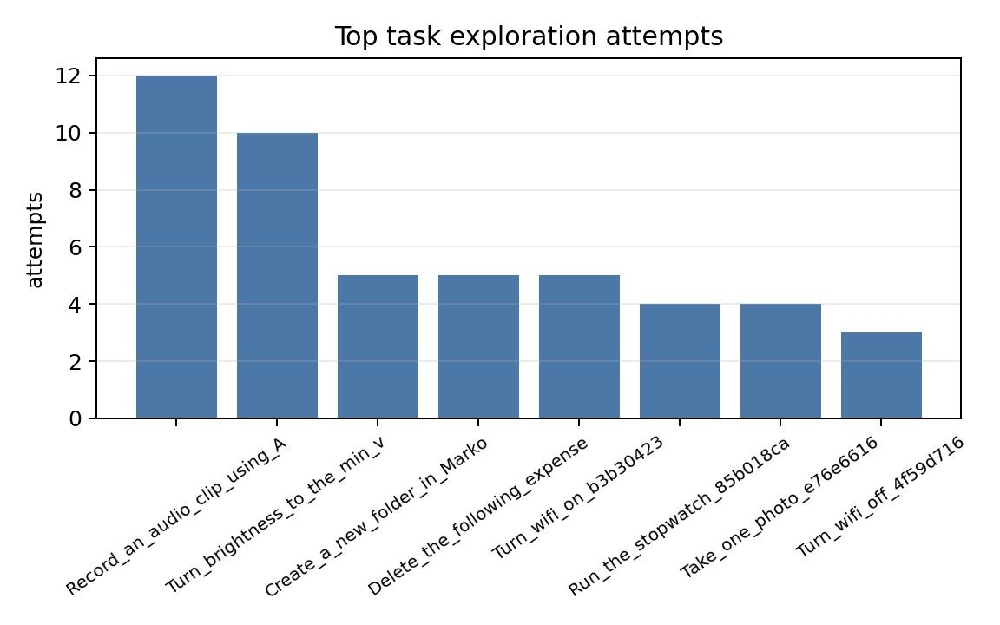
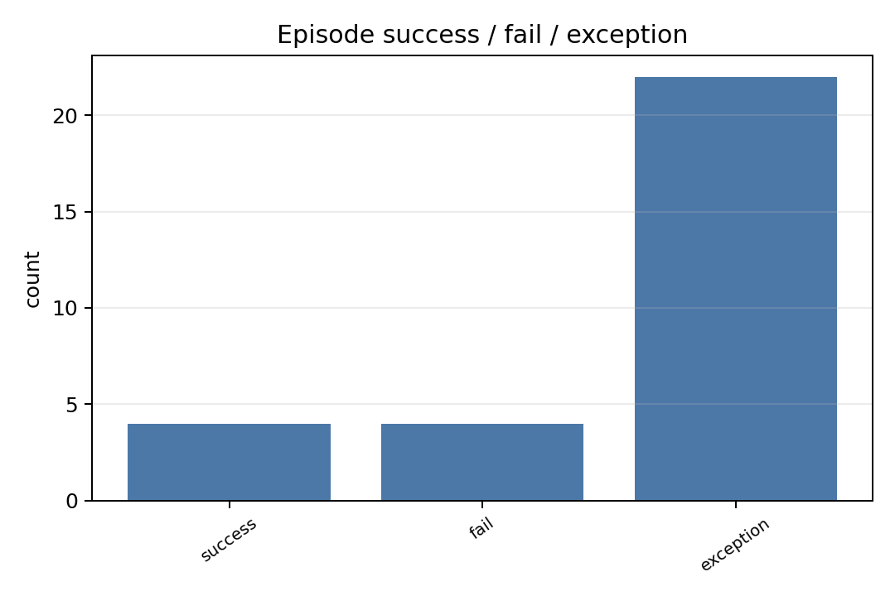
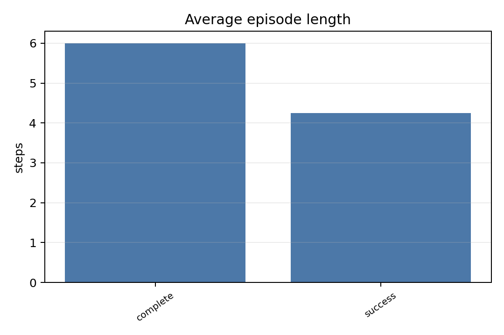
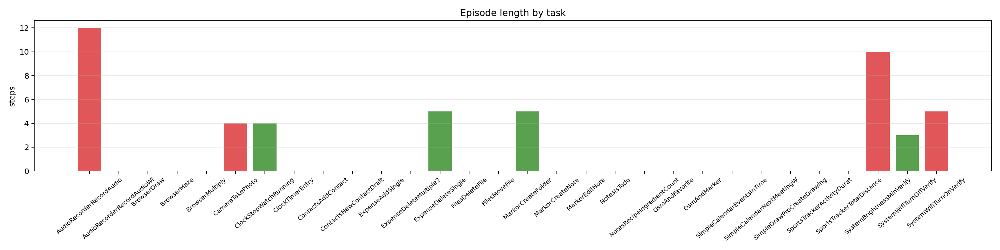
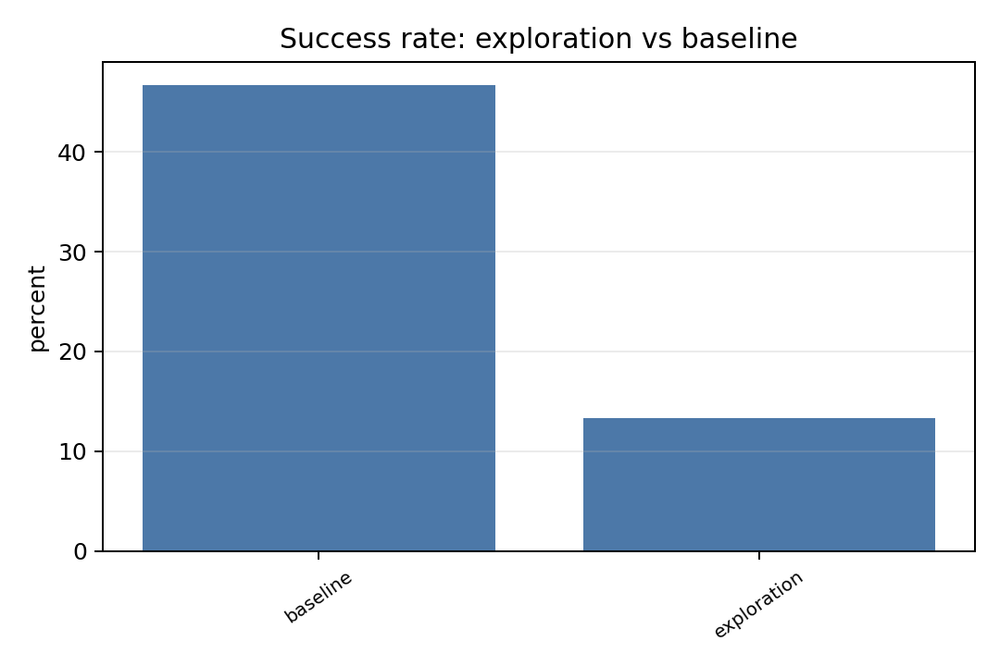
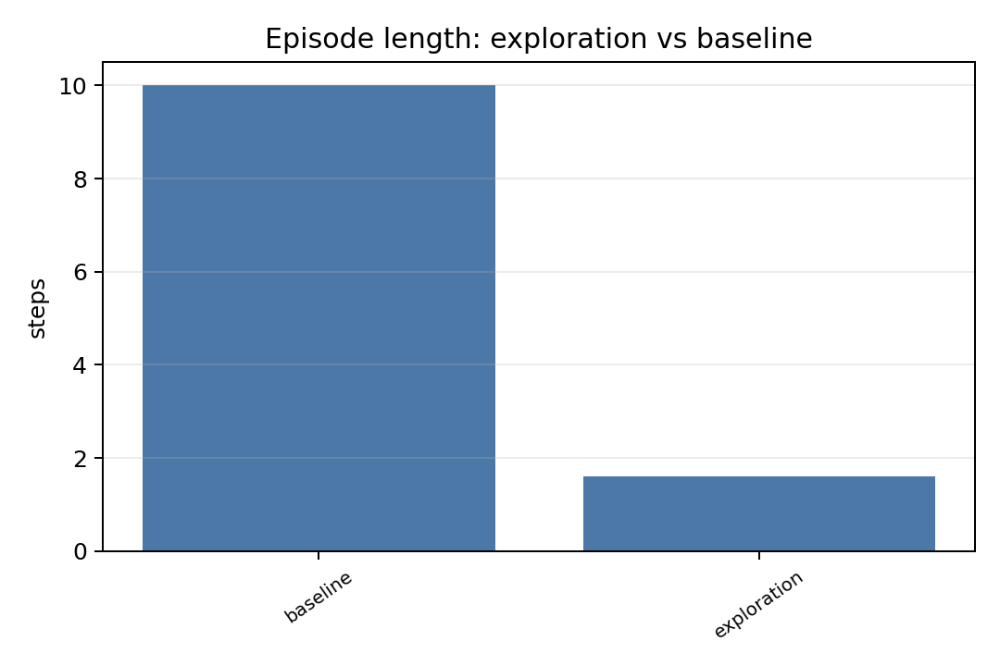
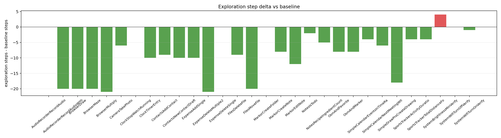

# AndroidWorld Exploration 完整实验报告

- 生成时间: `2026-06-02 18:20:48`
- checkpoint dir: `D:\Projects\android_world\results\strategy_30task_split\sensys_strategy30_v1\machine_2\S4_MCTS_BUDGET12\run_20260602T171800\checkpoints`
- trace root: `D:\Projects\android_world\results\strategy_30task_split\sensys_strategy30_v1\machine_2\S4_MCTS_BUDGET12\run_20260602T171800\traces`
- per-step metrics: `D:\Projects\android_world\results\strategy_30task_split\sensys_strategy30_v1\machine_2\S4_MCTS_BUDGET12\run_20260602T171800\report\step_metrics.csv`

## 总览

| metric | value |
| --- | ---: |
| total episodes | 30 |
| complete episodes | 8 |
| exception failures | 22 |
| success rate, complete only | 50.0% |
| success rate, all trials | 13.3% |
| avg episode length, complete | 6.0 |
| avg episode length, success | 4.25 |
| reasoning steps | 48 |
| exploration traces | 48 |
| prompt hint steps | 0 |
| evidence-only hint steps | 0 |
| evaluable action-hint steps | 0 |
| hint follow rate | n/a |
| rollback success rate | 97.3% |

## Diagnostic / Hard Validation

| artifact | value |
| --- | ---: |
| evidence_decisions rows | 312 |
| prompt_hints rows | 140 |
| injected prompt hints | 0 |
| step decoupling rows | 140 |
| decoupling invalid steps | 0 |
| exploration_latency rows | 96 |
| rollback_events rows | 222 |
| rollback event failures | 6 |
| missing required files | `['prompt_hint_records.jsonl', 'hint_hit_follow.jsonl']` |

## Prompt Injection Diagnosis

- prompt_hints rows: `140`
- injected hint count: `0`
- rejected hint count: `140`
- evidence_decisions rows: `312`

如果 injected hint count 为 `0`，本报告不得把 success rate 变化归因于 prompt augmentation；变化只能来自 exploration/rollback side effects、timing variance、evaluator variance 或随机性。

### Top rejection reasons

- prompt hint rejection reasons: `{'no_matched_evidence': 126, 'matched_evidence_not_promptable': 14}`
- evidence rejection reasons: `{'low_confidence': 216, 'evidence_only_but_no_injection_rule': 96}`
- evidence type counts: `{'ACTION_HINT': 216, 'NONE': 96}`

### Rejected evidence examples

| step | branch | type | confidence | threshold | reason | candidate |
| ---: | ---: | --- | ---: | ---: | --- | --- |
| 2 | 1 | `ACTION_HINT` | 0.21830000000000002 | 0.85 | `low_confidence` | `settings` |
| 2 | 2 | `ACTION_HINT` | 0.21230000000000002 | 0.85 | `low_confidence` | `settings` |
| 2 | 3 | `ACTION_HINT` | 0.20033738532068993 | 0.85 | `low_confidence` | `Profile picture, double tap to open Google Account` |
| 2 | 4 | `ACTION_HINT` | 0.21230000000000002 | 0.85 | `low_confidence` | `settings` |
| 2 | 5 | `ACTION_HINT` | 0.21230000000000002 | 0.85 | `low_confidence` | `settings` |
| 2 | 6 | `ACTION_HINT` | 0.21230000000000002 | 0.85 | `low_confidence` | `settings` |
| 2 | 7 | `ACTION_HINT` | 0.21230000000000002 | 0.85 | `low_confidence` | `settings` |
| 2 | 8 | `ACTION_HINT` | 0.21230000000000002 | 0.85 | `low_confidence` | `settings` |

## Candidate Quality Filtering

- raw candidates: `420`
- filtered candidates: `132`
- candidate operator counts: `{'NavigationPeek': 140, 'DetailPeek': 80, 'Other': 56, 'SearchPeek': 12}`
- top filtered examples: `[{'label': 'android.widget.LinearLayout', 'merged': 'android.widget.LinearLayout', 'reason': 'invalid_bbox', 'center': [540, 2362]}, {'label': 'android.widget.LinearLayout', 'merged': 'android.widget.LinearLayout', 'reason': 'invalid_bbox', 'center': [540, 2477]}, {'label': 'android.widget.LinearLayout', 'merged': 'android.widget.LinearLayout', 'reason': 'invalid_bbox', 'center': [540, 2593]}, {'label': 'android.widget.LinearLayout', 'merged': 'android.widget.LinearLayout', 'reason': 'invalid_bbox', 'center': [540, 2708]}, {'label': 'android.widget.LinearLayout', 'merged': 'android.widget.LinearLayout', 'reason': 'invalid_bbox', 'center': [540, 2824]}, {'label': 'android.widget.LinearLayout', 'merged': 'android.widget.LinearLayout', 'reason': 'invalid_bbox', 'center': [540, 2939]}, {'label': 'android.widget.LinearLayout', 'merged': 'android.widget.LinearLayout', 'reason': 'invalid_bbox', 'center': [540, 3055]}, {'label': 'android.widget.LinearLayout', 'merged': 'android.widget.LinearLayout', 'reason': 'invalid_bbox', 'center': [540, 3170]}, {'label': 'android.widget.LinearLayout', 'merged': 'android.widget.LinearLayout', 'reason': 'invalid_bbox', 'center': [540, 3286]}, {'label': 'android.widget.LinearLayout', 'merged': 'android.widget.LinearLayout', 'reason': 'invalid_bbox', 'center': [540, 3420]}, {'label': 'android.widget.LinearLayout', 'merged': 'android.widget.LinearLayout', 'reason': 'invalid_bbox', 'center': [540, 3535]}, {'label': 'android.widget.LinearLayout', 'merged': 'android.widget.LinearLayout', 'reason': 'invalid_bbox', 'center': [540, 3651]}, {'label': 'Profile picture, double tap to open Google Account', 'merged': 'profile picture, double tap to open google account account avatar', 'reason': 'invalid_bbox', 'center': [954, 54]}, {'label': 'android.widget.LinearLayout', 'merged': 'android.widget.LinearLayout', 'reason': 'invalid_bbox', 'center': [540, 247]}, {'label': 'android.widget.LinearLayout', 'merged': 'android.widget.LinearLayout', 'reason': 'invalid_bbox', 'center': [540, 2396]}, {'label': 'android.widget.LinearLayout', 'merged': 'android.widget.LinearLayout', 'reason': 'invalid_bbox', 'center': [540, 2512]}, {'label': 'android.widget.LinearLayout', 'merged': 'android.widget.LinearLayout', 'reason': 'invalid_bbox', 'center': [540, 2627]}, {'label': 'android.widget.LinearLayout', 'merged': 'android.widget.LinearLayout', 'reason': 'invalid_bbox', 'center': [540, 2743]}, {'label': 'android.widget.LinearLayout', 'merged': 'android.widget.LinearLayout', 'reason': 'invalid_bbox', 'center': [540, 2858]}, {'label': 'android.widget.LinearLayout', 'merged': 'android.widget.LinearLayout', 'reason': 'invalid_bbox', 'center': [540, 2992]}]`

## Search Strategy

- strategy name: `Operator-Stratified Best-First Exploration`
- root-level search: stratified breadth-first selection across operator groups.
- branch continuation: gated depth-first continuation to depth 2.
- ranking: best-first score.
- score formula: `2.0*MissingSlotGain + 1.5*TaskEntityMatch + 1.0*OperatorPriority + 1.0*TaskProgress + 0.5*Novelty - 2.0*RiskPenalty - 1.0*RollbackCost - 1.0*WrongScreenRolePenalty - 0.5*RevisitPenalty`.
- operators: `ListInspect`, `SearchPeek`, `FilterPeek`, `NavigationPeek`, `DetailPeek`, `StatsPeek`, `FormSchema`, `RiskBoundary`, `Other`.

## Latency Breakdown

| metric | value ms |
| --- | ---: |
| avg step latency | 66035.20594537258 |
| avg VLM latency | 1806.6997528076172 |
| avg exploration latency | 56896.58040304979 |
| avg wait after VLM for exploration | 56375.12271106243 |
| avg exploration state fetch | 3779.564435283343 |
| avg exploration a11y dump | 3541.940609614054 |
| avg branch state fetch | 1162.9429031641055 |
| avg branch a11y latency | 1006.1879494251349 |
| p50 exploration total | 3.0090808868408203 |
| p95 exploration total | 109456.78472518921 |
| p50 branch a11y | 0.0 |
| p95 branch a11y | 2498.271942138672 |
| p50 branch state fetch | 0.0 |
| p95 branch state fetch | 2691.3106441497803 |
| p50 rollback verify | 0.0 |
| p95 rollback verify | 0.0 |

## 统计图表





















## Baseline 对比

- baseline task 数: `116`
- 与本次实验匹配的 task 数: `30`
- baseline 平均成功率: `46.7%`
- exploration 平均成功率: `13.3%`
- baseline 平均步数: `10.0`
- exploration 平均步数: `1.6`

| task | baseline success | exploration success | baseline steps | exploration steps | step delta |
| --- | ---: | ---: | ---: | ---: | ---: |
| `AudioRecorderRecordAudio` | 0.0% | 0.0% | 12.0 | 12.0 | 0.0 |
| `AudioRecorderRecordAudioWithFileName` | 0.0% | 0.0% | 20.0 | 0.0 | -20.0 |
| `BrowserDraw` | 0.0% | 0.0% | 20.0 | 0.0 | -20.0 |
| `BrowserMaze` | 0.0% | 0.0% | 20.0 | 0.0 | -20.0 |
| `BrowserMultiply` | 0.0% | 0.0% | 21.0 | 0.0 | -21.0 |
| `CameraTakePhoto` | 0.0% | 0.0% | 10.0 | 4.0 | -6.0 |
| `ClockStopWatchRunning` | 100.0% | 100.0% | 4.0 | 4.0 | 0.0 |
| `ClockTimerEntry` | 0.0% | 0.0% | 10.0 | 0.0 | -10.0 |
| `ContactsAddContact` | 100.0% | 0.0% | 9.0 | 0.0 | -9.0 |
| `ContactsNewContactDraft` | 100.0% | 0.0% | 10.0 | 0.0 | -10.0 |
| `ExpenseAddSingle` | 100.0% | 0.0% | 10.0 | 0.0 | -10.0 |
| `ExpenseDeleteMultiple2` | 100.0% | 0.0% | 21.0 | 0.0 | -21.0 |
| `ExpenseDeleteSingle` | 100.0% | 100.0% | 5.0 | 5.0 | 0.0 |
| `FilesDeleteFile` | 0.0% | 0.0% | 9.0 | 0.0 | -9.0 |
| `FilesMoveFile` | 0.0% | 0.0% | 20.0 | 0.0 | -20.0 |
| `MarkorCreateFolder` | 100.0% | 100.0% | 5.0 | 5.0 | 0.0 |
| `MarkorCreateNote` | 100.0% | 0.0% | 8.0 | 0.0 | -8.0 |
| `MarkorEditNote` | 0.0% | 0.0% | 12.0 | 0.0 | -12.0 |
| `NotesIsTodo` | 100.0% | 0.0% | 2.0 | 0.0 | -2.0 |
| `NotesRecipeIngredientCount` | 0.0% | 0.0% | 5.0 | 0.0 | -5.0 |
| `OsmAndFavorite` | 100.0% | 0.0% | 8.0 | 0.0 | -8.0 |
| `OsmAndMarker` | 0.0% | 0.0% | 8.0 | 0.0 | -8.0 |
| `SimpleCalendarEventsInTimeRange` | 0.0% | 0.0% | 4.0 | 0.0 | -4.0 |
| `SimpleCalendarNextMeetingWithPerson` | 0.0% | 0.0% | 6.0 | 0.0 | -6.0 |
| `SimpleDrawProCreateDrawing` | 100.0% | 0.0% | 18.0 | 0.0 | -18.0 |
| `SportsTrackerActivityDuration` | 0.0% | 0.0% | 4.0 | 0.0 | -4.0 |
| `SportsTrackerTotalDistanceForCategoryOverInterval` | 0.0% | 0.0% | 4.0 | 0.0 | -4.0 |
| `SystemBrightnessMinVerify` | 100.0% | 0.0% | 6.0 | 10.0 | 4.0 |
| `SystemWifiTurnOffVerify` | 100.0% | 100.0% | 3.0 | 3.0 | 0.0 |
| `SystemWifiTurnOnVerify` | 100.0% | 0.0% | 6.0 | 5.0 | -1.0 |

## Exploration 统计

- exploration status: `{'skipped': 35, 'completed': 10, 'rollback_failed': 3}`
- 可用于下一步 prompt 的 exploration: 10/48 (20.8%)
- depth>=2 observation: 0/156 (0.0%)
- 平均每步候选元素数: `3.0`
- 平均每步 selected targets: `2.7708333333333335`
- 平均每步 observations: `3.25`

## State Match 与 Hint 命中率

- 有 pending exploration 可匹配的 reasoning step: 8
- state match step hit rate: 7/8 (87.5%)
- state match candidate hit rate: 41/84 (48.8%)
- hint injected steps: 0
- evidence-only hint steps: 0
- evaluable action-hint steps: 0
- hint followed: n/a

这里的 hint followed 只统计可评估的 action-hint：VLM 在注入 state-aligned hint 后，下一步实际 click 落在 exploration 建议的 next candidate bbox 内/距离 candidate center 小于 120 px，或实际 TYPE 文本与 typed speculative candidate 完全一致。evidence-only hint 只提供页面事实，不进入该命中率分母。

## Per-step Reasoning / Exploration Trace

完整逐步记录已保存到 `D:\Projects\android_world\results\strategy_30task_split\sensys_strategy30_v1\machine_2\S4_MCTS_BUDGET12\run_20260602T171800\report\step_metrics.csv`。下面展示前 30 行，用于检查每次 reasoning 前是否有 pending exploration、匹配到了多少结果、post-planning 阶段又探索了多少分支。

| task | step | pre pending | pre matched | hint | hint hit | post status | post candidates | selected | obs | action |
| --- | ---: | ---: | ---: | --- | --- | --- | ---: | ---: | ---: | --- |
| `Create_a_new_folder_in_Markor_named_folder_20...` | 1 | 0 | 0 | False | False | `skipped` | 0 | 0 | 0 | `open_app` |
| `Create_a_new_folder_in_Markor_named_folder_20...` | 2 | 0 | 0 | False | False | `skipped` | 0 | 0 | 0 | `click@(962,2068)` |
| `Create_a_new_folder_in_Markor_named_folder_20...` | 3 | 0 | 0 | False | False | `skipped` | 0 | 0 | 0 | `input_text` |
| `Create_a_new_folder_in_Markor_named_folder_20...` | 4 | 0 | 0 | False | False | `skipped` | 0 | 0 | 0 | `click@(168,1490)` |
| `Create_a_new_folder_in_Markor_named_folder_20...` | 5 | 0 | 0 | False | False | `skipped` | 0 | 0 | 0 | `status` |
| `Delete_the_following_expenses_from_pro_expens...` | 1 | 0 | 0 | False | False | `skipped` | 0 | 0 | 0 | `open_app` |
| `Delete_the_following_expenses_from_pro_expens...` | 2 | 0 | 0 | False | False | `skipped` | 0 | 0 | 0 | `click@(395,1780)` |
| `Delete_the_following_expenses_from_pro_expens...` | 3 | 0 | 0 | False | False | `skipped` | 0 | 0 | 0 | `click@(967,1658)` |
| `Delete_the_following_expenses_from_pro_expens...` | 4 | 0 | 0 | False | False | `skipped` | 0 | 0 | 0 | `click@(537,2221)` |
| `Delete_the_following_expenses_from_pro_expens...` | 5 | 0 | 0 | False | False | `skipped` | 0 | 0 | 0 | `status` |
| `Record_an_audio_clip_using_Audio_Recorder_app...` | 1 | 0 | 0 | False | False | `skipped` | 0 | 0 | 0 | `open_app` |
| `Record_an_audio_clip_using_Audio_Recorder_app...` | 2 | 0 | 0 | False | False | `skipped` | 0 | 0 | 0 | `click@(540,2150)` |
| `Record_an_audio_clip_using_Audio_Recorder_app...` | 3 | 0 | 0 | False | False | `skipped` | 0 | 0 | 0 | `click@(540,2150)` |
| `Record_an_audio_clip_using_Audio_Recorder_app...` | 4 | 0 | 0 | False | False | `skipped` | 0 | 0 | 0 | `click@(806,2248)` |
| `Record_an_audio_clip_using_Audio_Recorder_app...` | 5 | 0 | 0 | False | False | `skipped` | 0 | 0 | 0 | `click@(806,2248)` |
| `Record_an_audio_clip_using_Audio_Recorder_app...` | 6 | 0 | 0 | False | False | `skipped` | 0 | 0 | 0 | `click@(464,1418)` |
| `Record_an_audio_clip_using_Audio_Recorder_app...` | 7 | 0 | 0 | False | False | `skipped` | 0 | 0 | 0 | `click@(540,2183)` |
| `Record_an_audio_clip_using_Audio_Recorder_app...` | 8 | 0 | 0 | False | False | `skipped` | 0 | 0 | 0 | `click@(742,2181)` |
| `Record_an_audio_clip_using_Audio_Recorder_app...` | 9 | 0 | 0 | False | False | `skipped` | 0 | 0 | 0 | `click@(540,2183)` |
| `Record_an_audio_clip_using_Audio_Recorder_app...` | 10 | 0 | 0 | False | False | `skipped` | 0 | 0 | 0 | `click@(742,2181)` |
| `Record_an_audio_clip_using_Audio_Recorder_app...` | 11 | 0 | 0 | False | False | `skipped` | 0 | 0 | 0 | `click@(540,2183)` |
| `Record_an_audio_clip_using_Audio_Recorder_app...` | 12 | 0 | 0 | False | False | `skipped` | 0 | 0 | 0 | `click@(742,2181)` |
| `Run_the_stopwatch_85b018ca` | 1 | 0 | 0 | False | False | `skipped` | 0 | 0 | 0 | `open_app` |
| `Run_the_stopwatch_85b018ca` | 2 | 0 | 0 | False | False | `skipped` | 0 | 0 | 0 | `click@(754,2231)` |
| `Run_the_stopwatch_85b018ca` | 3 | 0 | 0 | False | False | `skipped` | 0 | 0 | 0 | `click@(540,1955)` |
| `Run_the_stopwatch_85b018ca` | 4 | 0 | 0 | False | False | `skipped` | 0 | 0 | 0 | `status` |
| `Take_one_photo_e76e6616` | 1 | 0 | 0 | False | False | `skipped` | 0 | 0 | 0 | `open_app` |
| `Take_one_photo_e76e6616` | 2 | 0 | 0 | False | False | `skipped` | 0 | 0 | 0 | `click@(540,2176)` |
| `Take_one_photo_e76e6616` | 3 | 0 | 0 | False | False | `skipped` | 0 | 0 | 0 | `click@(540,2176)` |
| `Take_one_photo_e76e6616` | 4 | 0 | 0 | False | False | `skipped` | 0 | 0 | 0 | `status` |

## Rollback 统计

- rollback total: 111
- rollback success: 108/111 (97.3%)
- level2 trigger reasons: `{'replay_required_after_home': 48}`

| level | total | success | success rate |
| --- | ---: | ---: | ---: |
| level1 | 87 | 87 | 100.0% |
| level2 | 24 | 21 | 87.5% |

## Per-task Exploration Top 20

| task dir | reasoning steps | exploration attempts | observations | hint steps | hint followed |
| --- | ---: | ---: | ---: | ---: | ---: |
| `Record_an_audio_clip_using_Audio_Recorder_app_and_save_it_51068baf` | 12 | 12 | 0 | 0 | 0 |
| `Turn_brightness_to_the_min_value_178fab52` | 10 | 10 | 96 | 0 | 0 |
| `Create_a_new_folder_in_Markor_named_folder_20260602_171813_0482ae75` | 5 | 5 | 0 | 0 | 0 |
| `Delete_the_following_expenses_from_pro_expense_Movie_Night_ccb19e2b` | 5 | 5 | 0 | 0 | 0 |
| `Turn_wifi_on_b3b30423` | 5 | 5 | 36 | 0 | 0 |
| `Run_the_stopwatch_85b018ca` | 4 | 4 | 0 | 0 | 0 |
| `Take_one_photo_e76e6616` | 4 | 4 | 0 | 0 | 0 |
| `Turn_wifi_off_4f59d716` | 3 | 3 | 24 | 0 | 0 |

## 具体 Exploration Traces

### Case 1: exploration step 7

- task instruction: `Turn brightness to the min value.`
- status: `rollback_failed`; trigger: `slot_gate_enabled:NAVIGATION_SEARCH:navigation_search`
- candidates: 14; selected targets: 12; latency: 52348.9 ms
- available for next prompt: `False`

Root screenshot:


| rank | selected element | score | relevance | center |
| ---: | --- | ---: | ---: | --- |
| 1 | `settings` | 0.010 | 0.000 | `[540, 1165]` |
| 2 | `Help & feedback` | 0.010 | 0.000 | `[911, 201]` |
| 3 | `settings` | 0.010 | 0.000 | `[540, 1459]` |
| 4 | `More options` | 0.010 | 0.000 | `[1027, 201]` |
| 5 | `settings` | 0.010 | 0.000 | `[540, 1606]` |

Branch 1: path=`settings`, score=0.010, depth=1, rollback=level1/backtrack/True

- depth 1: action=`click settings`; score=0.010; changed=False; activity=`com.google.android.gms/com.google.android.gms.accountsettings.mg.ui.main.MainActivity`


Observed elements:

```text
status bar launch animation container; container; status bar container; status bar; status bar contents; status bar start side container; status bar start side content; status bar start side except heads up; 15:41; notification icon area; notificationIcons; Android System notification: Check access settings; Android System notification: Serial console enabled; cutout space view; status bar end side container; status bar end side content; system icons; statusIcons; Do Not Disturb; No phone.; A...
```

Branch 2: path=`Help & feedback`, score=0.010, depth=1, rollback=level1/backtrack/True

- depth 1: action=`click Help & feedback`; score=0.010; changed=True; activity=`com.google.android.gms/com.google.android.gms.accountsettings.mg.ui.main.MainActivity`


Observed elements:

```text
status bar launch animation container; container; status bar container; status bar; status bar contents; status bar start side container; status bar start side content; status bar start side except heads up; 15:41; notification icon area; notificationIcons; Android System notification: Check access settings; Android System notification: Serial console enabled; cutout space view; status bar end side container; status bar end side content; system icons; statusIcons; Do Not Disturb; No phone.; A...
```

Root a11y excerpt:

```json
[
  {
    "text": null,
    "desc": null,
    "class": null,
    "center": [
      540,
      64
    ],
    "clickable": null
  },
  {
    "text": null,
    "desc": null,
    "class": null,
    "center": [
      540,
      64
    ],
    "clickable": null
  },
  {
    "text": null,
    "desc": null,
    "class": null,
    "center": [
      540,
      64
    ],
    "clickable": null
  },
  {
    "text": null,
    "desc": null,
    "class": null,
    "center": [
      540,
      64
    ],
    "clickable": null
  },
  {
    "text": null,
    "desc": null,
    "class": null,
    "center": [
      538,
      64
    ],
    "clickable": null
  },
  {
    "text": null,
    "desc": null,
    "class": null,
    "center": [
      259,
      64
    ],
    "clickable": null
  },
  {
    "text": null,
    "desc": null,
    "class": null,
    "center": [
      157,
      64
    ],
    "clickable": null
  },
  {
    "text": null,
    "desc": null,
    "class": null,
    "center": [
      157,
      64
    ],
    "clickable": null
  }
]
```

### Case 2: exploration step 8

- task instruction: `Turn brightness to the min value.`
- status: `rollback_failed`; trigger: `slot_gate_enabled:NAVIGATION_SEARCH:navigation_search`
- candidates: 10; selected targets: 10; latency: 33336.3 ms
- available for next prompt: `False`

Root screenshot:


| rank | selected element | score | relevance | center |
| ---: | --- | ---: | ---: | --- |
| 1 | `settings` | 0.010 | 0.000 | `[540, 238]` |
| 2 | `settings` | 0.050 | 0.000 | `[540, 400]` |
| 3 | `settings` | 0.050 | 0.000 | `[540, 567]` |
| 4 | `settings` | 0.050 | 0.000 | `[540, 798]` |
| 5 | `settings` | 0.050 | 0.000 | `[540, 1029]` |

Branch 1: path=`settings`, score=0.010, depth=1, rollback=level2/home_replay_failed/False

- depth 1: action=`click settings`; score=0.010; changed=True; activity=`com.google.android.settings.intelligence/com.google.android.settings.intelligence.modules.search....`


Observed elements:

```text
status bar launch animation container; container; status bar container; status bar; status bar contents; status bar start side container; status bar start side content; status bar start side except heads up; 15:42; notification icon area; notificationIcons; Android System notification: Check access settings; Android System notification: Serial console enabled; cutout space view; status bar end side container; status bar end side content; system icons; statusIcons; Do Not Disturb; No phone.; A...
```

Branch 2: path=`passive coverage sample 1`, score=0.000, depth=0, rollback=level0/passive_no_action/True

- depth 0: action=`inspect passive coverage sample 1`; score=0.000; changed=False; activity=`com.android.settings/com.android.settings.Settings`


Observed elements:

```text
status bar launch animation container; container; status bar container; status bar; status bar contents; status bar start side container
```

Root a11y excerpt:

```json
[
  {
    "text": null,
    "desc": null,
    "class": null,
    "center": [
      540,
      64
    ],
    "clickable": null
  },
  {
    "text": null,
    "desc": null,
    "class": null,
    "center": [
      540,
      64
    ],
    "clickable": null
  },
  {
    "text": null,
    "desc": null,
    "class": null,
    "center": [
      540,
      64
    ],
    "clickable": null
  },
  {
    "text": null,
    "desc": null,
    "class": null,
    "center": [
      540,
      64
    ],
    "clickable": null
  },
  {
    "text": null,
    "desc": null,
    "class": null,
    "center": [
      538,
      64
    ],
    "clickable": null
  },
  {
    "text": null,
    "desc": null,
    "class": null,
    "center": [
      259,
      64
    ],
    "clickable": null
  },
  {
    "text": null,
    "desc": null,
    "class": null,
    "center": [
      157,
      64
    ],
    "clickable": null
  },
  {
    "text": null,
    "desc": null,
    "class": null,
    "center": [
      157,
      64
    ],
    "clickable": null
  }
]
```

### Case 3: exploration step 9

- task instruction: `Turn brightness to the min value.`
- status: `rollback_failed`; trigger: `slot_gate_enabled:NAVIGATION_SEARCH:navigation_search`
- candidates: 15; selected targets: 12; latency: 28636.5 ms
- available for next prompt: `False`

Root screenshot:


| rank | selected element | score | relevance | center |
| ---: | --- | ---: | ---: | --- |
| 1 | `Search` | 0.050 | 0.000 | `[890, 191]` |
| 2 | `Grid view` | 0.050 | 0.000 | `[953, 588]` |
| 3 | `Images` | 0.090 | 0.000 | `[191, 446]` |
| 4 | `settings` | 0.050 | 0.000 | `[367, 348]` |
| 5 | `Audio` | 0.090 | 0.000 | `[456, 446]` |

Branch 1: path=`Search`, score=0.050, depth=1, rollback=level1/backtrack/True

- depth 1: action=`click Search`; score=0.050; changed=True; activity=`com.google.android.documentsui/com.android.documentsui.files.FilesActivity`


Observed elements:

```text
status bar launch animation container; container; status bar container; status bar; status bar contents; status bar start side container; status bar start side content; status bar start side except heads up; 15:43; notification icon area; notificationIcons; Android System notification: Check access settings; Android System notification: Serial console enabled; cutout space view; status bar end side container; status bar end side content; system icons; statusIcons; Do Not Disturb; No phone.; A...
```

Branch 2: path=`Grid view`, score=0.050, depth=1, rollback=level2/home_replay_failed/False

- depth 1: action=`click Grid view`; score=0.050; changed=True; activity=`com.google.android.documentsui/com.android.documentsui.files.FilesActivity`


Observed elements:

```text
status bar launch animation container; container; status bar container; status bar; status bar contents; status bar start side container; status bar start side content; status bar start side except heads up; 15:43; notification icon area; notificationIcons; Android System notification: Check access settings; Android System notification: Serial console enabled; cutout space view; status bar end side container; status bar end side content; system icons; statusIcons; Do Not Disturb; No phone.; A...
```

Root a11y excerpt:

```json
[
  {
    "text": null,
    "desc": null,
    "class": null,
    "center": [
      540,
      64
    ],
    "clickable": null
  },
  {
    "text": null,
    "desc": null,
    "class": null,
    "center": [
      540,
      64
    ],
    "clickable": null
  },
  {
    "text": null,
    "desc": null,
    "class": null,
    "center": [
      540,
      64
    ],
    "clickable": null
  },
  {
    "text": null,
    "desc": null,
    "class": null,
    "center": [
      540,
      64
    ],
    "clickable": null
  },
  {
    "text": null,
    "desc": null,
    "class": null,
    "center": [
      538,
      64
    ],
    "clickable": null
  },
  {
    "text": null,
    "desc": null,
    "class": null,
    "center": [
      259,
      64
    ],
    "clickable": null
  },
  {
    "text": null,
    "desc": null,
    "class": null,
    "center": [
      157,
      64
    ],
    "clickable": null
  },
  {
    "text": null,
    "desc": null,
    "class": null,
    "center": [
      157,
      64
    ],
    "clickable": null
  }
]
```

### Case 4: exploration step 2

- task instruction: `Turn wifi on.`
- status: `completed`; trigger: `slot_gate_enabled:NAVIGATION_SEARCH:navigation_search`
- candidates: 9; selected targets: 9; latency: 2001943.1 ms
- available for next prompt: `True`

Root screenshot:


| rank | selected element | score | relevance | center |
| ---: | --- | ---: | ---: | --- |
| 1 | `settings` | 0.700 | 0.000 | `[540, 659]` |
| 2 | `settings` | 0.050 | 0.000 | `[540, 885]` |
| 3 | `Profile picture, double tap to open Google Account` | 0.050 | 0.000 | `[954, 338]` |
| 4 | `settings` | 0.050 | 0.000 | `[540, 1116]` |
| 5 | `settings` | 0.050 | 0.000 | `[540, 1347]` |

Branch 1: path=`settings`, score=0.700, depth=1, rollback=level2/home_replay/True

- depth 1: action=`click settings`; score=0.700; changed=True; activity=`com.google.android.settings.intelligence/com.google.android.settings.intelligence.modules.search....`


Observed elements:

```text
status bar launch animation container; container; status bar container; status bar; status bar contents; status bar start side container; status bar start side content; status bar start side except heads up; 15:34; notification icon area; notificationIcons; Android System notification: Check access settings; Android System notification: Serial console enabled; cutout space view; status bar end side container; status bar end side content; system icons; statusIcons; Do Not Disturb; No phone.; W...
```

Branch 2: path=`settings`, score=0.050, depth=1, rollback=level1/backtrack/True

- depth 1: action=`click settings`; score=0.050; changed=True; activity=`com.android.settings/com.android.settings.SubSettings`


Observed elements:

```text
status bar launch animation container; container; status bar container; status bar; status bar contents; status bar start side container; status bar start side content; status bar start side except heads up; 15:34; notification icon area; notificationIcons; Android System notification: Check access settings; Android System notification: Serial console enabled; cutout space view; status bar end side container; status bar end side content; system icons; statusIcons; Do Not Disturb; No phone.; W...
```

Root a11y excerpt:

```json
[
  {
    "text": null,
    "desc": null,
    "class": null,
    "center": [
      540,
      64
    ],
    "clickable": null
  },
  {
    "text": null,
    "desc": null,
    "class": null,
    "center": [
      540,
      64
    ],
    "clickable": null
  },
  {
    "text": null,
    "desc": null,
    "class": null,
    "center": [
      540,
      64
    ],
    "clickable": null
  },
  {
    "text": null,
    "desc": null,
    "class": null,
    "center": [
      540,
      64
    ],
    "clickable": null
  },
  {
    "text": null,
    "desc": null,
    "class": null,
    "center": [
      538,
      64
    ],
    "clickable": null
  },
  {
    "text": null,
    "desc": null,
    "class": null,
    "center": [
      259,
      64
    ],
    "clickable": null
  },
  {
    "text": null,
    "desc": null,
    "class": null,
    "center": [
      157,
      64
    ],
    "clickable": null
  },
  {
    "text": null,
    "desc": null,
    "class": null,
    "center": [
      157,
      64
    ],
    "clickable": null
  }
]
```

### Case 5: exploration step 3

- task instruction: `Turn brightness to the min value.`
- status: `completed`; trigger: `slot_gate_enabled:NAVIGATION_SEARCH:navigation_search`
- candidates: 11; selected targets: 11; latency: 150619.7 ms
- available for next prompt: `True`

Root screenshot:


| rank | selected element | score | relevance | center |
| ---: | --- | ---: | ---: | --- |
| 1 | `settings` | 0.050 | 0.000 | `[540, 238]` |
| 2 | `settings` | 0.050 | 0.000 | `[540, 363]` |
| 3 | `settings` | 0.050 | 0.000 | `[540, 492]` |
| 4 | `settings` | 0.050 | 0.000 | `[540, 723]` |
| 5 | `settings` | 0.050 | 0.000 | `[540, 954]` |

Branch 1: path=`settings`, score=0.050, depth=1, rollback=level1/backtrack/True

- depth 1: action=`click settings`; score=0.050; changed=True; activity=`com.google.android.settings.intelligence/com.google.android.settings.intelligence.modules.search....`


Observed elements:

```text
status bar launch animation container; container; status bar container; status bar; status bar contents; status bar start side container; status bar start side content; status bar start side except heads up; 15:36; notification icon area; notificationIcons; Android System notification: Check access settings; Android System notification: Serial console enabled; cutout space view; status bar end side container; status bar end side content; system icons; statusIcons; Do Not Disturb; No phone.; A...
```

Branch 2: path=`settings`, score=0.050, depth=1, rollback=level2/home_replay/True

- depth 1: action=`click settings`; score=0.050; changed=True; activity=`com.android.settings/com.android.settings.SubSettings`


Observed elements:

```text
status bar launch animation container; container; status bar container; status bar; status bar contents; status bar start side container; status bar start side content; status bar start side except heads up; 15:36; notification icon area; notificationIcons; Android System notification: Check access settings; Android System notification: Serial console enabled; cutout space view; status bar end side container; status bar end side content; system icons; statusIcons; Do Not Disturb; No phone.; A...
```

Root a11y excerpt:

```json
[
  {
    "text": null,
    "desc": null,
    "class": null,
    "center": [
      540,
      64
    ],
    "clickable": null
  },
  {
    "text": null,
    "desc": null,
    "class": null,
    "center": [
      540,
      64
    ],
    "clickable": null
  },
  {
    "text": null,
    "desc": null,
    "class": null,
    "center": [
      540,
      64
    ],
    "clickable": null
  },
  {
    "text": null,
    "desc": null,
    "class": null,
    "center": [
      540,
      64
    ],
    "clickable": null
  },
  {
    "text": null,
    "desc": null,
    "class": null,
    "center": [
      538,
      64
    ],
    "clickable": null
  },
  {
    "text": null,
    "desc": null,
    "class": null,
    "center": [
      259,
      64
    ],
    "clickable": null
  },
  {
    "text": null,
    "desc": null,
    "class": null,
    "center": [
      157,
      64
    ],
    "clickable": null
  },
  {
    "text": null,
    "desc": null,
    "class": null,
    "center": [
      157,
      64
    ],
    "clickable": null
  }
]
```

### Case 6: exploration step 2

- task instruction: `Turn brightness to the min value.`
- status: `completed`; trigger: `slot_gate_enabled:NAVIGATION_SEARCH:navigation_search`
- candidates: 9; selected targets: 9; latency: 109456.8 ms
- available for next prompt: `True`

Root screenshot:


| rank | selected element | score | relevance | center |
| ---: | --- | ---: | ---: | --- |
| 1 | `settings` | 0.050 | 0.000 | `[540, 659]` |
| 2 | `settings` | 0.050 | 0.000 | `[540, 885]` |
| 3 | `Profile picture, double tap to open Google Account` | 0.056 | 0.006 | `[954, 338]` |
| 4 | `settings` | 0.050 | 0.000 | `[540, 1116]` |
| 5 | `settings` | 0.050 | 0.000 | `[540, 1347]` |

Branch 1: path=`settings`, score=0.050, depth=1, rollback=level2/home_replay/True

- depth 1: action=`click settings`; score=0.050; changed=True; activity=`com.google.android.settings.intelligence/com.google.android.settings.intelligence.modules.search....`


Observed elements:

```text
status bar launch animation container; container; status bar container; status bar; status bar contents; status bar start side container; status bar start side content; status bar start side except heads up; 15:34; notification icon area; notificationIcons; Android System notification: Check access settings; Android System notification: Serial console enabled; cutout space view; status bar end side container; status bar end side content; system icons; statusIcons; Do Not Disturb; No phone.; A...
```

Branch 2: path=`settings`, score=0.050, depth=1, rollback=level1/backtrack/True

- depth 1: action=`click settings`; score=0.050; changed=True; activity=`com.android.settings/com.android.settings.SubSettings`


Observed elements:

```text
status bar launch animation container; container; status bar container; status bar; status bar contents; status bar start side container; status bar start side content; status bar start side except heads up; 15:34; notification icon area; notificationIcons; Android System notification: Check access settings; Android System notification: Serial console enabled; cutout space view; status bar end side container; status bar end side content; system icons; statusIcons; Do Not Disturb; No phone.; A...
```

Root a11y excerpt:

```json
[
  {
    "text": null,
    "desc": null,
    "class": null,
    "center": [
      540,
      64
    ],
    "clickable": null
  },
  {
    "text": null,
    "desc": null,
    "class": null,
    "center": [
      540,
      64
    ],
    "clickable": null
  },
  {
    "text": null,
    "desc": null,
    "class": null,
    "center": [
      540,
      64
    ],
    "clickable": null
  },
  {
    "text": null,
    "desc": null,
    "class": null,
    "center": [
      540,
      64
    ],
    "clickable": null
  },
  {
    "text": null,
    "desc": null,
    "class": null,
    "center": [
      538,
      64
    ],
    "clickable": null
  },
  {
    "text": null,
    "desc": null,
    "class": null,
    "center": [
      259,
      64
    ],
    "clickable": null
  },
  {
    "text": null,
    "desc": null,
    "class": null,
    "center": [
      157,
      64
    ],
    "clickable": null
  },
  {
    "text": null,
    "desc": null,
    "class": null,
    "center": [
      157,
      64
    ],
    "clickable": null
  }
]
```

### Case 7: exploration step 2

- task instruction: `Turn wifi off.`
- status: `completed`; trigger: `slot_gate_enabled:NAVIGATION_SEARCH:navigation_search`
- candidates: 9; selected targets: 9; latency: 105119.2 ms
- available for next prompt: `True`

Root screenshot:


| rank | selected element | score | relevance | center |
| ---: | --- | ---: | ---: | --- |
| 1 | `settings` | 0.700 | 0.000 | `[540, 659]` |
| 2 | `settings` | 0.050 | 0.000 | `[540, 885]` |
| 3 | `Profile picture, double tap to open Google Account` | 0.050 | 0.000 | `[954, 338]` |
| 4 | `settings` | 0.050 | 0.000 | `[540, 1116]` |
| 5 | `settings` | 0.050 | 0.000 | `[540, 1347]` |

Branch 1: path=`settings`, score=0.700, depth=1, rollback=level2/home_replay/True

- depth 1: action=`click settings`; score=0.700; changed=True; activity=`com.google.android.settings.intelligence/com.google.android.settings.intelligence.modules.search....`


Observed elements:

```text
status bar launch animation container; container; status bar container; status bar; status bar contents; status bar start side container; status bar start side content; status bar start side except heads up; 15:34; notification icon area; notificationIcons; Android System notification: Check access settings; Android System notification: Serial console enabled; cutout space view; status bar end side container; status bar end side content; system icons; statusIcons; Do Not Disturb; No phone.; A...
```

Branch 2: path=`settings`, score=0.050, depth=1, rollback=level1/backtrack/True

- depth 1: action=`click settings`; score=0.050; changed=True; activity=`com.android.settings/com.android.settings.SubSettings`


Observed elements:

```text
status bar launch animation container; container; status bar container; status bar; status bar contents; status bar start side container; status bar start side content; status bar start side except heads up; 15:34; notification icon area; notificationIcons; Android System notification: Check access settings; Android System notification: Serial console enabled; cutout space view; status bar end side container; status bar end side content; system icons; statusIcons; Do Not Disturb; No phone.; A...
```

Root a11y excerpt:

```json
[
  {
    "text": null,
    "desc": null,
    "class": null,
    "center": [
      540,
      64
    ],
    "clickable": null
  },
  {
    "text": null,
    "desc": null,
    "class": null,
    "center": [
      540,
      64
    ],
    "clickable": null
  },
  {
    "text": null,
    "desc": null,
    "class": null,
    "center": [
      540,
      64
    ],
    "clickable": null
  },
  {
    "text": null,
    "desc": null,
    "class": null,
    "center": [
      540,
      64
    ],
    "clickable": null
  },
  {
    "text": null,
    "desc": null,
    "class": null,
    "center": [
      538,
      64
    ],
    "clickable": null
  },
  {
    "text": null,
    "desc": null,
    "class": null,
    "center": [
      259,
      64
    ],
    "clickable": null
  },
  {
    "text": null,
    "desc": null,
    "class": null,
    "center": [
      157,
      64
    ],
    "clickable": null
  },
  {
    "text": null,
    "desc": null,
    "class": null,
    "center": [
      157,
      64
    ],
    "clickable": null
  }
]
```

### Case 8: exploration step 5

- task instruction: `Turn brightness to the min value.`
- status: `completed`; trigger: `slot_gate_enabled:NAVIGATION_SEARCH:navigation_search`
- candidates: 14; selected targets: 12; latency: 64397.4 ms
- available for next prompt: `True`

Root screenshot:


| rank | selected element | score | relevance | center |
| ---: | --- | ---: | ---: | --- |
| 1 | `settings` | 0.010 | 0.000 | `[540, 1165]` |
| 2 | `Navigate up` | 0.010 | 0.000 | `[73, 201]` |
| 3 | `settings` | 0.010 | 0.000 | `[540, 1312]` |
| 4 | `Help & feedback` | 0.010 | 0.000 | `[911, 201]` |
| 5 | `settings` | 0.010 | 0.000 | `[540, 1459]` |

Branch 1: path=`settings`, score=0.010, depth=1, rollback=level1/backtrack/True

- depth 1: action=`click settings`; score=0.010; changed=False; activity=`com.google.android.gms/com.google.android.gms.accountsettings.mg.ui.main.MainActivity`


Observed elements:

```text
status bar launch animation container; container; status bar container; status bar; status bar contents; status bar start side container; status bar start side content; status bar start side except heads up; 15:40; notification icon area; notificationIcons; Android System notification: Check access settings; Android System notification: Serial console enabled; cutout space view; status bar end side container; status bar end side content; system icons; statusIcons; Do Not Disturb; No phone.; A...
```

Branch 2: path=`Navigate up`, score=0.010, depth=1, rollback=level1/backtrack/True

- depth 1: action=`click Navigate up`; score=0.010; changed=True; activity=`com.google.android.gms/com.google.android.gms.accountsettings.mg.ui.main.MainActivity`


Observed elements:

```text
status bar launch animation container; container; status bar container; status bar; status bar contents; status bar start side container; status bar start side content; status bar start side except heads up; 15:40; notification icon area; notificationIcons; Android System notification: Check access settings; Android System notification: Serial console enabled; cutout space view; status bar end side container; status bar end side content; system icons; statusIcons; Do Not Disturb; No phone.; A...
```

Root a11y excerpt:

```json
[
  {
    "text": null,
    "desc": null,
    "class": null,
    "center": [
      540,
      64
    ],
    "clickable": null
  },
  {
    "text": null,
    "desc": null,
    "class": null,
    "center": [
      540,
      64
    ],
    "clickable": null
  },
  {
    "text": null,
    "desc": null,
    "class": null,
    "center": [
      540,
      64
    ],
    "clickable": null
  },
  {
    "text": null,
    "desc": null,
    "class": null,
    "center": [
      540,
      64
    ],
    "clickable": null
  },
  {
    "text": null,
    "desc": null,
    "class": null,
    "center": [
      538,
      64
    ],
    "clickable": null
  },
  {
    "text": null,
    "desc": null,
    "class": null,
    "center": [
      259,
      64
    ],
    "clickable": null
  },
  {
    "text": null,
    "desc": null,
    "class": null,
    "center": [
      157,
      64
    ],
    "clickable": null
  },
  {
    "text": null,
    "desc": null,
    "class": null,
    "center": [
      157,
      64
    ],
    "clickable": null
  }
]
```

### Case 9: exploration step 4

- task instruction: `Turn brightness to the min value.`
- status: `completed`; trigger: `slot_gate_enabled:NAVIGATION_SEARCH:navigation_search`
- candidates: 14; selected targets: 12; latency: 57626.3 ms
- available for next prompt: `True`

Root screenshot:


| rank | selected element | score | relevance | center |
| ---: | --- | ---: | ---: | --- |
| 1 | `Sign in to your Google Account` | 0.090 | 0.000 | `[539, 708]` |
| 2 | `settings` | 0.050 | 0.000 | `[540, 1018]` |
| 3 | `Navigate up` | 0.050 | 0.000 | `[73, 201]` |
| 4 | `settings` | 0.050 | 0.000 | `[540, 1165]` |
| 5 | `Help & feedback` | 0.050 | 0.000 | `[911, 201]` |

Branch 1: path=`Sign in to your Google Account`, score=0.090, depth=1, rollback=level1/backtrack/True

- depth 1: action=`click Sign in to your Google Account`; score=0.090; changed=True; activity=`com.google.android.gms/com.google.android.gms.auth.uiflows.addaccount.ErrorActivity`


Observed elements:

```text
status bar launch animation container; container; status bar container; status bar; status bar contents; status bar start side container; status bar start side content; status bar start side except heads up; 15:38; notification icon area; notificationIcons; Android System notification: Check access settings; Android System notification: Serial console enabled; cutout space view; status bar end side container; status bar end side content; system icons; statusIcons; Do Not Disturb; No phone.; A...
```

Branch 2: path=`settings`, score=0.050, depth=1, rollback=level1/backtrack/True

- depth 1: action=`click settings`; score=0.050; changed=True; activity=`com.google.android.gms/com.google.android.gms.adsidentity.settings.AdsIdentityCollapseSettingsAct...`


Observed elements:

```text
status bar launch animation container; container; status bar container; status bar; status bar contents; status bar start side container; status bar start side content; status bar start side except heads up; 15:38; notification icon area; notificationIcons; Android System notification: Check access settings; Android System notification: Serial console enabled; cutout space view; status bar end side container; status bar end side content; system icons; statusIcons; Do Not Disturb; No phone.; A...
```

Root a11y excerpt:

```json
[
  {
    "text": null,
    "desc": null,
    "class": null,
    "center": [
      540,
      64
    ],
    "clickable": null
  },
  {
    "text": null,
    "desc": null,
    "class": null,
    "center": [
      540,
      64
    ],
    "clickable": null
  },
  {
    "text": null,
    "desc": null,
    "class": null,
    "center": [
      540,
      64
    ],
    "clickable": null
  },
  {
    "text": null,
    "desc": null,
    "class": null,
    "center": [
      540,
      64
    ],
    "clickable": null
  },
  {
    "text": null,
    "desc": null,
    "class": null,
    "center": [
      538,
      64
    ],
    "clickable": null
  },
  {
    "text": null,
    "desc": null,
    "class": null,
    "center": [
      259,
      64
    ],
    "clickable": null
  },
  {
    "text": null,
    "desc": null,
    "class": null,
    "center": [
      157,
      64
    ],
    "clickable": null
  },
  {
    "text": null,
    "desc": null,
    "class": null,
    "center": [
      157,
      64
    ],
    "clickable": null
  }
]
```

### Case 10: exploration step 5

- task instruction: `Turn wifi on.`
- status: `completed`; trigger: `slot_gate_enabled:NAVIGATION_SEARCH:navigation_search`
- candidates: 5; selected targets: 5; latency: 38817.2 ms
- available for next prompt: `True`

Root screenshot:


| rank | selected element | score | relevance | center |
| ---: | --- | ---: | ---: | --- |
| 1 | `Navigate up` | 0.010 | 0.000 | `[73, 201]` |
| 2 | `settings` | 0.050 | 0.000 | `[540, 722]` |
| 3 | `settings` | 0.050 | 0.000 | `[540, 971]` |
| 4 | `settings` | 0.050 | 0.000 | `[540, 1173]` |
| 5 | `settings` | 0.050 | 0.000 | `[540, 1328]` |

Branch 1: path=`Navigate up`, score=0.010, depth=1, rollback=level1/backtrack/True

- depth 1: action=`click Navigate up`; score=0.010; changed=False; activity=`com.android.settings/com.android.settings.SubSettings`


Observed elements:

```text
status bar launch animation container; container; status bar container; status bar; status bar contents; status bar start side container; status bar start side content; status bar start side except heads up; 15:37; notification icon area; notificationIcons; Android System notification: Check access settings; Android System notification: Serial console enabled; cutout space view; status bar end side container; status bar end side content; system icons; statusIcons; Do Not Disturb; No phone.; A...
```

Branch 2: path=`settings`, score=0.050, depth=1, rollback=level1/backtrack/True

- depth 1: action=`click settings`; score=0.050; changed=True; activity=`com.android.settings/com.android.settings.SubSettings`


Observed elements:

```text
status bar launch animation container; container; status bar container; status bar; status bar contents; status bar start side container; status bar start side content; status bar start side except heads up; 15:37; notification icon area; notificationIcons; Android System notification: Check access settings; Android System notification: Serial console enabled; cutout space view; status bar end side container; status bar end side content; system icons; statusIcons; Do Not Disturb; No phone.; A...
```

Root a11y excerpt:

```json
[
  {
    "text": null,
    "desc": null,
    "class": null,
    "center": [
      540,
      64
    ],
    "clickable": null
  },
  {
    "text": null,
    "desc": null,
    "class": null,
    "center": [
      540,
      64
    ],
    "clickable": null
  },
  {
    "text": null,
    "desc": null,
    "class": null,
    "center": [
      540,
      64
    ],
    "clickable": null
  },
  {
    "text": null,
    "desc": null,
    "class": null,
    "center": [
      540,
      64
    ],
    "clickable": null
  },
  {
    "text": null,
    "desc": null,
    "class": null,
    "center": [
      538,
      64
    ],
    "clickable": null
  },
  {
    "text": null,
    "desc": null,
    "class": null,
    "center": [
      259,
      64
    ],
    "clickable": null
  },
  {
    "text": null,
    "desc": null,
    "class": null,
    "center": [
      157,
      64
    ],
    "clickable": null
  },
  {
    "text": null,
    "desc": null,
    "class": null,
    "center": [
      157,
      64
    ],
    "clickable": null
  }
]
```

### Case 11: exploration step 6

- task instruction: `Turn brightness to the min value.`
- status: `completed`; trigger: `slot_gate_enabled:NAVIGATION_SEARCH:navigation_search`
- candidates: 14; selected targets: 12; latency: 32182.3 ms
- available for next prompt: `True`

Root screenshot:


| rank | selected element | score | relevance | center |
| ---: | --- | ---: | ---: | --- |
| 1 | `settings` | 0.010 | 0.000 | `[540, 1165]` |
| 2 | `Help & feedback` | 0.010 | 0.000 | `[911, 201]` |
| 3 | `settings` | 0.010 | 0.000 | `[540, 1459]` |
| 4 | `More options` | 0.010 | 0.000 | `[1027, 201]` |
| 5 | `settings` | 0.010 | 0.000 | `[540, 1606]` |

Branch 1: path=`settings`, score=0.010, depth=1, rollback=level1/backtrack/True

- depth 1: action=`click settings`; score=0.010; changed=False; activity=`com.google.android.gms/com.google.android.gms.accountsettings.mg.ui.main.MainActivity`


Observed elements:

```text
status bar launch animation container; container; status bar container; status bar; status bar contents; status bar start side container; status bar start side content; status bar start side except heads up; 15:41; notification icon area; notificationIcons; Android System notification: Check access settings; Android System notification: Serial console enabled; cutout space view; status bar end side container; status bar end side content; system icons; statusIcons; Do Not Disturb; No phone.; A...
```

Branch 2: path=`Help & feedback`, score=0.010, depth=1, rollback=level1/backtrack/True

- depth 1: action=`click Help & feedback`; score=0.010; changed=True; activity=`com.google.android.gms/com.google.android.gms.accountsettings.mg.ui.main.MainActivity`


Observed elements:

```text
status bar launch animation container; container; status bar container; status bar; status bar contents; status bar start side container; status bar start side content; status bar start side except heads up; 15:41; notification icon area; notificationIcons; Android System notification: Check access settings; Android System notification: Serial console enabled; cutout space view; status bar end side container; status bar end side content; system icons; statusIcons; Do Not Disturb; No phone.; A...
```

Root a11y excerpt:

```json
[
  {
    "text": null,
    "desc": null,
    "class": null,
    "center": [
      540,
      64
    ],
    "clickable": null
  },
  {
    "text": null,
    "desc": null,
    "class": null,
    "center": [
      540,
      64
    ],
    "clickable": null
  },
  {
    "text": null,
    "desc": null,
    "class": null,
    "center": [
      540,
      64
    ],
    "clickable": null
  },
  {
    "text": null,
    "desc": null,
    "class": null,
    "center": [
      540,
      64
    ],
    "clickable": null
  },
  {
    "text": null,
    "desc": null,
    "class": null,
    "center": [
      538,
      64
    ],
    "clickable": null
  },
  {
    "text": null,
    "desc": null,
    "class": null,
    "center": [
      259,
      64
    ],
    "clickable": null
  },
  {
    "text": null,
    "desc": null,
    "class": null,
    "center": [
      157,
      64
    ],
    "clickable": null
  },
  {
    "text": null,
    "desc": null,
    "class": null,
    "center": [
      157,
      64
    ],
    "clickable": null
  }
]
```

### Case 12: exploration step 3

- task instruction: `Turn wifi on.`
- status: `completed`; trigger: `slot_gate_enabled:NAVIGATION_SEARCH:navigation_search`
- candidates: 10; selected targets: 10; latency: 30146.9 ms
- available for next prompt: `True`

Root screenshot:


| rank | selected element | score | relevance | center |
| ---: | --- | ---: | ---: | --- |
| 1 | `settings` | 0.010 | 0.000 | `[540, 2240]` |
| 2 | `Navigate up` | 0.050 | 0.000 | `[73, 201]` |
| 3 | `settings` | 0.010 | 0.000 | `[540, 1113]` |
| 4 | `settings` | 0.050 | 0.000 | `[540, 701]` |
| 5 | `settings` | 0.050 | 0.000 | `[540, 907]` |

Branch 1: path=`settings`, score=0.010, depth=1, rollback=level1/backtrack/True

- depth 1: action=`click settings`; score=0.010; changed=False; activity=`com.android.settings/com.android.settings.SubSettings`


Observed elements:

```text
status bar launch animation container; container; status bar container; status bar; status bar contents; status bar start side container; status bar start side content; status bar start side except heads up; 15:36; notification icon area; notificationIcons; Android System notification: Check access settings; Android System notification: Serial console enabled; cutout space view; status bar end side container; status bar end side content; system icons; statusIcons; Do Not Disturb; No phone.; W...
```

Branch 2: path=`Navigate up`, score=0.050, depth=1, rollback=level1/backtrack/True

- depth 1: action=`click Navigate up`; score=0.050; changed=False; activity=`com.android.settings/com.android.settings.SubSettings`


Observed elements:

```text
status bar launch animation container; container; status bar container; status bar; status bar contents; status bar start side container; status bar start side content; status bar start side except heads up; 15:36; notification icon area; notificationIcons; Android System notification: Check access settings; Android System notification: Serial console enabled; cutout space view; status bar end side container; status bar end side content; system icons; statusIcons; Do Not Disturb; No phone.; W...
```

Root a11y excerpt:

```json
[
  {
    "text": null,
    "desc": null,
    "class": null,
    "center": [
      540,
      64
    ],
    "clickable": null
  },
  {
    "text": null,
    "desc": null,
    "class": null,
    "center": [
      540,
      64
    ],
    "clickable": null
  },
  {
    "text": null,
    "desc": null,
    "class": null,
    "center": [
      540,
      64
    ],
    "clickable": null
  },
  {
    "text": null,
    "desc": null,
    "class": null,
    "center": [
      540,
      64
    ],
    "clickable": null
  },
  {
    "text": null,
    "desc": null,
    "class": null,
    "center": [
      538,
      64
    ],
    "clickable": null
  },
  {
    "text": null,
    "desc": null,
    "class": null,
    "center": [
      259,
      64
    ],
    "clickable": null
  },
  {
    "text": null,
    "desc": null,
    "class": null,
    "center": [
      157,
      64
    ],
    "clickable": null
  },
  {
    "text": null,
    "desc": null,
    "class": null,
    "center": [
      157,
      64
    ],
    "clickable": null
  }
]
```

### Case 13: exploration step 3

- task instruction: `Turn wifi off.`
- status: `completed`; trigger: `slot_gate_enabled:NAVIGATION_SEARCH:navigation_search`
- candidates: 10; selected targets: 10; latency: 26324.1 ms
- available for next prompt: `True`

Root screenshot:


| rank | selected element | score | relevance | center |
| ---: | --- | ---: | ---: | --- |
| 1 | `settings` | 0.010 | 0.000 | `[540, 2240]` |
| 2 | `Navigate up` | 0.050 | 0.000 | `[73, 201]` |
| 3 | `settings` | 0.010 | 0.000 | `[540, 1113]` |
| 4 | `settings` | 0.050 | 0.000 | `[540, 701]` |
| 5 | `settings` | 0.050 | 0.000 | `[540, 907]` |

Branch 1: path=`settings`, score=0.010, depth=1, rollback=level1/backtrack/True

- depth 1: action=`click settings`; score=0.010; changed=False; activity=`com.android.settings/com.android.settings.SubSettings`


Observed elements:

```text
status bar launch animation container; container; status bar container; status bar; status bar contents; status bar start side container; status bar start side content; status bar start side except heads up; 15:36; notification icon area; notificationIcons; Android System notification: Check access settings; Android System notification: Serial console enabled; cutout space view; status bar end side container; status bar end side content; system icons; statusIcons; Do Not Disturb; No phone.; A...
```

Branch 2: path=`Navigate up`, score=0.050, depth=1, rollback=level1/backtrack/True

- depth 1: action=`click Navigate up`; score=0.050; changed=False; activity=`com.android.settings/com.android.settings.SubSettings`


Observed elements:

```text
status bar launch animation container; container; status bar container; status bar; status bar contents; status bar start side container; status bar start side content; status bar start side except heads up; 15:36; notification icon area; notificationIcons; Android System notification: Check access settings; Android System notification: Serial console enabled; cutout space view; status bar end side container; status bar end side content; system icons; statusIcons; Do Not Disturb; No phone.; A...
```

Root a11y excerpt:

```json
[
  {
    "text": null,
    "desc": null,
    "class": null,
    "center": [
      540,
      64
    ],
    "clickable": null
  },
  {
    "text": null,
    "desc": null,
    "class": null,
    "center": [
      540,
      64
    ],
    "clickable": null
  },
  {
    "text": null,
    "desc": null,
    "class": null,
    "center": [
      540,
      64
    ],
    "clickable": null
  },
  {
    "text": null,
    "desc": null,
    "class": null,
    "center": [
      540,
      64
    ],
    "clickable": null
  },
  {
    "text": null,
    "desc": null,
    "class": null,
    "center": [
      538,
      64
    ],
    "clickable": null
  },
  {
    "text": null,
    "desc": null,
    "class": null,
    "center": [
      259,
      64
    ],
    "clickable": null
  },
  {
    "text": null,
    "desc": null,
    "class": null,
    "center": [
      157,
      64
    ],
    "clickable": null
  },
  {
    "text": null,
    "desc": null,
    "class": null,
    "center": [
      157,
      64
    ],
    "clickable": null
  }
]
```


## Reasoning / Hint / Action 中间结果

### Reasoning Case 1

- task instruction: `Turn brightness to the min value.`
- step: 2; prompt mode: `baseline`; executed action: `swipe`
- exploration status after planning: `completed`; rollback success: `True`

Injected exploration hint before reasoning:

```text
<none>
```

VLM raw output:

```text
<THINK> 我看到当前是设置主界面。任务目标是调节亮度，这个选项通常在“显示”设置里。我在当前屏幕上没有看到“显示”选项，所以我需要向下滚动页面来查找它。 </THINK> explain:我需要向下滚动页面，以找到并进入“显示”设置选项。 action:SLIDE point1:500,868 point2:500,453 summary:任务目标是将亮度调到最低。目前已成功打开设置应用，正在寻找“显示”设置选项。
```

Parsed action:

```json
{
  "explain": "我需要向下滚动页面，以找到并进入“显示”设置选项。",
  "action": "SLIDE",
  "point1": [
    500,
    868
  ],
  "point2": [
    500,
    453
  ],
  "summary": "任务目标是将亮度调到最低。目前已成功打开设置应用，正在寻找“显示”设置选项。",
  "cot": "我看到当前是设置主界面。任务目标是调节亮度，这个选项通常在“显示”设置里。我在当前屏幕上没有看到“显示”选项，所以我需要向下滚动页面来查找它。"
}
```

Post-planning exploration summary prepared for future prompt:

| rank | explored path | depth | prompt line |
| ---: | --- | ---: | --- |
| 1 | `settings` | 1 | 1. I simulated `settings` and returned by level2/home_replay. The preview ended on `com.google.android.settings.intelligence.modules.search.SearchActivity` and showed: status bar launch animation container; status bar container; status bar contents; status ... |
| 2 | `settings` | 1 | 2. I simulated `settings` and returned by level1/backtrack. The preview ended on `com.android.settings.SubSettings` and showed: status bar launch animation container; status bar container; status bar contents; status bar start side container; status bar sta... |
| 3 | `settings` | 1 | 3. I simulated `settings` and returned by level2/home_replay. The preview ended on `com.android.settings.SubSettings` and showed: status bar launch animation container; status bar container; status bar contents; status bar start side container; status bar s... |

### Reasoning Case 2

- task instruction: `Turn brightness to the min value.`
- step: 3; prompt mode: `baseline`; executed action: `click@(275,1641)`
- exploration status after planning: `completed`; rollback success: `True`

Injected exploration hint before reasoning:

```text
<none>
```

VLM raw output:

```text
<THINK> 我看到当前是设置主界面。任务目标是调节亮度到最低。根据界面显示，我需要先进入“Display”（显示）设置项，才能找到亮度调节的选项。因此，我下一步应该点击“Display”这个选项。 </THINK> explain:我需要点击“Display”选项，以进入显示设置页面，从而找到并调节亮度。 action:CLICK point:255,684 summary:任务目标是将亮度调到最低。目前已成功打开设置应用，下一步将进入“显示”设置页面以找到亮度调节选项。
```

Parsed action:

```json
{
  "explain": "我需要点击“Display”选项，以进入显示设置页面，从而找到并调节亮度。",
  "action": "CLICK",
  "point": [
    255,
    684
  ],
  "summary": "任务目标是将亮度调到最低。目前已成功打开设置应用，下一步将进入“显示”设置页面以找到亮度调节选项。",
  "cot": "我看到当前是设置主界面。任务目标是调节亮度到最低。根据界面显示，我需要先进入“Display”（显示）设置项，才能找到亮度调节的选项。因此，我下一步应该点击“Display”这个选项。"
}
```

Post-planning exploration summary prepared for future prompt:

| rank | explored path | depth | prompt line |
| ---: | --- | ---: | --- |
| 1 | `settings` | 1 | 1. I simulated `settings` and returned by level1/backtrack. The preview ended on `com.google.android.settings.intelligence.modules.search.SearchActivity` and showed: status bar launch animation container; status bar container; status bar contents; status ba... |
| 2 | `settings` | 1 | 2. I simulated `settings` and returned by level2/home_replay. The preview ended on `com.android.settings.SubSettings` and showed: status bar launch animation container; status bar container; status bar contents; status bar start side container; status bar s... |
| 3 | `settings` | 1 | 3. I simulated `settings` and returned by level1/backtrack. The preview ended on `com.android.settings.SubSettings` and showed: status bar launch animation container; status bar container; status bar contents; status bar start side container; status bar sta... |

### Reasoning Case 3

- task instruction: `Turn brightness to the min value.`
- step: 4; prompt mode: `baseline`; executed action: `click@(72,197)`
- exploration status after planning: `completed`; rollback success: `True`

Injected exploration hint before reasoning:

```text
<none>
```

VLM raw output:

```text
<THINK> 我看到当前界面是“Google”设置页面，这并不是我需要的“显示”设置。为了完成将亮度调到最低的任务，我必须先返回到上一级菜单。左上角的返回箭头是实现这一目的的标准控件。因此，我需要点击这个返回箭头，以便回到设置的主列表，然后重新寻找“显示”选项。 </THINK> explain:我需要点击返回按钮，退出当前的“Google”设置页面，以便回到主设置菜单继续寻找“显示”选项。 action:CLICK point:67,82 summary:任务目标是将亮度调到最低。当前误入了“Google”设置页面，需要先返回到主设置菜单，然后重新寻找“显示”设置选项。
```

Parsed action:

```json
{
  "explain": "我需要点击返回按钮，退出当前的“Google”设置页面，以便回到主设置菜单继续寻找“显示”选项。",
  "action": "CLICK",
  "point": [
    67,
    82
  ],
  "summary": "任务目标是将亮度调到最低。当前误入了“Google”设置页面，需要先返回到主设置菜单，然后重新寻找“显示”设置选项。",
  "cot": "我看到当前界面是“Google”设置页面，这并不是我需要的“显示”设置。为了完成将亮度调到最低的任务，我必须先返回到上一级菜单。左上角的返回箭头是实现这一目的的标准控件。因此，我需要点击这个返回箭头，以便回到设置的主列表，然后重新寻找“显示”选项。"
}
```

Post-planning exploration summary prepared for future prompt:

| rank | explored path | depth | prompt line |
| ---: | --- | ---: | --- |
| 1 | `Sign in to your Google Account` | 1 | 1. I simulated `Sign in to your Google Account` and returned by level1/backtrack. The preview ended on `com.google.android.gms.auth.uiflows.addaccount.ErrorActivity` and showed: status bar launch animation container; status bar container; status bar content... |
| 2 | `settings` | 1 | 2. I simulated `settings` and returned by level1/backtrack. The preview ended on `com.google.android.gms.adsidentity.settings.AdsIdentityCollapseSettingsActivity` and showed: status bar launch animation container; status bar container; status bar contents; ... |
| 3 | `Navigate up` | 1 | 3. I simulated `Navigate up` and returned by level2/home_replay. The preview ended on `com.android.settings.Settings` and showed: status bar launch animation container; status bar container; status bar contents; status bar start side container; status bar s... |

### Reasoning Case 4

- task instruction: `Turn brightness to the min value.`
- step: 5; prompt mode: `baseline`; executed action: `click@(72,197)`
- exploration status after planning: `completed`; rollback success: `True`

Injected exploration hint before reasoning:

```text
<none>
```

VLM raw output:

```text
<THINK> 我看到当前界面是“Google”设置页面，这与我的任务目标——调整亮度——无关。为了回到正确的路径，我需要先返回到上一级设置菜单。左上角的返回箭头是实现这一目的的标准控件。点击它之后，我预期会看到主设置列表，然后我就可以重新寻找“显示”或“亮度”相关的选项了。 </THINK> explain:我需要点击返回按钮，退出当前的“Google”设置页面，以便回到主设置菜单继续寻找亮度调节选项。 action:CLICK point:67,82 summary:任务目标是将亮度调到最低。当前误入了“Google”设置页面，需要先返回到主设置菜单，然后重新寻找“显示”设置选项。
```

Parsed action:

```json
{
  "explain": "我需要点击返回按钮，退出当前的“Google”设置页面，以便回到主设置菜单继续寻找亮度调节选项。",
  "action": "CLICK",
  "point": [
    67,
    82
  ],
  "summary": "任务目标是将亮度调到最低。当前误入了“Google”设置页面，需要先返回到主设置菜单，然后重新寻找“显示”设置选项。",
  "cot": "我看到当前界面是“Google”设置页面，这与我的任务目标——调整亮度——无关。为了回到正确的路径，我需要先返回到上一级设置菜单。左上角的返回箭头是实现这一目的的标准控件。点击它之后，我预期会看到主设置列表，然后我就可以重新寻找“显示”或“亮度”相关的选项了。"
}
```

Post-planning exploration summary prepared for future prompt:

| rank | explored path | depth | prompt line |
| ---: | --- | ---: | --- |
| 1 | `settings` | 1 | 1. I simulated `settings` and returned by level1/backtrack. The preview ended on `com.google.android.gms.accountsettings.mg.ui.main.MainActivity` and showed: status bar launch animation container; status bar container; status bar contents; status bar start ... |
| 2 | `Navigate up` | 1 | 2. I simulated `Navigate up` and returned by level1/backtrack. The preview ended on `com.google.android.gms.accountsettings.mg.ui.main.MainActivity` and showed: status bar launch animation container; status bar container; status bar contents; status bar sta... |
| 3 | `settings` | 1 | 3. I simulated `settings` and returned by level2/home_replay. The preview ended on `com.google.android.gms.backup.component.EnhancedBackupOptInActivity` and showed: status bar launch animation container; status bar container; status bar contents; status bar... |

### Reasoning Case 5

- task instruction: `Turn brightness to the min value.`
- step: 6; prompt mode: `baseline`; executed action: `click@(72,199)`
- exploration status after planning: `completed`; rollback success: `True`

Injected exploration hint before reasoning:

```text
<none>
```

VLM raw output:

```text
<THINK> 我看到当前界面是“Google”设置页面，这与我的任务目标——调整亮度——无关。为了回到正确的路径，我需要先返回到上一级设置菜单。左上角的返回箭头是实现这一目的的标准控件。点击它之后，我预期会看到主设置列表，然后我就可以重新寻找“显示”或“亮度”相关的选项了。 </THINK> explain:我需要点击返回按钮，退出当前的“Google”设置页面，以便回到主设置菜单继续寻找亮度调节选项。 action:CLICK point:67,83 summary:任务目标是将亮度调到最低。当前误入了“Google”设置页面，需要先返回到主设置菜单，然后重新寻找“显示”设置选项。
```

Parsed action:

```json
{
  "explain": "我需要点击返回按钮，退出当前的“Google”设置页面，以便回到主设置菜单继续寻找亮度调节选项。",
  "action": "CLICK",
  "point": [
    67,
    83
  ],
  "summary": "任务目标是将亮度调到最低。当前误入了“Google”设置页面，需要先返回到主设置菜单，然后重新寻找“显示”设置选项。",
  "cot": "我看到当前界面是“Google”设置页面，这与我的任务目标——调整亮度——无关。为了回到正确的路径，我需要先返回到上一级设置菜单。左上角的返回箭头是实现这一目的的标准控件。点击它之后，我预期会看到主设置列表，然后我就可以重新寻找“显示”或“亮度”相关的选项了。"
}
```

Post-planning exploration summary prepared for future prompt:

| rank | explored path | depth | prompt line |
| ---: | --- | ---: | --- |
| 1 | `settings` | 1 | 1. I simulated `settings` and returned by level1/backtrack. The preview ended on `com.google.android.gms.accountsettings.mg.ui.main.MainActivity` and showed: status bar launch animation container; status bar container; status bar contents; status bar start ... |
| 2 | `Help & feedback` | 1 | 2. I simulated `Help & feedback` and returned by level1/backtrack. The preview ended on `com.google.android.gms.accountsettings.mg.ui.main.MainActivity` and showed: status bar launch animation container; status bar container; status bar contents; status bar... |
| 3 | `settings` | 1 | 3. I simulated `settings` and returned by level1/backtrack. The preview ended on `com.google.android.gms.accountsettings.mg.ui.main.MainActivity` and showed: status bar launch animation container; status bar container; status bar contents; status bar start ... |

### Reasoning Case 6

- task instruction: `Turn brightness to the min value.`
- step: 7; prompt mode: `baseline`; executed action: `wait`
- exploration status after planning: `rollback_failed`; rollback success: `False`

Injected exploration hint before reasoning:

```text
<none>
```

VLM raw output:

```text
<THINK> 我看到当前界面是“Google”设置页面，这与我的任务目标——调整亮度——无关。为了回到正确的路径，我需要先返回到上一级设置菜单。左上角的返回箭头是实现这一目的的标准控件。点击它之后，我预期会看到主设置列表，然后我就可以重新寻找“显示”或“亮度”相关的选项了。 </THINK> explain:我需要点击返回按钮，退出当前的“Google”设置页面，以便回到主设置菜单继续寻找亮度调节选项。 action:CLICK point:67,82 summary:任务目标是将亮度调到最低。当前误入了“Google”设置页面，需要先返回到主设置菜单，然后重新寻找“显示”设置选项。
```

Parsed action:

```json
{
  "explain": "我需要点击返回按钮，退出当前的“Google”设置页面，以便回到主设置菜单继续寻找亮度调节选项。",
  "action": "WAIT",
  "point": [
    67,
    82
  ],
  "summary": "Internal rollback-gate no-op; not added to prompt history.",
  "cot": "我看到当前界面是“Google”设置页面，这与我的任务目标——调整亮度——无关。为了回到正确的路径，我需要先返回到上一级设置菜单。左上角的返回箭头是实现这一目的的标准控件。点击它之后，我预期会看到主设置列表，然后我就可以重新寻找“显示”或“亮度”相关的选项了。",
  "exploration_rollback_gate_blocked_action": {
    "action_type": "click",
    "index": null,
    "x": 72,
    "y": 197,
    "text": null,
    "direction": null,
    "goal_status": null,
    "app_name": null,
    "keycode": null,
    "clear_text": null
  }
}
```

### Reasoning Case 7

- task instruction: `Turn brightness to the min value.`
- step: 8; prompt mode: `baseline`; executed action: `swipe`
- exploration status after planning: `rollback_failed`; rollback success: `False`

Injected exploration hint before reasoning:

```text
<none>
```

VLM raw output:

```text
<THINK> 我看到当前界面是设置的主菜单。我的任务是把亮度调到最低。根据历史记录，我之前尝试进入“显示”设置但失败了，现在回到了这里。为了找到“显示”设置，我需要向下滚动页面，因为这个选项通常在列表的更下方。因此，我决定执行一个向下滑动操作来浏览更多设置项。 </THINK> explain:我需要向下滑动页面，以找到并进入“显示”设置选项。 action:SLIDE point1:500,868 point2:500,435 summary:任务目标是将亮度调到最低。当前在设置主菜单，由于之前未能找到“显示”选项，现在将通过滑动页面来查找该选项。
```

Parsed action:

```json
{
  "explain": "我需要向下滑动页面，以找到并进入“显示”设置选项。",
  "action": "SLIDE",
  "point1": [
    500,
    868
  ],
  "point2": [
    500,
    435
  ],
  "summary": "任务目标是将亮度调到最低。当前在设置主菜单，由于之前未能找到“显示”选项，现在将通过滑动页面来查找该选项。",
  "cot": "我看到当前界面是设置的主菜单。我的任务是把亮度调到最低。根据历史记录，我之前尝试进入“显示”设置但失败了，现在回到了这里。为了找到“显示”设置，我需要向下滚动页面，因为这个选项通常在列表的更下方。因此，我决定执行一个向下滑动操作来浏览更多设置项。",
  "exploration_rollback_uncertain_but_planned_action_executed": {
    "action_type": "swipe",
    "index": null,
    "x": null,
    "y": null,
    "text": null,
    "direction": "up",
    "goal_status": null,
    "app_name": null,
    "keycode": null,
    "clear_text": null
  },
  "rollback_precondition_reason": "fixed_safe_non_target_action:swipe"
}
```

### Reasoning Case 8

- task instruction: `Turn brightness to the min value.`
- step: 9; prompt mode: `baseline`; executed action: `swipe`
- exploration status after planning: `rollback_failed`; rollback success: `False`

Injected exploration hint before reasoning:

```text
<none>
```

VLM raw output:

```text
<tool_call> {"name":"mobile_use","arguments":{"action":"SLIDE","point1":500,980,500,486}}</tool_call>
```

Parsed action:

```json
{
  "cot": "",
  "action": "RECOVERED_TOOL_CALL",
  "summary": "Recovered action from tool_call parser.",
  "parse_error": "cannot find GELAB key-value fields; action-tool fallback failed: cannot parse tool-call JSON; plain-json fallback failed: no plain JSON before tool_call; tool-call fallback failed: cannot parse tool-call JSON",
  "fallback": "tool_call_recovery",
  "exploration_rollback_uncertain_but_planned_action_executed": {
    "action_type": "swipe",
    "index": null,
    "x": null,
    "y": null,
    "text": null,
    "direction": "down",
    "goal_status": null,
    "app_name": null,
    "keycode": null,
    "clear_text": null
  },
  "rollback_precondition_reason": "fixed_safe_non_target_action:swipe"
}
```

### Reasoning Case 9

- task instruction: `Turn wifi off.`
- step: 2; prompt mode: `baseline`; executed action: `click@(410,864)`
- exploration status after planning: `completed`; rollback success: `True`

Injected exploration hint before reasoning:

```text
<none>
```

VLM raw output:

```text
<THINK> 我看到当前是设置主界面。任务目标是关闭Wi-Fi。根据界面布局，Wi-Fi相关的设置应该在“Network & internet”这个选项里。因此，我需要点击“Network & internet”来进入下一步。点击后，我预期会看到一个包含Wi-Fi开关或Wi-Fi设置选项的新页面。 </THINK> explain:我需要点击“Network & internet”来访问Wi-Fi设置。 action:CLICK point:380,360 summary:任务目标是关闭Wi-Fi。目前已成功打开设置应用，下一步将进入网络设置页面。
```

Parsed action:

```json
{
  "explain": "我需要点击“Network & internet”来访问Wi-Fi设置。",
  "action": "CLICK",
  "point": [
    380,
    360
  ],
  "summary": "任务目标是关闭Wi-Fi。目前已成功打开设置应用，下一步将进入网络设置页面。",
  "cot": "我看到当前是设置主界面。任务目标是关闭Wi-Fi。根据界面布局，Wi-Fi相关的设置应该在“Network & internet”这个选项里。因此，我需要点击“Network & internet”来进入下一步。点击后，我预期会看到一个包含Wi-Fi开关或Wi-Fi设置选项的新页面。"
}
```

Post-planning exploration summary prepared for future prompt:

| rank | explored path | depth | prompt line |
| ---: | --- | ---: | --- |
| 1 | `settings` | 1 | 1. I simulated `settings` and returned by level2/home_replay. The preview ended on `com.google.android.settings.intelligence.modules.search.SearchActivity` and showed: status bar launch animation container; status bar container; status bar contents; status ... |
| 2 | `settings` | 1 | 2. I simulated `settings` and returned by level1/backtrack. The preview ended on `com.android.settings.SubSettings` and showed: status bar launch animation container; status bar container; status bar contents; status bar start side container; status bar sta... |
| 3 | `Profile picture, double tap to open Google Account` | 1 | 3. I simulated `Profile picture, double tap to open Google Account` and returned by level1/backtrack. The preview ended on `com.android.settings.Settings` and showed: status bar launch animation container; status bar container; status bar contents; status b... |

### Reasoning Case 10

- task instruction: `Turn wifi off.`
- step: 3; prompt mode: `baseline`; executed action: `status`
- exploration status after planning: `completed`; rollback success: `True`

Injected exploration hint before reasoning:

```text
<none>
```

VLM raw output:

```text
<THINK> 我看到当前界面是“Network & internet”设置。任务目标是关闭Wi-Fi。根据界面显示，“Internet”选项下有“Airplane mode is on”的提示，这说明Wi-Fi已经被关闭了。因此，任务已经完成，不需要再进行任何操作。 </THINK> explain:任务已完成，因为当前界面显示Wi-Fi已关闭。 action:COMPLETE return:我已确认Wi-Fi已关闭。 summary:任务目标是关闭Wi-Fi。当前在“网络和互联网”设置页面，已确认Wi-Fi处于关闭状态，任务完成。
```

Parsed action:

```json
{
  "explain": "任务已完成，因为当前界面显示Wi-Fi已关闭。",
  "action": "COMPLETE",
  "return": "我已确认Wi-Fi已关闭。",
  "summary": "任务目标是关闭Wi-Fi。当前在“网络和互联网”设置页面，已确认Wi-Fi处于关闭状态，任务完成。",
  "cot": "我看到当前界面是“Network & internet”设置。任务目标是关闭Wi-Fi。根据界面显示，“Internet”选项下有“Airplane mode is on”的提示，这说明Wi-Fi已经被关闭了。因此，任务已经完成，不需要再进行任何操作。"
}
```

Post-planning exploration summary prepared for future prompt:

| rank | explored path | depth | prompt line |
| ---: | --- | ---: | --- |
| 1 | `settings` | 1 | 1. I simulated `settings` and returned by level1/backtrack. The preview ended on `com.android.settings.SubSettings` and showed: status bar launch animation container; status bar container; status bar contents; status bar start side container; status bar sta... |
| 2 | `settings` | 1 | 2. I simulated `settings` and returned by level1/backtrack. The preview ended on `com.android.settings.SubSettings` and showed: status bar launch animation container; status bar container; status bar contents; status bar start side container; status bar sta... |
| 3 | `settings` | 1 | 3. I simulated `settings` and returned by level1/backtrack. The preview ended on `com.android.settings.SubSettings` and showed: status bar launch animation container; status bar container; status bar contents; status bar start side container; status bar sta... |

### Reasoning Case 11

- task instruction: `Turn wifi on.`
- step: 2; prompt mode: `baseline`; executed action: `click@(419,864)`
- exploration status after planning: `completed`; rollback success: `True`

Injected exploration hint before reasoning:

```text
<none>
```

VLM raw output:

```text
<THINK> 我看到当前是设置主界面。任务目标是打开Wi-Fi。根据界面布局，'Network & internet'选项是管理Wi-Fi的入口。因此，我需要点击这个选项来进入下一步。点击后，我预期会看到一个包含Wi-Fi开关或Wi-Fi设置的页面。 </THINK> explain:我需要点击'Network & internet'来进入网络设置页面，以便找到并打开Wi-Fi。 action:CLICK point:388,360 summary:任务目标是打开Wi-Fi。目前已成功进入设置应用，下一步将进入网络设置页面。
```

Parsed action:

```json
{
  "explain": "我需要点击'Network & internet'来进入网络设置页面，以便找到并打开Wi-Fi。",
  "action": "CLICK",
  "point": [
    388,
    360
  ],
  "summary": "任务目标是打开Wi-Fi。目前已成功进入设置应用，下一步将进入网络设置页面。",
  "cot": "我看到当前是设置主界面。任务目标是打开Wi-Fi。根据界面布局，'Network & internet'选项是管理Wi-Fi的入口。因此，我需要点击这个选项来进入下一步。点击后，我预期会看到一个包含Wi-Fi开关或Wi-Fi设置的页面。"
}
```

Post-planning exploration summary prepared for future prompt:

| rank | explored path | depth | prompt line |
| ---: | --- | ---: | --- |
| 1 | `settings` | 1 | 1. I simulated `settings` and returned by level2/home_replay. The preview ended on `com.google.android.settings.intelligence.modules.search.SearchActivity` and showed: status bar launch animation container; status bar container; status bar contents; status ... |
| 2 | `settings` | 1 | 2. I simulated `settings` and returned by level1/backtrack. The preview ended on `com.android.settings.SubSettings` and showed: status bar launch animation container; status bar container; status bar contents; status bar start side container; status bar sta... |
| 3 | `Profile picture, double tap to open Google Account` | 1 | 3. I simulated `Profile picture, double tap to open Google Account` and returned by level1/backtrack. The preview ended on `com.android.settings.Settings` and showed: status bar launch animation container; status bar container; status bar contents; status b... |

### Reasoning Case 12

- task instruction: `Turn wifi on.`
- step: 3; prompt mode: `baseline`; executed action: `click@(353,713)`
- exploration status after planning: `completed`; rollback success: `True`

Injected exploration hint before reasoning:

```text
<none>
```

VLM raw output:

```text
<THINK> 我看到当前界面是“Network & internet”设置页。任务目标是打开Wi-Fi。根据界面布局，第一个选项“Internet”下面有“Networks available”的描述，这显然是管理Wi-Fi和移动网络的地方。因此，我需要点击这个“Internet”选项来进入下一步。点击后，我预期会看到一个包含Wi-Fi开关的页面。 </THINK> explain:我需要点击“Internet”选项，因为这是进入Wi-Fi设置页面的入口。 action:CLICK point:327,297 summary:任务目标是打开Wi-Fi。目前已成功进入“Network & internet”设置页面，下一步将进入“Internet”子菜单以找到Wi-Fi开关。
```

Parsed action:

```json
{
  "explain": "我需要点击“Internet”选项，因为这是进入Wi-Fi设置页面的入口。",
  "action": "CLICK",
  "point": [
    327,
    297
  ],
  "summary": "任务目标是打开Wi-Fi。目前已成功进入“Network & internet”设置页面，下一步将进入“Internet”子菜单以找到Wi-Fi开关。",
  "cot": "我看到当前界面是“Network & internet”设置页。任务目标是打开Wi-Fi。根据界面布局，第一个选项“Internet”下面有“Networks available”的描述，这显然是管理Wi-Fi和移动网络的地方。因此，我需要点击这个“Internet”选项来进入下一步。点击后，我预期会看到一个包含Wi-Fi开关的页面。"
}
```

Post-planning exploration summary prepared for future prompt:

| rank | explored path | depth | prompt line |
| ---: | --- | ---: | --- |
| 1 | `settings` | 1 | 1. I simulated `settings` and returned by level1/backtrack. The preview ended on `com.android.settings.SubSettings` and showed: status bar launch animation container; status bar container; status bar contents; status bar start side container; status bar sta... |
| 2 | `settings` | 1 | 2. I simulated `settings` and returned by level1/backtrack. The preview ended on `com.android.settings.SubSettings` and showed: status bar launch animation container; status bar container; status bar contents; status bar start side container; status bar sta... |
| 3 | `settings` | 1 | 3. I simulated `settings` and returned by level1/backtrack. The preview ended on `com.android.settings.SubSettings` and showed: status bar launch animation container; status bar container; status bar contents; status bar start side container; status bar sta... |

### Reasoning Case 13

- task instruction: `Turn wifi on.`
- step: 5; prompt mode: `baseline`; executed action: `status`
- exploration status after planning: `completed`; rollback success: `True`

Injected exploration hint before reasoning:

```text
<none>
```

VLM raw output:

```text
<THINK> 我看到当前界面是“Network preferences”，并且“Turn on Wi-Fi automatically”这个选项的开关已经处于开启状态。这表明Wi-Fi已经被成功打开了。任务目标已经达成，所以我应该结束任务。 </THINK> explain:我已经确认Wi-Fi已成功开启，任务目标已经完成。 action:COMPLETE return:我已成功打开Wi-Fi。
```

Parsed action:

```json
{
  "explain": "我已经确认Wi-Fi已成功开启，任务目标已经完成。",
  "action": "COMPLETE",
  "return": "我已成功打开Wi-Fi。",
  "cot": "我看到当前界面是“Network preferences”，并且“Turn on Wi-Fi automatically”这个选项的开关已经处于开启状态。这表明Wi-Fi已经被成功打开了。任务目标已经达成，所以我应该结束任务。"
}
```

Post-planning exploration summary prepared for future prompt:

| rank | explored path | depth | prompt line |
| ---: | --- | ---: | --- |
| 1 | `settings` | 1 | 1. I simulated `settings` and returned by level1/backtrack. The preview ended on `com.android.settings.SubSettings` and showed: status bar launch animation container; status bar container; status bar contents; status bar start side container; status bar sta... |
| 2 | `settings` | 1 | 2. I simulated `settings` and returned by level1/backtrack. The preview ended on `com.android.settings.SubSettings` and showed: status bar launch animation container; status bar container; status bar contents; status bar start side container; status bar sta... |
| 3 | `settings` | 1 | 3. I simulated `settings` and returned by level1/backtrack. The preview ended on `com.android.settings.SubSettings` and showed: status bar launch animation container; status bar container; status bar contents; status bar start side container; status bar sta... |


## 具体 Hint Cases

没有发现被注入到 prompt 的 exploration hint。


## Rollback Fail Cases

### Rollback Failure 1

- task instruction: `Turn brightness to the min value.`
- step: 7; level=`level2`; mode=`home_replay_failed`; matched_by=`activity_match=False|phash_diff=10`
- back presses: 4; replayed actions: 6; latency: 25707.4 ms
- likely reasons: `activity_mismatch`


Final state after failed rollback:


Replay actions:

```json
[
  "open_app",
  "swipe",
  "click",
  "click",
  "click",
  "click"
]
```

### Rollback Failure 2

- task instruction: `Turn brightness to the min value.`
- step: 8; level=`level2`; mode=`home_replay_failed`; matched_by=`activity_match=False|phash_diff=14`
- back presses: 4; replayed actions: 6; latency: 26378.2 ms
- likely reasons: `activity_mismatch`


Final state after failed rollback:


Replay actions:

```json
[
  "swipe",
  "click",
  "click",
  "click",
  "click",
  "wait"
]
```

### Rollback Failure 3

- task instruction: `Turn brightness to the min value.`
- step: 9; level=`level2`; mode=`home_replay_failed`; matched_by=`activity_match=False|phash_diff=27`
- back presses: 4; replayed actions: 6; latency: 22100.0 ms
- likely reasons: `activity_mismatch, visual_hash_mismatch`


Final state after failed rollback:


Replay actions:

```json
[
  "click",
  "click",
  "click",
  "click",
  "wait",
  "swipe"
]
```


## 结论

- 完整实验中应同时看 `state match rate` 和 `hint follow rate`。前者表示 speculative t+2 信息是否能对齐到 t+1 页面，后者表示 VLM 是否真正采用了该信息。
- `available_for_next_prompt` 很高但 `state match rate` 低，通常说明 exploration 做出来了，但 t+1 页面与 depth1 页面不一致，需要收紧匹配或改变 exploration 目标。
- `state match rate` 高但 `hint follow rate` 低，通常说明 prompt 里信息格式、候选元素选择或任务相关性不足，需要优化 distill 后的 hint 文本。
- rollback failure 必须单独看，尤其是 level2 replay failure；这类失败会污染主进程状态，当前代码已经在 rollback_failed 时 suppress 主 action。

